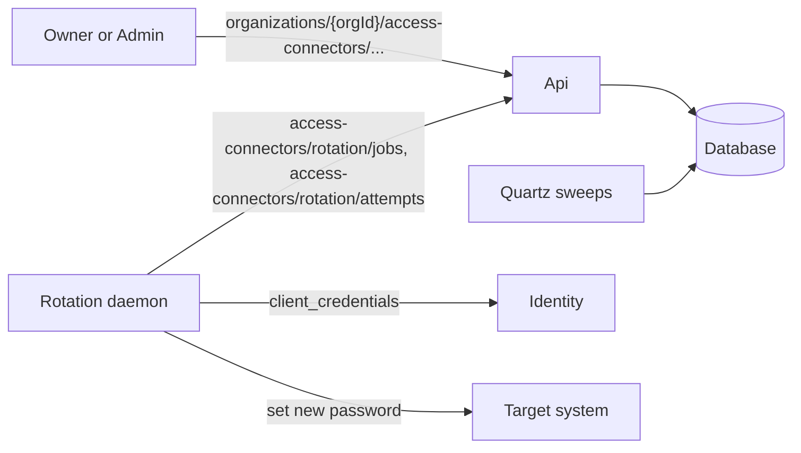

# Credential rotation

Credential rotation rewrites the password behind a PAM-governed vault item at the system that
actually owns it, and replaces the vault item's contents to match. The server never touches the
target system and never reads the credential. It offers work, hands out exactly one claim at a time,
accepts an encrypted write back, and records what happened.

**Audience:** server engineers working on PAM rotation, and AI agents editing this subtree.

## Start here

- [Daemon protocol](docs/daemon-protocol.md) — the request-by-request contract a rotation daemon
  follows, from registration to reporting an outcome, and what each failure response means.
- [Job lifecycle](docs/job-lifecycle.md) — the job and attempt state machines, the retry budget, and
  the background sweeps that move everything time-derived.
- [Security model](docs/security-model.md) — the trust boundary, the layered authorization chain, and
  the deliberate choices behind the error responses and the failure-reason contract.

## The actors

**An administrator** registers target systems, registers daemons, assigns daemons to targets, and
creates a rotation config per vault item. This is the `organizations/{orgId}/access-connectors` surface,
restricted to an Owner or an Admin by
[`ManageAccessConnectorRequirement`](Api/Authorization/ManageAccessConnectorRequirement.cs) — there is no custom
permission for it, because registering a daemon means handing that daemon the organization key.

**A rotation daemon** runs on the customer's network, where the target system is reachable and the
server is not. It authenticates with a machine credential, polls for work, claims one job at a time,
performs the rotation, and reports back. It is not in this repository.

**The Quartz sweeps** own everything time-derived, because nothing else is watching the clock. The
rotation sweep offers a config whose schedule came due, times out a job that never completed, and
reclaims a job from a daemon that went away; a second sweep expires leases that reached their end,
which is what fires the access-end trigger. Both run once a minute — see [`Jobs`](Jobs) and the
triggers in `src/Api/Jobs/JobsHostedService.cs`.

## The four objects

| Object                | Represents                                                                                             |
| --------------------- | ------------------------------------------------------------------------------------------------------ |
| **Target system**     | Somewhere credentials can be rotated. Either automatic — rotated through a connector a daemon drives — or manual, which only tracks a schedule and records what a human did out of band. |
| **Rotation config**   | The setup for one vault item: which target, which account on it, when it is next due, and whether a lease ending should trigger a rotation. A vault item has at most one. |
| **Rotation job**      | One offer of work for a config. A config has at most one active job at a time, and every job is created by [`OfferRotationCommand`](Commands/OfferRotationCommand.cs). |
| **Rotation attempt**  | One daemon's try at a job. A job has at most one in-flight attempt, inserted in the same transaction as the claim that creates it. |

Entities live in [`src/Pam.Domain/Entities`](../../../../../src/Pam.Domain/Entities); their XML
documentation is the authority on individual fields. Predicates shared between the admin commands,
the daemon endpoints, and the sweeps are implemented once in
[`PamRotationRules`](../../../../../src/Pam.Domain/PamRotationRules.cs), so a guard cannot mean two
different things in two places.

## What triggers a rotation

A job is only ever created by `OfferRotationCommand`, from one of three sources:

- **Scheduled** — the config's cron expression came due and the sweep picked it up. Cron expressions
  are Quartz six-field, always evaluated in UTC, and rejected at write time if two consecutive
  occurrences fall closer together than `MinScheduleInterval`.
- **On demand** — an administrator asked for it. Subject to `OnDemandCooldown` since the last
  successful rotation.
- **Access end** — a lease on the config's vault item ended, by revocation or by expiry, and the
  config opts into rotating on access end. This is the control that stops a credential a member just
  held from staying valid.

On a manual target there is no daemon to offer a job to, so a due config instead surfaces an
obligation for an operator to discharge, and an administrator records the rotation afterwards.

## Configuration

Every timing knob lives on [`PamRotationOptions`](PamRotationOptions.cs), bound from
`globalSettings:pam:rotation`. The class holds the defaults, and consumers inject `IOptions` rather
than reading configuration — so the defaults in that one file are the whole truth for an
unconfigured environment. The values worth knowing before reading anything else:

| Option                 | Default    | What it bounds                                                        |
| ---------------------- | ---------- | --------------------------------------------------------------------- |
| `JobTtl`               | 1 hour     | How long a job may live before the sweep times it out.                |
| `ReleaseDelay`         | 15 minutes | The claim lease — how long a daemon holds a job before it can be reclaimed. |
| `MaxAttempts`          | 5          | Failed attempts a job may accrue before it fails outright.            |
| `RetryBaseDelay`       | 1 second   | The base of the exponential retry backoff.                            |
| `DaemonOfflineAfter`   | 5 minutes  | How long since its last heartbeat a daemon still counts as connected. |
| `HeartbeatMinInterval` | 1 minute   | The server-side throttle on heartbeat writes, and the floor a daemon should not poll faster than. |
| `MinScheduleInterval`  | 15 minutes | The floor on how often a cron schedule may fire.                      |
| `OnDemandCooldown`     | 1 minute   | The floor between two on-demand triggers of one config.               |
| `FailureRetryDelay`    | 1 hour     | How far out a config's next rotation moves after its job fails.       |

## Feature flags

The whole rotation surface — endpoints, commands, and the rotation sweep — is behind
`PamAccessConnector`, on top of the `Pam` flag the rest of the library uses. Every entry point checks it: the
endpoint groups through the shared chain, and the sweep job and the access-end handler on their first
line, since neither is reached through an endpoint.

The lease-expiry sweep is the exception. It is gated on `Pam`, not `PamAccessConnector`, because expiring a
lease that reached its end is a leasing concern; the rotation trigger it also fires self-gates
further down.
