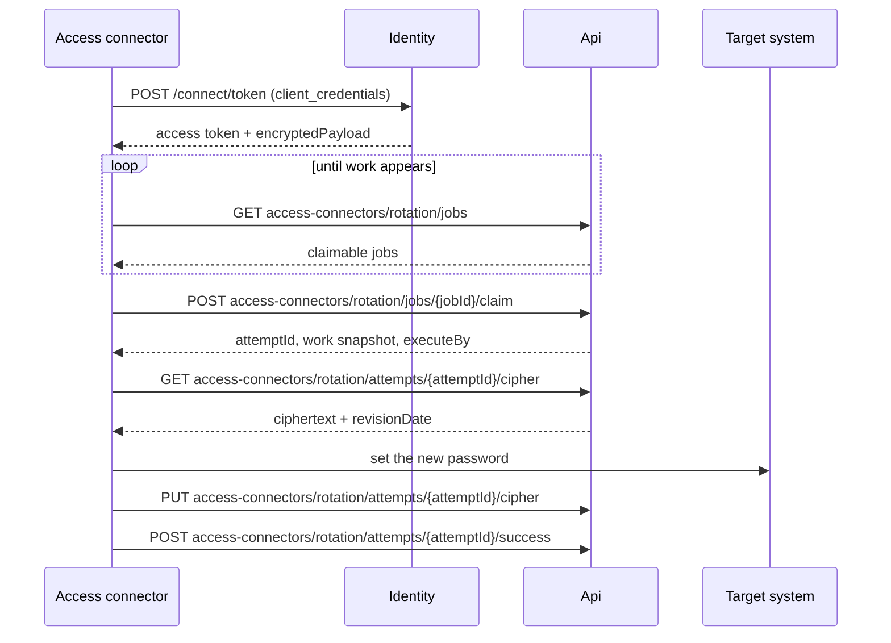

# Access connector protocol

The request-by-request contract between an access connector and the server. This is the server side
of it: what each endpoint requires, what it returns, and what a non-success response means. The
access connector itself is not in this repository.

**Audience:** server engineers changing the connector-facing endpoints, and anyone implementing or
debugging an access connector against them.

Routes live under `access-connectors/rotation/` and are mapped in
[`PamEndpointsExtensions`](../../Api/Endpoints/PamEndpointsExtensions.cs). Every one of them
requires an access connector token, not a member's.

## The whole exchange

The server never contacts the target system and cannot observe whether the password there actually
changed. That is why a failure report carries a sync state, and why the ordering above matters: the
access connector changes the target first, then writes the vault item, so a failure in between is
reportable as a known drift rather than an unknown one.

## Registration

An administrator registers the access connector; the access connector does not register itself.

1. Wrap the organization key client-side and post the ciphertext to `POST
   organizations/{orgId}/access-connectors` with a display name.
   [`RegisterAccessConnectorCommand`](../Commands/RegisterAccessConnectorCommand.cs) stores the
   wrapped key and never sees the plaintext.
2. Keep the `clientSecret` from the response. It is shown exactly once — the server stores only a
   hash of it and cannot return it again.
3. Assemble the access connector's credential from the response's `apiKeyId` and `clientSecret`,
   plus the encryption key half held client-side, in the form
   `0.access-connector.<apiKeyId>.<clientSecret>:<encryptionKey>`.
4. Assign the access connector to each target system it should work, with `POST
   organizations/{orgId}/access-connectors/{id}/assignments`. An access connector with no assignment
   sees no work. The access connector must be enabled and the target must be automatic; a manual
   target has no access connector to assign.

The credential is a generic `dbo.ApiKey` row with no service account attached; the access connector
row points at it. PAM reuses the Secrets Manager credential store rather than minting a parallel
one.

## Authentication

The access connector exchanges its credential for an access token at Identity's token endpoint using
the client-credentials grant, with client id `access-connector.<apiKeyId>` and scope
`api.pam.rotation`.
[`PamDaemonClientProvider`](../../../../../../src/Identity/IdentityServer/ClientProviders/PamDaemonClientProvider.cs)
resolves the client and refuses to issue a token unless the access connector is enabled and its
organization is both enabled and licensed for PAM.

Two things come back that matter:

- **The access token.** Valid for 15 minutes — shorter than the platform default, because an access
  connector polls continuously and re-authenticates cheaply, and the short window bounds how long a
  deleted access connector keeps a usable token.
- **`encryptedPayload`.** The organization key, still wrapped. The access connector unwraps it
  locally with the encryption key half of its credential. This is how the access connector can
  decrypt and re-encrypt a vault item that the server cannot.

Every subsequent request carries the token as a bearer token. Eligibility is not re-established per
request by a filter: it is established here, at issuance, and again by the work queries themselves,
which refuse to show or hand out work to an access connector that is no longer enabled. The
practical consequences for an access connector implementer:

- Being disabled or deleted stops new work at once — the poll goes empty and claims fail — without
  waiting for the current token to expire.
- A revoked access connector cannot obtain another token, so re-authenticating is what surfaces a
  revocation definitively.
- A lapsed organization license is checked only at issuance, so an already-issued token keeps
  working until it expires.

See [Security model](security-model.md) for the full chain and what a revocation does and does not
interrupt.

## Polling and the heartbeat

`GET access-connectors/rotation/jobs` returns the jobs this access connector may claim right now.
The list re-derives every condition the claim itself re-checks — the config is enabled, the target
is active, an assignment exists, the access connector is enabled — so what an access connector is
shown and what it can actually claim never diverge.

The same request is also the heartbeat. There is no separate heartbeat endpoint and no connection
row: liveness is derived from the last time the access connector made any connector-facing request,
which for an idle access connector is only ever the poll.
[`AccessConnectorHeartbeatEndpointFilter`](../Api/Endpoints/Filters/AccessConnectorHeartbeatEndpointFilter.cs)
runs ahead of every access connector route and writes that timestamp — but only if the stored one is
already older than `HeartbeatMinInterval`, so polling faster than that gains nothing.

The contract has two halves:

- An access connector **must** call some connector-facing endpoint more often than
  `DaemonOfflineAfter` for as long as it holds a claim. If it stops, the release sweep may reclaim
  the job once the claim's lease has also expired.
- An access connector **should not** poll more often than `HeartbeatMinInterval`.

## Claiming

`POST access-connectors/rotation/jobs/{jobId}/claim` is first-claim-wins. The claim and the attempt row that records it
are created in one transaction, so a claimed job always has exactly one in-flight attempt from the
moment it is claimed.

A successful claim returns the whole work snapshot, so the access connector needs no further round
trip to start: the attempt id, the target system's name and connector kind, the password policy to
generate against, the vault item id, the account identity to rotate, whether to terminate existing
sessions, and `executeBy`.

`accountIdentity` is opaque to the server. It is stored and handed back verbatim and never parsed —
only the access connector interprets it.

`executeBy` is the claim's lease deadline, `ReleaseDelay` after the claim. Passing it does not by
itself lose the job: release also requires the access connector's heartbeat to have gone stale. See
[Job lifecycle](job-lifecycle.md).

Two failures, and they mean different things:

- **409** — the job is no longer claimable. Another access connector almost certainly won the race.
  Claim a different job.
- **404** — this access connector was never eligible to claim it: no assignment to the target, a
  different organization, or a disabled target or config. Indistinguishable from a job that does not
  exist, on purpose.

## Reading the vault item

`GET access-connectors/rotation/attempts/{id}/cipher` returns the vault item for this access
connector's claimed, executing attempt and nothing else. It is deliberately not the general
vault-item read, which is bound to a member's identity —
[`GetRotationCipherQuery`](../Queries/GetRotationCipherQuery.cs) re-verifies the attempt, its
status, its claimant, and the job's claim before returning anything.

`data` is the item's encrypted blob exactly as stored. Keep `revisionDate`; the write back needs it.

## Writing the rotated secret back

`PUT access-connectors/rotation/attempts/{id}/cipher` carries the new encrypted blob and the
`lastKnownRevisionDate` read above. The write goes through an atomic capability check that
re-verifies, under a single lock, that the job is still claimed by this access connector and the
attempt is still executing — closing the window between "may this access connector write" and "write
it".

- **409** — either the capability no longer holds, or the item's revision date has moved since it was
  read, meaning a member edited it concurrently. Both are audited as a rejected write. The revision
  check exists to protect that concurrent edit rather than silently overwriting it.
- **404** — unknown attempt id. Nothing is audited, because there is nothing to audit it against.

An accepted write sets the attempt's cipher-updated marker, bumps the account revision date, and
pushes a sync so open clients pick up the new secret.

## Reporting the outcome

Exactly one of these ends an attempt.

`POST access-connectors/rotation/attempts/{id}/success` requires the attempt to already have an
accepted cipher write. A success report on an attempt that never wrote is treated as stale and
rejected — the server will not mark a rotation successful on the access connector's word alone.
Success resolves the attempt, marks the job succeeded, clears the claim, stamps the config's last
rotation, and recomputes its next due time from the cron expression.

`POST access-connectors/rotation/attempts/{id}/failure` carries a sync state and a bounded error code with an optional
short detail. The sync state is the operationally important field: it says whether the target's
password was left changed, unchanged, or in an indeterminate state, which is the only way an operator
can tell whether the vault item and the target now disagree.

Never forward raw target-system error output as the error code or detail. It can echo credentials.
The server truncates the combined reason and never rejects a report for length, so truncation is not
a safety net you can rely on — the bound is the access connector's responsibility.

A failure either returns the job to pending for another attempt, with exponential backoff, or fails
the job outright once the retry budget is spent. Either way the access connector's part is over.

Both report endpoints return **409** for a stale report — the attempt is no longer executing under
this access connector's claim, which is what an access connector sees when its job was released or
timed out while it was working. Both return **404** for an unknown attempt id.

## Endpoint reference

| Method and route                          | Purpose                                        |
| ----------------------------------------- | ---------------------------------------------- |
| `GET access-connectors/rotation/jobs`                | Poll for claimable work; doubles as heartbeat. |
| `POST access-connectors/rotation/jobs/{id}/claim`           | Claim a job and open an attempt.               |
| `GET access-connectors/rotation/attempts/{id}/cipher`       | Read the claimed attempt's vault item.         |
| `PUT access-connectors/rotation/attempts/{id}/cipher`       | Write the rotated secret back.                 |
| `POST access-connectors/rotation/attempts/{id}/success`     | Report a successful rotation.                  |
| `POST access-connectors/rotation/attempts/{id}/failure`     | Report a failed rotation.                      |
