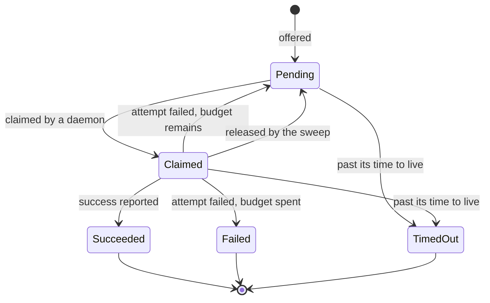
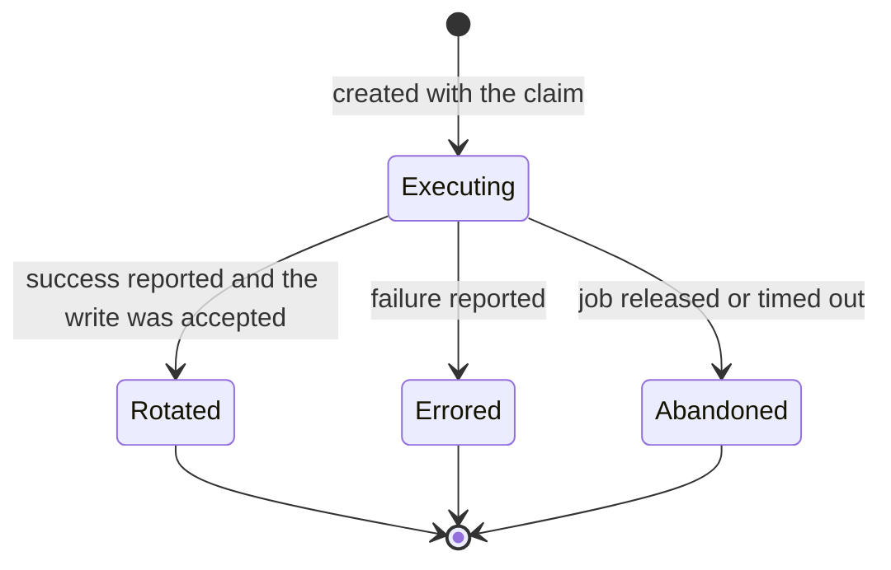

# Job lifecycle

How a rotation job and its attempts move through their states, who is allowed to move them, and what
the background sweeps do about the states nothing else can reach.

**Audience:** server engineers changing rotation dispatch, the retry policy, or the sweeps.

The rule underneath all of it: a job's state is only ever changed by a guarded operation that
re-checks its own preconditions at the moment of the write. Nothing here trusts a read from a
previous statement, because every one of these transitions races either another daemon or a sweep.

## Job states

Pending and claimed are the two active states. Everything else is terminal.

Every transition out of claimed — retry, release, success, or timeout — clears the job's claim
fields. The identity of the daemon that did the work is not lost, because it is recorded permanently
on the attempt instead.

## Attempt states

Reaching rotated needs two independent facts: an accepted cipher write, and a success report from the
daemon that holds the claim. A report alone is not enough. That backstop is enforced in the same
statement that resolves the attempt, so it cannot be raced.

## Invariants

These are enforced at the data layer, not by a preceding read — by a unique index where one suffices,
and by a guarded write under lock where it does not:

- **One config per vault item.** A vault item has at most one rotation config. Unique index.
- **One assignment per daemon and target.** A daemon cannot be assigned to the same target twice.
  Unique index.
- **At most one active job per config.** A config has at most one pending or claimed job.
  [`OfferRotationCommand`](../Commands/OfferRotationCommand.cs) is the single creation point for a
  job, and its insert re-checks the invariant under a range lock on the config.
- **At most one in-flight attempt per job.** The executing attempt is inserted in the claim's own
  transaction, so a claimed job has exactly one from the moment it is claimed.
- **A daemon and the config it works are in the same organization.** Re-checked inside the claim,
  even though the caller already checked it from the token's claims.

## Offering work

`OfferRotationCommand` re-checks that the config is enabled, its target is automatic, and that target
is active — and then the guarded insert re-checks all of it again under lock, because a concurrent
pause or disable can land in between. The insert reports which of three things happened:

- **Created** — the job exists, and the audit trail records it as offered.
- **An active job already exists** — the invariant held against this insert. Nothing was written.
- **The config is no longer offerable** — a concurrent pause, disable, or method change won. Nothing
  was written.

Callers treat both non-created outcomes as a silent no-op. The scheduled sweep does not inspect the
outcome at all; an administrator's on-demand trigger checks the same conditions up front so it can
return a useful error instead.

## The retry budget

A failed attempt either returns the job to pending or fails it outright, decided in the same
statement that records the failure:

- Errored attempts are counted. If the count is below `MaxAttempts`, the job returns to pending with
  `NextClaimableAt` pushed out by `RetryBaseDelay * 2^(errored - 1)`.
- Otherwise the job fails, and if the config has a cron expression its next rotation moves out by
  `FailureRetryDelay`.

**Abandoned attempts are never charged against the budget.** A job that was released or timed out
mid-attempt has not used up a try — that would punish a config for infrastructure trouble rather than
for a rotation that genuinely did not work.

## The sweeps

[`PamRotationSweepService`](../Jobs/PamRotationSweepService.cs) runs once a minute and does three
things in sequence. Each phase touches a disjoint set of rows, and each is independently
fault-isolated: a failure in one phase, or on one row inside a phase, is logged and swallowed so it
never stops the rest.

### Offering due configs

Every enabled config whose next rotation time has arrived is offered a job. On a manual target there
is no daemon to offer to, so the config instead reads as awaiting a manual rotation — an obligation an
administrator discharges by recording that they did it, which stamps the last rotation and recomputes
the next one.

### Timing out jobs

A job still pending or claimed past its `ExpiresAt` is timed out and its executing attempt, if any, is
abandoned — in one transaction, so a crash between the two cannot leave an executing attempt behind a
job that already moved on.

**Success wins.** A job with a rotated attempt is excluded even if it is otherwise past its
expiry, so a slow-but-successful report still beats the sweep.

The audit event distinguishes two very different failures using the job's attempt count: zero attempts
means nothing ever claimed it, which points at a missing assignment or an offline fleet; one or more
means a daemon took it and went quiet.

A timed-out job pushes the config's next rotation out by `FailureRetryDelay` — but only if the config
has a cron expression. Writing a concrete next-rotation time onto a config with no schedule would
enrol it in the due sweep permanently, since nothing would ever clear the value again, and every
later offer would be recorded as scheduled on a config an administrator set up as on-demand only.

### Releasing abandoned claims

A claimed job is returned to pending when **both** conditions hold: the claim's lease has expired
(`ReleaseDelay` after the claim) **and** the claiming daemon's heartbeat is stale
(`DaemonOfflineAfter`). Its executing attempt is abandoned.

Requiring both is deliberate. Releasing on a stale heartbeat alone would snatch a job from a daemon
that is mid-rotation on a slow target; releasing on the lease alone would do the same to a daemon that
is demonstrably still alive. Release is never based on the daemon's status either — a disabled or
deleted daemon's jobs come back through this same path, once its heartbeats actually stop, because it
can no longer authenticate.

The re-claim time is computed from the lease deadline rather than from the moment the sweep runs, so a
job becomes claimable at exactly the same instant whether the sweep catches it promptly or a minute
later.

Deleting a daemon is the one case that does not wait for this sweep. Because the sweep finds stale
claimants by joining the daemon row, a job still claimed by a daemon that has just been deleted would
be invisible to it and would sit until its much later time-to-live, blocking any replacement job for
that config. So the delete releases those jobs itself, while the claim is still visible.

## Lease expiry

A second sweep, [`PamLeaseExpirySweepService`](../Jobs/PamLeaseExpirySweepService.cs), flips active
leases whose window has closed to expired, records that, and fires the rotation access-end trigger for
each. It exists because a lease reaching its own end otherwise produced no record and no rotation —
only an explicit revocation did.

Emitting the audit event and firing the rotation trigger are in separate error-handling blocks on
purpose. Sharing one meant an audit-store hiccup silently swallowed the rotation, and rotating on
access end is precisely the control that stops a credential a member just held from staying valid.

## Administrative changes to in-flight work

| Action                | Effect on work already in flight                                                                                                 |
| --------------------- | -------------------------------------------------------------------------------------------------------------------------------- |
| Pause a config        | No new jobs are offered, and its pending job stops being claimable. A claimed job runs to completion.                             |
| Disable a target      | Same: nothing new is offered or claimable, and a claim in progress is not interrupted.                                            |
| Disable a daemon      | It is dropped from the poll and the claim immediately, so it gets no new work. A claim it already holds comes back through the release sweep, once its current token expires and its heartbeats stop with it. Its credential is kept. |
| Delete a daemon       | Its claimed jobs are released and their executing attempts abandoned in the delete's own transaction, then its assignments, its row, and its credential go. The daemon held the plaintext organization key, so rotating the organization key is the remediation for a suspected compromise. |
| Delete a config       | Refused while it has an active job — re-checked under the same lock the offer takes, so a job claimed since the check blocks the delete rather than being torn out from under its daemon. Otherwise its jobs and attempts are hard-deleted with it. |

Deleting a config discards its jobs and attempts because the audit trail, not those rows, is the
durable history of what was rotated and when.

## The audit trail

Every transition above writes to the PAM access-audit trail. Machinery events — offered, dispatched,
succeeded, released, timed out — are single outcome-phase events with no human actor. Administrative
actions are recorded twice, once before the write and once after, so an action that failed halfway is
still visible. Rejections are recorded too: a rejected cipher write and a stale success or failure
report both leave a trail even though they change nothing.

Kinds and their meanings are documented on
[`AccessAuditEventKind`](../../../../../../src/Pam.Domain/Enums/AccessAuditEventKind.cs).
