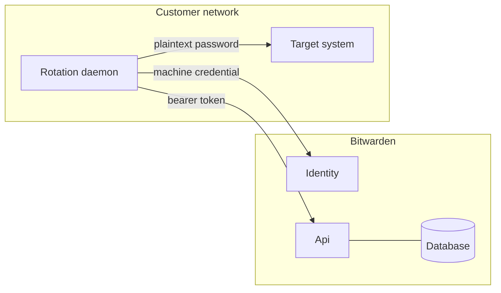

# Security model

Rotation gives a machine on someone else's network a credential, a bearer token, and the ability to
overwrite a vault item. This documents where the trust boundary sits, the layers that hold it, and the
reasoning behind choices that otherwise look like over-engineering.

**Audience:** server engineers changing anything on the rotation path, and reviewers assessing it.

## The trust boundary

The daemon sits outside the boundary. It holds the organization key in memory, so it can read and
write Vault Data in the clear. That is unavoidable — something has to know the new password to set it
on the target, and it cannot be us.

What the server holds is the other side of that split:

| Held by the server                          | Held only by the daemon        |
| ------------------------------------------- | ------------------------------ |
| The wrapped organization key, as ciphertext  | The unwrapped organization key |
| A hash of the daemon's client secret         | The client secret              |
| The vault item's encrypted blob              | The item's plaintext           |
| The account identity, opaque and never parsed | The target's password          |

No rotation code path decrypts a vault item, and no log line or audit event carries credential
material. A failure reason is the one place daemon-supplied text is persisted, which is why it has its
own contract below.

## Where a daemon's eligibility is established

Four checks stand between a daemon request and a change to Vault Data, and each assumes the ones
before it may have been bypassed.

1. **The token policy.** `PamRotationDaemon` requires an authenticated caller carrying the
   `api.pam.rotation` scope and a rotation-daemon client type. It proves the caller holds a daemon
   token. It proves nothing about *which* daemon.
2. **Token issuance.**
   [`PamDaemonClientProvider`](../../../../../../src/Identity/IdentityServer/ClientProviders/PamDaemonClientProvider.cs)
   issues a token only to an enabled daemon whose organization is enabled and licensed for PAM, and
   caps the token's life at 15 minutes so a token issued before a revocation is short-lived.
3. **Resource scoping in the handler.** Commands confirm that every id arriving by route belongs to
   the calling daemon's organization before acting on it or auditing it.
4. **The work queries themselves.** The poll and the claim join the daemon row on being enabled and
   on sharing the config's organization, so a daemon disabled or deleted mid-token sees no work and
   can claim none. The cipher write and both report paths re-check the claim inside the statement that
   performs the write.

[`AccessConnectorHeartbeatEndpointFilter`](../Api/Endpoints/Filters/AccessConnectorHeartbeatEndpointFilter.cs), which
runs ahead of every daemon route, authorizes nothing. Its job is the heartbeat. The one thing it does
reject is a token whose subject does not parse as a daemon id — which the policy cannot express — and
it rejects that as a 404, so a daemon-shaped token this server cannot resolve learns nothing about the
surface behind it.

The filter is named for the one thing it does on purpose. It used to re-read the daemon and its
organization's licensing on every request, which mostly duplicated guards the work queries already
carry, and answered a product-wide question — how long may a token outlive its subject? — with a
check bespoke to this one surface. The token lifetime answers it now. The name followed the behaviour,
because a filter that sounds like it verifies the caller end to end invites the next query added here
to skip its own eligibility join.

### What a revocation reaches, and when

**Disabling or deleting a daemon** takes effect on new work immediately, at layer 4. It does not
interrupt an attempt the daemon has already claimed: those endpoints verify the claim, not the
daemon's current status, so a daemon holding a live token can finish a rotation it started. Deleting
the daemon is the exception — its commands cannot resolve the deleted row and fail closed.

That is the same posture as pausing a config: stop handing out work, but let an in-flight rotation
finish rather than abandon it halfway between the target and the vault.

**A lapsed PAM license or a suspended organization is the one case no query re-checks.** Layer 2 is
the only place it is enforced, so the window is the token's remaining life — up to 15 minutes — rather
than zero. Bear this in mind when adding a daemon-facing route: if it must not survive a lapsed
license, it needs its own check, because nothing below layer 2 will make one for it.

### Why layer 4 is not redundant

Layer 3 reads, then acts. Between the two, another daemon can claim the job, a sweep can release it,
or an administrator can pause the config. Every state-changing rotation operation therefore re-checks
its own preconditions in the write itself:

- **Claiming** matches on the job still being pending, so two concurrent claims serialize on the row
  and only the first wins.
- **Accepting a cipher write** locks the job row for the life of the transaction, so a concurrent
  release or timeout — which writes that same row — blocks until the write commits, or vice versa.
  Without the lock there is a window between "may this daemon write" and "write it".
- **Resolving an attempt** requires the attempt to still be executing under this daemon's claim.

## What the error responses deliberately do not tell you

Ids on this surface are bare route values a daemon supplies. Anything that varies its response by
whether an id exists is an oracle for enumerating another organization's data, so responses are shaped
to avoid that.

**Claiming classifies eligibility before it classifies claimability.** A job that does not exist and a
job this daemon may not claim both return 404. Only a daemon that was genuinely eligible and lost the
race — or hit a backoff, a paused config, or a disabled target — gets 409. Getting this ordering
backwards would make 409 a confirmation that a job id is real.

**A daemon that should not be here looks like one that never existed.** An unresolvable daemon token
is a 404, and a daemon that is no longer eligible simply sees an empty work list, so disabled,
deleted, unlicensed, and unknown are indistinguishable from the outside.

**An unknown attempt id is a 404 with no audit event.** This is the subtler one. If the server audited
a rejected write or a stale report before checking that the attempt belongs to the caller's
organization, a daemon could write events carrying its own name into another organization's audit
trail, and the 404-versus-409 split would tell it which foreign ids are real. So every report and
write path resolves the attempt, its job, its config, and the daemon, and requires the config and the
daemon to share an organization, before it audits anything.

## The failure-reason contract

A daemon reports a bounded error code plus an optional short detail. It must not forward raw
target-system error output: connection strings, command echoes, and authentication failures routinely
quote the credential itself, and this field is persisted and shown to administrators.

The server truncates the combined reason and never rejects a report for being too long. Truncation is
a storage bound, not a safety net — a truncated secret is still a leaked secret. The bound is the
daemon's responsibility; the server's job is to make sure a badly-behaved daemon cannot lose a report
by making it unparseable.

The sync state alongside it is a security signal in its own right. It says whether a failed rotation
left the target's password changed, so an operator can tell that the vault item and the target now
disagree — which is the state where a credential exists that nobody can look up.

## Protecting a concurrent member edit

The cipher write requires the daemon to send back the revision date it read. If the item has changed
since, the write is rejected rather than applied. This goes beyond what dispatch correctness needs: it
stops a rotation in flight from silently overwriting an edit a member made in the meantime. The
tolerance matches the vault's own last-known-revision check.

An accepted write also bumps the account revision date in the same transaction as the write. The push
notification is best-effort; the revision date is the durable signal. Without it, a client that missed
the push would see nothing changed, skip the sync, and keep serving the pre-rotation password.

## Administrative authority

The rotation admin surface is restricted to an Owner or an Admin by
[`ManageAccessConnectorRequirement`](../Api/Authorization/ManageAccessConnectorRequirement.cs). Two things about it
are deliberate:

- **There is no custom-permission arm.** PAM's only permission is authority over access-rule
  authorship — over who may lease a credential. That is not the same authority as over the daemons
  that rewrite those credentials at the target.
- **There is no provider arm.** The requirement implements `IOrganizationRequirement` directly rather
  than deriving from the base permission requirement, whose final arm authorizes any provider managing
  the organization. Registering a daemon hands it the organization key, and rotation rewrites the
  credentials inside the vault; neither is a provider's to hold or to change.

## Credential handling

The client secret is returned exactly once, at registration. The server stores a hash and cannot
produce the plaintext again — losing it means registering a new daemon.

Deleting a daemon removes its row and invalidates its credential, but the daemon held the plaintext
organization key while it ran. Deletion is not containment for a compromised daemon; rotating the
organization key is.

## Known gap

The daemon-facing group is not yet rate-limited per client. It is tracked as a TODO on the group's
registration in
[`PamEndpointsExtensions`](../../Api/Endpoints/PamEndpointsExtensions.cs). Until it lands, the
protection against a daemon polling abusively is the conditional heartbeat write and the fact that a
poll is a single indexed query.
