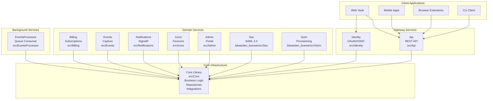
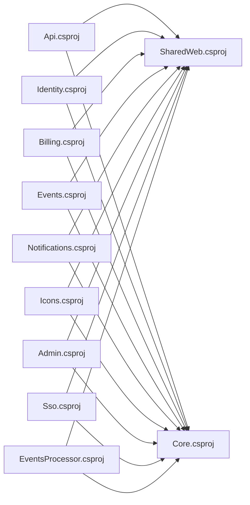
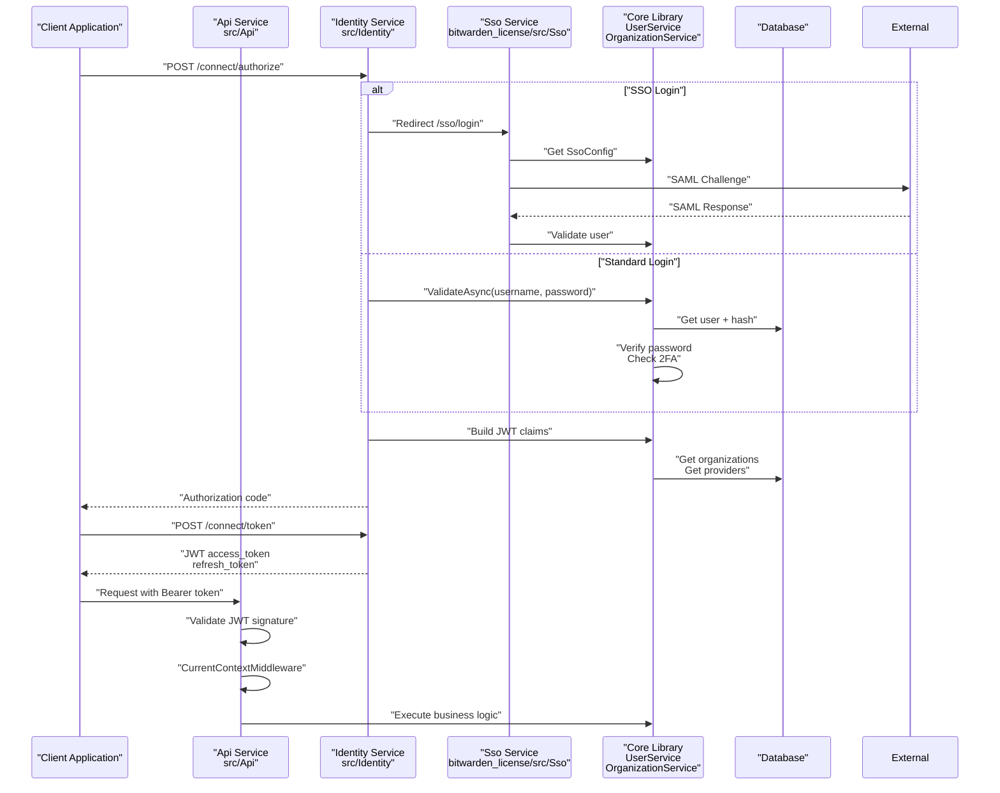

# Overview

Relevant source files

The following files were used as context for generating this wiki page:

- [bitwarden_license/src/Sso/Sso.csproj](https://github.com/bitwarden/server/blob/39f38f50/bitwarden_license/src/Sso/Sso.csproj)
- [src/Admin/Admin.csproj](https://github.com/bitwarden/server/blob/39f38f50/src/Admin/Admin.csproj)
- [src/Api/Api.csproj](https://github.com/bitwarden/server/blob/39f38f50/src/Api/Api.csproj)
- [src/Billing/Billing.csproj](https://github.com/bitwarden/server/blob/39f38f50/src/Billing/Billing.csproj)
- [src/Core/Core.csproj](https://github.com/bitwarden/server/blob/39f38f50/src/Core/Core.csproj)
- [src/Events/Events.csproj](https://github.com/bitwarden/server/blob/39f38f50/src/Events/Events.csproj)
- [src/EventsProcessor/EventsProcessor.csproj](https://github.com/bitwarden/server/blob/39f38f50/src/EventsProcessor/EventsProcessor.csproj)
- [src/Icons/Icons.csproj](https://github.com/bitwarden/server/blob/39f38f50/src/Icons/Icons.csproj)
- [src/Identity/Identity.csproj](https://github.com/bitwarden/server/blob/39f38f50/src/Identity/Identity.csproj)
- [src/Notifications/Notifications.csproj](https://github.com/bitwarden/server/blob/39f38f50/src/Notifications/Notifications.csproj)
- [util/Server/Server.csproj](https://github.com/bitwarden/server/blob/39f38f50/util/Server/Server.csproj)
- [util/Setup/Setup.csproj](https://github.com/bitwarden/server/blob/39f38f50/util/Setup/Setup.csproj)

This document provides an introduction to the Bitwarden server repository, which implements the complete backend infrastructure for the Bitwarden password management platform. The server handles vault storage, user authentication, organization management, billing operations, and administrative functions. 

The repository is structured as a microservices architecture with 9+ distinct services that share common business logic through a central Core library. For detailed information about the architecture, see [System Architecture](#1.1). For information about the project structure and build configuration, see [Project Structure and Build System](#1.2).

## Repository Purpose

The Bitwarden server repository (`https://github.com/bitwarden/server`) implements a complete password management backend that provides:

- **Vault Management**: Encrypted storage and retrieval of passwords, secure notes, identities, and payment cards
- **Authentication Services**: OAuth2/OIDC provider with multi-factor authentication (TOTP, FIDO2, Duo, Yubikey)
- **Organization Management**: Multi-user organizations with role-based access control, collections, and policies
- **Billing Integration**: Subscription management with Stripe, Braintree, BitPay, and PayPal
- **Enterprise Features**: SAML 2.0 SSO, SCIM provisioning, and administrative controls
- **Audit Logging**: Comprehensive event tracking and compliance reporting

The server supports both cloud-hosted (Bitwarden Cloud) and self-hosted deployment models, with multi-region capabilities and multiple database backends (SQL Server, MySQL, PostgreSQL, SQLite).

**Sources:** [src/Core/Core.csproj:1-84](https://github.com/bitwarden/server/blob/39f38f50/src/Core/Core.csproj#L1-L84), [src/Api/Api.csproj:1-40](https://github.com/bitwarden/server/blob/39f38f50/src/Api/Api.csproj#L1-L40), [src/Identity/Identity.csproj:1-19](https://github.com/bitwarden/server/blob/39f38f50/src/Identity/Identity.csproj#L1-L19)

## Service Architecture Overview

The Bitwarden server follows a microservices pattern with distinct services for different functional domains. All services depend on the `Core` library for shared business logic, repositories, and external integrations.

**Service Responsibilities:**

| Service | Project Path | Purpose |
|---------|--------------|---------|
| `Api` | [src/Api]() | Main REST API for vault operations, user management, and organization administration |
| `Identity` | [src/Identity]() | OAuth2/OIDC authentication provider built on Duende IdentityServer |
| `Billing` | [src/Billing]() | Subscription and payment management with webhook handlers |
| `Events` | [src/Events]() | Event capture API for audit logging |
| `EventsProcessor` | [src/EventsProcessor]() | Background processor for asynchronous event processing |
| `Notifications` | [src/Notifications]() | SignalR hub for real-time vault synchronization |
| `Icons` | [src/Icons]() | Website favicon retrieval and caching service |
| `Admin` | [src/Admin]() | Administrative web portal for system management |
| `Sso` | [bitwarden_license/src/Sso]() | SAML 2.0 single sign-on for enterprise customers |
| `Scim` | [bitwarden_license/src/Scim]() | SCIM 2.0 user provisioning API |

**Sources:** [src/Api/Api.csproj:1-40](https://github.com/bitwarden/server/blob/39f38f50/src/Api/Api.csproj#L1-L40), [src/Identity/Identity.csproj:1-19](https://github.com/bitwarden/server/blob/39f38f50/src/Identity/Identity.csproj#L1-L19), [src/Billing/Billing.csproj:1-18](https://github.com/bitwarden/server/blob/39f38f50/src/Billing/Billing.csproj#L1-L18), [src/Events/Events.csproj:1-15](https://github.com/bitwarden/server/blob/39f38f50/src/Events/Events.csproj#L1-L15), [src/EventsProcessor/EventsProcessor.csproj:1-13](https://github.com/bitwarden/server/blob/39f38f50/src/EventsProcessor/EventsProcessor.csproj#L1-L13), [src/Notifications/Notifications.csproj:1-23](https://github.com/bitwarden/server/blob/39f38f50/src/Notifications/Notifications.csproj#L1-L23), [src/Icons/Icons.csproj:1-22](https://github.com/bitwarden/server/blob/39f38f50/src/Icons/Icons.csproj#L1-L22), [src/Admin/Admin.csproj:1-27](https://github.com/bitwarden/server/blob/39f38f50/src/Admin/Admin.csproj#L1-L27), [bitwarden_license/src/Sso/Sso.csproj:1-21](https://github.com/bitwarden/server/blob/39f38f50/bitwarden_license/src/Sso/Sso.csproj#L1-L21)

## Core Library Architecture

The `Core` library ([src/Core]()) serves as the foundation for all services, providing shared business logic, data access, and external integrations. This architecture ensures consistent behavior across services and simplifies maintenance.

```mermaid
graph TB
    subgraph "Services Layer"
        UserService["UserService<br/>Authentication<br/>2FA<br/>Premium"]
        OrganizationService["OrganizationService<br/>Subscriptions<br/>User Management<br/>Policies"]
        CipherService["CipherService<br/>Vault Items<br/>Encryption"]
        PaymentService["PaymentService<br/>Stripe<br/>Braintree<br/>BitPay"]
        MailService["MailService<br/>Handlebars Templates<br/>Email Delivery"]
        PolicyService["PolicyService<br/>Requirement Checks<br/>Enforcement"]
    end
    
    subgraph "Repository Layer"
        IUserRepository["IUserRepository<br/>SQL/MySQL/Postgres"]
        IOrganizationRepository["IOrganizationRepository"]
        ICipherRepository["ICipherRepository"]
        ITransactionRepository["ITransactionRepository"]
        IEventRepository["IEventRepository"]
    end
    
    subgraph "Integration Layer"
        StripeAdapter["Stripe Integration<br/>Stripe.net"]
        BraintreeGateway["Braintree Gateway<br/>Braintree"]
        BitPayClient["BitPay Client<br/>BitPay.Light"]
        AWSIntegration["AWS Integration<br/>SES/SQS"]
        AzureIntegration["Azure Integration<br/>Blob/Queue/ServiceBus"]
        LaunchDarklyClient["LaunchDarkly Client<br/>Feature Flags"]
    end
    
    subgraph "Consuming Services"
        ApiConsumer["Api Service"]
        IdentityConsumer["Identity Service"]
        BillingConsumer["Billing Service"]
        OtherConsumers["All Other Services"]
    end
    
    UserService --> IUserRepository
    OrganizationService --> IOrganizationRepository
    CipherService --> ICipherRepository
    PaymentService --> ITransactionRepository
    
    PaymentService --> StripeAdapter
    PaymentService --> BraintreeGateway
    PaymentService --> BitPayClient
    
    MailService --> AWSIntegration
    
    ApiConsumer --> UserService
    ApiConsumer --> OrganizationService
    ApiConsumer --> CipherService
    IdentityConsumer --> UserService
    BillingConsumer --> PaymentService
    BillingConsumer --> OrganizationService
    OtherConsumers --> UserService
```

**Core Library Components:**

The Core library is organized into three primary layers:

1. **Service Layer** - Business logic implementations
   - User authentication, 2FA, and premium features
   - Organization subscription management and user provisioning
   - Cipher (vault item) encryption and storage
   - Payment processing across multiple gateways
   - Email generation with Handlebars templates
   - Policy validation and enforcement

2. **Repository Layer** - Data access abstractions
   - Interface definitions for all data entities
   - Implementations for SQL Server, MySQL, PostgreSQL, and SQLite
   - Stored procedure wrappers for complex queries
   - Transaction management

3. **Integration Layer** - External service adapters
   - Payment gateways (Stripe, Braintree, BitPay, PayPal)
   - Cloud providers (AWS SES/SQS, Azure Blob/Queue/ServiceBus)
   - Feature flags (LaunchDarkly)
   - Email delivery (SendGrid, AWS SES, SMTP)

**Sources:** [src/Core/Core.csproj:1-84](https://github.com/bitwarden/server/blob/39f38f50/src/Core/Core.csproj#L1-L84)

## Technology Stack

The Core library's dependencies define the technology stack for the entire platform:

| Technology | Package | Purpose |
|------------|---------|---------|
| **Authentication** | `Duende.IdentityServer` | OAuth2/OIDC provider implementation |
| **2FA** | `Fido2.AspNet`, `DuoUniversal`, `Otp.NET`, `YubicoDotNetClient` | Multi-factor authentication support |
| **Payment Processing** | `Stripe.net`, `Braintree`, `BitPay.Light` | Payment gateway integrations |
| **Cloud Services** | `AWSSDK.*`, `Azure.*` | AWS and Azure service clients |
| **Feature Flags** | `LaunchDarkly.ServerSdk` | Dynamic feature control |
| **Email** | `Handlebars.Net`, `MailKit`, `SendGrid` | Email templating and delivery |
| **Caching** | `Microsoft.Extensions.Caching.StackExchangeRedis` | Redis-based distributed caching |
| **Real-time** | `Microsoft.AspNetCore.SignalR.*` | WebSocket-based notifications |
| **Logging** | `Serilog.*`, `Sentry.Serilog` | Structured logging and error tracking |
| **Background Jobs** | `Quartz.*` | Scheduled task execution |
| **Database** | `Microsoft.Data.SqlClient` | SQL Server connectivity |

**Sources:** [src/Core/Core.csproj:16-84](https://github.com/bitwarden/server/blob/39f38f50/src/Core/Core.csproj#L16-L84)

## Deployment Models

The Bitwarden server supports two primary deployment models:

### Cloud Deployment

The cloud deployment runs on Kubernetes with services deployed as separate pods. This model supports:
- Multi-region deployments (US, EU)
- Horizontal scaling with load balancers
- Azure Container Registry for image distribution
- Separate database instances per region
- Redis backplane for SignalR scalability

### Self-Hosted Deployment

The self-hosted model uses Docker Compose to run all services on a single host or small cluster. The Setup utility ([util/Setup]()) generates configuration files, SSL certificates, and Docker Compose manifests for easy deployment.

| Component | Cloud | Self-Hosted |
|-----------|-------|-------------|
| **Container Orchestration** | Kubernetes | Docker Compose |
| **Database** | Azure SQL / Managed PostgreSQL | SQL Server / MySQL / PostgreSQL in containers |
| **Caching** | Azure Redis Cache | Redis container |
| **Storage** | Azure Blob Storage | Local filesystem |
| **SSL Termination** | Azure Application Gateway | Let's Encrypt certificates |
| **Configuration** | Environment variables | `globalSettings.json` and environment variables |

**Sources:** [util/Setup/Setup.csproj:1-22](https://github.com/bitwarden/server/blob/39f38f50/util/Setup/Setup.csproj#L1-L22), [util/Server/Server.csproj:1-8](https://github.com/bitwarden/server/blob/39f38f50/util/Server/Server.csproj#L1-L8)

## Project Dependencies

All service projects follow a consistent dependency structure:

**Dependency Pattern:**
- All services depend on `Core.csproj` for business logic
- All services depend on `SharedWeb.csproj` for common web utilities (middleware, filters, authentication helpers)
- The `Api` and `Billing` services additionally reference commercial projects for licensed features

**Sources:** [src/Api/Api.csproj:19-31](https://github.com/bitwarden/server/blob/39f38f50/src/Api/Api.csproj#L19-L31), [src/Identity/Identity.csproj:10-13](https://github.com/bitwarden/server/blob/39f38f50/src/Identity/Identity.csproj#L10-L13), [src/Billing/Billing.csproj:8-12](https://github.com/bitwarden/server/blob/39f38f50/src/Billing/Billing.csproj#L8-L12), [src/Events/Events.csproj:10-13](https://github.com/bitwarden/server/blob/39f38f50/src/Events/Events.csproj#L10-L13), [src/Notifications/Notifications.csproj:18-21](https://github.com/bitwarden/server/blob/39f38f50/src/Notifications/Notifications.csproj#L18-L21), [src/Icons/Icons.csproj:17-20](https://github.com/bitwarden/server/blob/39f38f50/src/Icons/Icons.csproj#L17-L20), [src/Admin/Admin.csproj:9-25](https://github.com/bitwarden/server/blob/39f38f50/src/Admin/Admin.csproj#L9-L25), [bitwarden_license/src/Sso/Sso.csproj:16-19](https://github.com/bitwarden/server/blob/39f38f50/bitwarden_license/src/Sso/Sso.csproj#L16-L19), [src/EventsProcessor/EventsProcessor.csproj:8-11](https://github.com/bitwarden/server/blob/39f38f50/src/EventsProcessor/EventsProcessor.csproj#L8-L11)

## Authentication Flow

The system uses a multi-layered authentication approach with JWT tokens issued by the Identity service:

The Identity service uses `Duende.IdentityServer` to implement OAuth2/OIDC protocols. JWT tokens contain user claims, organization memberships, and role assignments. The Api service validates these tokens and uses `CurrentContextMiddleware` to populate request context.

**Sources:** [src/Identity/Identity.csproj:1-19](https://github.com/bitwarden/server/blob/39f38f50/src/Identity/Identity.csproj#L1-L19), [src/Api/Api.csproj:1-40](https://github.com/bitwarden/server/blob/39f38f50/src/Api/Api.csproj#L1-L40), [src/Core/Core.csproj:55](https://github.com/bitwarden/server/blob/39f38f50/src/Core/Core.csproj#L55), [bitwarden_license/src/Sso/Sso.csproj:1-21](https://github.com/bitwarden/server/blob/39f38f50/bitwarden_license/src/Sso/Sso.csproj#L1-L21)

## Data Storage

The system supports multiple database backends with a unified repository interface:

| Database | Provider | Use Case |
|----------|----------|----------|
| **SQL Server** | `Microsoft.Data.SqlClient` | Primary cloud database (Azure SQL) |
| **MySQL** | `MySqlConnector` | Self-hosted deployments |
| **PostgreSQL** | `Npgsql` | Self-hosted and cloud deployments |
| **SQLite** | `Microsoft.Data.Sqlite` | Development and testing |
| **Redis** | `StackExchange.Redis` | Session caching and SignalR backplane |
| **Cosmos DB** | `Microsoft.Azure.Cosmos` | Event storage in cloud deployments |

Repository implementations ([src/Core/Repositories]()) provide database-agnostic interfaces, with concrete implementations using stored procedures for SQL Server and parameterized queries for other providers.

**Sources:** [src/Core/Core.csproj:43-45](https://github.com/bitwarden/server/blob/39f38f50/src/Core/Core.csproj#L43-L45), [src/Core/Core.csproj:63](https://github.com/bitwarden/server/blob/39f38f50/src/Core/Core.csproj#L63), [src/Core/Core.csproj:39](https://github.com/bitwarden/server/blob/39f38f50/src/Core/Core.csproj#L39)

## External Integrations

The Core library integrates with numerous external services:

**Payment Gateways:**
- `Stripe.net` - Primary payment processor for subscriptions and invoices
- `Braintree` - Legacy PayPal integration
- `BitPay.Light` - Cryptocurrency payments

**Cloud Services:**
- `AWSSDK.SimpleEmail` - Email delivery via AWS SES
- `AWSSDK.SQS` - Queue-based event processing
- `Azure.Storage.Blobs` - File storage
- `Azure.Storage.Queues` - Background job queues
- `Azure.Messaging.ServiceBus` - Enterprise messaging

**Authentication Providers:**
- `Fido2.AspNet` - WebAuthn/FIDO2 support
- `DuoUniversal` - Duo Security integration
- `YubicoDotNetClient` - Yubikey OTP validation
- `Otp.NET` - TOTP generation and validation

**Operational Tools:**
- `LaunchDarkly.ServerSdk` - Feature flag management
- `Sentry.Serilog` - Error tracking and monitoring
- `Serilog.*` - Structured logging