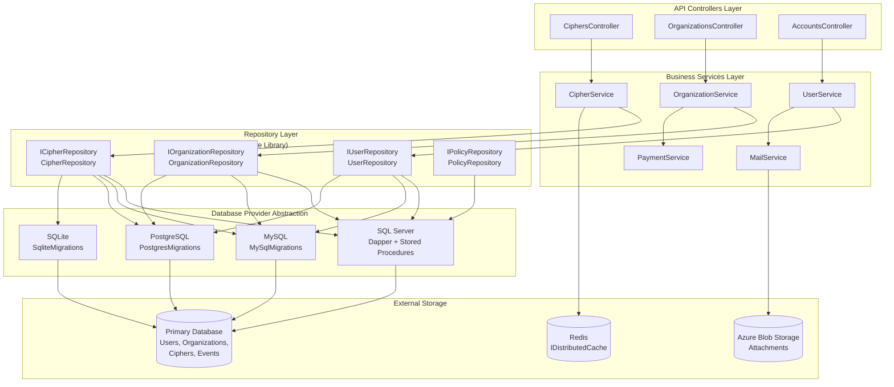

# System Architecture

<details>
<summary>Relevant source files</summary>

The following files were used as context for generating this wiki page:

- [bitwarden_license/src/Scim/Startup.cs](https://github.com/bitwarden/server/blob/39f38f50/bitwarden_license/src/Scim/Startup.cs)
- [bitwarden_license/src/Scim/Utilities/ApiKeyAuthenticationHandler.cs](https://github.com/bitwarden/server/blob/39f38f50/bitwarden_license/src/Scim/Utilities/ApiKeyAuthenticationHandler.cs)
- [bitwarden_license/src/Sso/Sso.csproj](https://github.com/bitwarden/server/blob/39f38f50/bitwarden_license/src/Sso/Sso.csproj)
- [src/Admin/Admin.csproj](https://github.com/bitwarden/server/blob/39f38f50/src/Admin/Admin.csproj)
- [src/Admin/Startup.cs](https://github.com/bitwarden/server/blob/39f38f50/src/Admin/Startup.cs)
- [src/Api/Api.csproj](https://github.com/bitwarden/server/blob/39f38f50/src/Api/Api.csproj)
- [src/Api/Startup.cs](https://github.com/bitwarden/server/blob/39f38f50/src/Api/Startup.cs)
- [src/Billing/Billing.csproj](https://github.com/bitwarden/server/blob/39f38f50/src/Billing/Billing.csproj)
- [src/Billing/Startup.cs](https://github.com/bitwarden/server/blob/39f38f50/src/Billing/Startup.cs)
- [src/Core/Core.csproj](https://github.com/bitwarden/server/blob/39f38f50/src/Core/Core.csproj)
- [src/Core/Utilities/CoreHelpers.cs](https://github.com/bitwarden/server/blob/39f38f50/src/Core/Utilities/CoreHelpers.cs)
- [src/Events/Events.csproj](https://github.com/bitwarden/server/blob/39f38f50/src/Events/Events.csproj)
- [src/Events/Startup.cs](https://github.com/bitwarden/server/blob/39f38f50/src/Events/Startup.cs)
- [src/EventsProcessor/EventsProcessor.csproj](https://github.com/bitwarden/server/blob/39f38f50/src/EventsProcessor/EventsProcessor.csproj)
- [src/EventsProcessor/Startup.cs](https://github.com/bitwarden/server/blob/39f38f50/src/EventsProcessor/Startup.cs)
- [src/Icons/Icons.csproj](https://github.com/bitwarden/server/blob/39f38f50/src/Icons/Icons.csproj)
- [src/Identity/Controllers/SsoController.cs](https://github.com/bitwarden/server/blob/39f38f50/src/Identity/Controllers/SsoController.cs)
- [src/Identity/Identity.csproj](https://github.com/bitwarden/server/blob/39f38f50/src/Identity/Identity.csproj)
- [src/Identity/IdentityServer/ApiResources.cs](https://github.com/bitwarden/server/blob/39f38f50/src/Identity/IdentityServer/ApiResources.cs)
- [src/Identity/Startup.cs](https://github.com/bitwarden/server/blob/39f38f50/src/Identity/Startup.cs)
- [src/Notifications/Notifications.csproj](https://github.com/bitwarden/server/blob/39f38f50/src/Notifications/Notifications.csproj)
- [src/Notifications/Startup.cs](https://github.com/bitwarden/server/blob/39f38f50/src/Notifications/Startup.cs)
- [test/Core.Test/Utilities/CoreHelpersTests.cs](https://github.com/bitwarden/server/blob/39f38f50/test/Core.Test/Utilities/CoreHelpersTests.cs)
- [util/Server/Program.cs](https://github.com/bitwarden/server/blob/39f38f50/util/Server/Program.cs)
- [util/Server/Server.csproj](https://github.com/bitwarden/server/blob/39f38f50/util/Server/Server.csproj)
- [util/Server/Startup.cs](https://github.com/bitwarden/server/blob/39f38f50/util/Server/Startup.cs)
- [util/Setup/Setup.csproj](https://github.com/bitwarden/server/blob/39f38f50/util/Setup/Setup.csproj)

</details>


The Bitwarden server implements a microservices architecture consisting of 9+ distinct services that all depend on a shared Core library. This page describes the high-level service architecture, service-to-service communication patterns, and the foundational role of the Core library. For project structure details, see [Project Structure and Build System](#1.2).

## Service Overview

The Bitwarden server consists of the following distinct services, each with its own `.csproj` file and `Startup.cs`:

| Service | Project Path | Primary Responsibility |
|---------|-------------|----------------------|
| **Api** | `src/Api/` | Main REST API gateway for vault operations, organizations, and user management |
| **Identity** | `src/Identity/` | OAuth2/OIDC provider using Duende IdentityServer for authentication and token issuance |
| **Billing** | `src/Billing/` | Payment processing, subscription management, webhook handling |
| **Admin** | `src/Admin/` | Administrative portal with web UI for system management |
| **Events** | `src/Events/` | Event collection API for audit logging |
| **EventsProcessor** | `src/EventsProcessor/` | Background processor consuming event queues |
| **Notifications** | `src/Notifications/` | SignalR hub for real-time push notifications |
| **Icons** | `src/Icons/` | Favicon retrieval service for vault items |
| **SSO** | `bitwarden_license/src/Sso/` | SAML 2.0 provider for enterprise single sign-on |
| **SCIM** | `bitwarden_license/src/Scim/` | SCIM 2.0 API for automated user provisioning |

All services support both cloud-hosted and self-hosted deployment models, with behavior controlled by `GlobalSettings.SelfHosted`.

**Complete Service Dependency Architecture**

```mermaid
graph TB
    subgraph External["External Clients"]
        Web["Web Vault"]
        Mobile["Mobile Apps"]
        Browser["Browser Extensions"]
        CLI["CLI Tools"]
    end
    
    subgraph Gateway["API Gateway Services"]
        Api["Api Service<br/>Bit.Api.Startup<br/>src/Api/"]
        Identity["Identity Service<br/>Bit.Identity.Startup<br/>src/Identity/"]
    end
    
    subgraph Domain["Domain Services"]
        Billing["Billing Service<br/>Bit.Billing.Startup<br/>src/Billing/"]
        Admin["Admin Service<br/>Bit.Admin.Startup<br/>src/Admin/"]
        Events["Events Service<br/>Bit.Events.Startup<br/>src/Events/"]
        Notifications["Notifications Service<br/>Bit.Notifications.Startup<br/>src/Notifications/"]
        Icons["Icons Service<br/>src/Icons/"]
        Sso["SSO Service<br/>Bit.Sso.Startup<br/>bitwarden_license/src/Sso/"]
        Scim["SCIM Service<br/>Bit.Scim.Startup<br/>bitwarden_license/src/Scim/"]
    end
    
    subgraph Background["Background Processors"]
        EventsProc["EventsProcessor<br/>Bit.EventsProcessor.Startup<br/>src/EventsProcessor/"]
        Jobs["JobsHostedService<br/>Scheduled Tasks"]
    end
    
    subgraph Foundation["Core Foundation"]
        Core["Core Library<br/>src/Core/Core.csproj<br/>Business Logic + Repositories + Integrations"]
        SharedWeb["SharedWeb Library<br/>src/SharedWeb/<br/>Web Utilities + Middleware"]
    end
    
    subgraph Data["Data Layer"]
        DB[("SQL Server/MySQL/PostgreSQL<br/>Primary Database")]
        Redis[("Redis<br/>Distributed Cache")]
        Azure[("Azure Blob Storage<br/>Attachments")]
        ServiceBus[("Azure Service Bus<br/>Message Queue")]
    end
    
    Web --> Api
    Mobile --> Api
    Browser --> Api
    CLI --> Api
    Web --> Identity
    Mobile --> Identity
    Browser --> Identity
    
    Api --> Core
    Identity --> Core
    Billing --> Core
    Admin --> Core
    Events --> Core
    Notifications --> SharedWeb
    Icons --> Core
    Sso --> Core
    Scim --> Core
    EventsProc --> Core
    Jobs --> Core
    
    Core --> SharedWeb
    Api --> SharedWeb
    Identity --> SharedWeb
    Billing --> SharedWeb
    Admin --> SharedWeb
    Events --> SharedWeb
    Sso --> SharedWeb
    Scim --> SharedWeb
    EventsProc --> SharedWeb
    
    Core --> DB
    Core --> Redis
    Core --> Azure
    Core --> ServiceBus
    Notifications --> Redis
    EventsProc --> ServiceBus
```



Sources: [src/Api/Api.csproj](https://github.com/bitwarden/server/blob/39f38f50/src/Api/Api.csproj), [src/Identity/Identity.csproj](https://github.com/bitwarden/server/blob/39f38f50/src/Identity/Identity.csproj), [src/Billing/Billing.csproj](https://github.com/bitwarden/server/blob/39f38f50/src/Billing/Billing.csproj), [src/Admin/Admin.csproj](https://github.com/bitwarden/server/blob/39f38f50/src/Admin/Admin.csproj), [src/Events/Events.csproj](https://github.com/bitwarden/server/blob/39f38f50/src/Events/Events.csproj), [src/EventsProcessor/EventsProcessor.csproj](https://github.com/bitwarden/server/blob/39f38f50/src/EventsProcessor/EventsProcessor.csproj), [src/Notifications/Notifications.csproj](https://github.com/bitwarden/server/blob/39f38f50/src/Notifications/Notifications.csproj), [src/Icons/Icons.csproj](https://github.com/bitwarden/server/blob/39f38f50/src/Icons/Icons.csproj), [bitwarden_license/src/Sso/Sso.csproj](https://github.com/bitwarden/server/blob/39f38f50/bitwarden_license/src/Sso/Sso.csproj), [src/Core/Core.csproj](https://github.com/bitwarden/server/blob/39f38f50/src/Core/Core.csproj)

## Core Library Foundation

The `Core` library ([src/Core/Core.csproj]()) is the architectural foundation that all services depend on. It contains:

**Three Primary Layers**:

1. **Service Layer** - Business logic implementations
   - `UserService`, `OrganizationService`, `CipherService`
   - `MailService` (with Handlebars templates), `PaymentService`
   - Two-factor authentication services (TOTP, Duo, FIDO2, YubiKey)

2. **Repository Layer** - Data access abstractions
   - `UserRepository`, `OrganizationRepository`, `CipherRepository`
   - `PolicyRepository`, `EventRepository`, etc.
   - Multi-database provider support (SQL Server, MySQL, PostgreSQL, SQLite)

3. **Integration Layer** - External system adapters
   - Payment gateways: `StripeAdapter`, Braintree, BitPay
   - Cloud services: `AWSServices` (SES/SQS), `AzureServices` (Blob/Queue/ServiceBus)
   - Feature flags: `LaunchDarkly` client
   - Email providers: SendGrid, AWS SES, SMTP

**Core Library Package Dependencies**

The Core library includes extensive external integrations:

```
Payment Processing:
- Stripe.net (45.14.0)
- Braintree (5.28.0)
- BitPay.Light (1.0.1907)

Authentication:
- Duende.IdentityServer (7.2.4)
- Microsoft.AspNetCore.Authentication.JwtBearer
- Fido2.AspNet (3.0.1)
- DuoUniversal (1.3.1)
- YubicoDotNetClient (1.2.0)
- Otp.NET (1.4.0)

Azure Services:
- Azure.Storage.Blobs, Azure.Storage.Queues
- Azure.Messaging.ServiceBus
- Azure.Data.Tables
- Microsoft.Azure.Cosmos

AWS Services:
- AWSSDK.SimpleEmail, AWSSDK.SQS

Caching & Messaging:
- Microsoft.Extensions.Caching.StackExchangeRedis
- RabbitMQ.Client (7.1.2)
- LaunchDarkly.ServerSdk (8.10.1)

Email & Notifications:
- MailKit (4.14.0)
- SendGrid (9.29.3)
- Handlebars.Net (2.1.6)

Job Scheduling:
- Quartz (3.14.0)
- Quartz.Extensions.Hosting
```

All services call `services.AddGlobalSettingsServices()`, `services.AddDatabaseRepositories()`, `services.AddBaseServices()`, and `services.AddDefaultServices()` in their `Startup.ConfigureServices()` to register Core dependencies.

Sources: [src/Core/Core.csproj:16-69](https://github.com/bitwarden/server/blob/39f38f50/src/Core/Core.csproj#L16-L69), [src/Api/Startup.cs:60-233](https://github.com/bitwarden/server/blob/39f38f50/src/Api/Startup.cs#L60-L233), [src/Identity/Startup.cs:34-168](https://github.com/bitwarden/server/blob/39f38f50/src/Identity/Startup.cs#L34-L168), [src/Billing/Startup.cs:34-131](https://github.com/bitwarden/server/blob/39f38f50/src/Billing/Startup.cs#L34-L131)

## Service-Specific Architectures

### Api Service

The primary REST API gateway handling vault operations, user management, and organization administration.

**Startup Configuration**: [src/Api/Startup.cs:60-235]()
- **Authorization Policies**: `Application`, `Web`, `Push`, `Licensing`, `Organization`, `Installation`, `Secrets`, `Send` [src/Api/Startup.cs:109-155]()
- **Rate Limiting**: `AspNetCoreRateLimit` with IP-based throttling (cloud only) [src/Api/Startup.cs:69-71, 256]()
- **Swagger/OpenAPI**: Enabled for development and self-hosted [src/Api/Startup.cs:300-326]()
- **Key Rotation Validators**: Cipher, Folder, Send, EmergencyAccess, OrganizationUser, WebAuthnLogin, Device [src/Api/Startup.cs:161-183]()
- **Middleware Pipeline**: SecurityHeaders → Rate Limiting → CurrentContext → Authentication → Authorization [src/Api/Startup.cs:248-282]()

### Identity Service

OAuth2/OIDC provider using Duende IdentityServer for authentication and token issuance.

**Startup Configuration**: [src/Identity/Startup.cs:34-168]()
- **IdentityServer**: Custom configuration via `AddCustomIdentityServerServices()` [src/Identity/Startup.cs:141]()
- **External SSO**: OpenID Connect integration for SSO service [src/Identity/Startup.cs:99-138]()
  - Authority: `globalSettings.BaseServiceUri.InternalSso`
  - Client: `oidc-identity` with `SsoTokenable` parameter passing
- **JWT Claims**: Built via `CoreHelpers.BuildIdentityClaims()` including organization roles, provider roles, and premium status [src/Core/Utilities/CoreHelpers.cs:710-804]()
- **Cookie Configuration**: Development mode allows SameSite=Unspecified [src/Identity/Startup.cs:80-90]()

### Billing Service

Payment processing and subscription management with webhook handlers for multiple payment gateways.

**Startup Configuration**: [src/Billing/Startup.cs:34-131]()
- **Stripe Configuration**: Global API key and retry settings [src/Billing/Startup.cs:45-46]()
- **Webhook Handlers**: Scoped services for each Stripe event type [src/Billing/Startup.cs:64-77]()
  - `ISubscriptionDeletedHandler`, `ISubscriptionUpdatedHandler`
  - `IUpcomingInvoiceHandler`, `IChargeSucceededHandler`, `IChargeRefundedHandler`
  - `IPaymentFailedHandler`, `IPaymentSucceededHandler`
- **IPN Clients**: PayPal IPN via `IPayPalIPNClient` [src/Billing/Startup.cs:58]()
- **Background Jobs**: Quartz.NET integration [src/Billing/Startup.cs:118-126]()

### Notifications Service

SignalR hub for real-time push notifications with Redis backplane.

**Startup Configuration**: [src/Notifications/Startup.cs:24-79]()
- **SignalR Hub**: MessagePack protocol with `ContractlessStandardResolver` [src/Notifications/Startup.cs:49-53]()
- **Redis Backplane**: StackExchange.Redis with `ChannelPrefix = "Notifications"` [src/Notifications/Startup.cs:54-61]()
- **Hub Endpoints**: `/hub` (authenticated), `/anonymous-hub` (anonymous) [src/Notifications/Startup.cs:118-128]()
- **User ID Provider**: `SubjectUserIdProvider` for mapping authenticated users [src/Notifications/Startup.cs:62]()

Sources: [src/Api/Startup.cs](https://github.com/bitwarden/server/blob/39f38f50/src/Api/Startup.cs), [src/Identity/Startup.cs](https://github.com/bitwarden/server/blob/39f38f50/src/Identity/Startup.cs), [src/Billing/Startup.cs](https://github.com/bitwarden/server/blob/39f38f50/src/Billing/Startup.cs), [src/Notifications/Startup.cs](https://github.com/bitwarden/server/blob/39f38f50/src/Notifications/Startup.cs)

## Service Communication Patterns

**Service Dependency Matrix**

| Service | Core Library | Database | Distributed Cache | Message Queue | Background Jobs | External APIs |
|---------|--------------|----------|-------------------|---------------|-----------------|---------------|
| Api | ✓ | ✓ (via Core) | ✓ | - | ✓ (`JobsHostedService`) | Stripe, Event Grid |
| Identity | ✓ | ✓ (via Core) | ✓ | ✓ (`ApplicationCacheHostedService`) | - | SSO Service (internal) |
| Billing | ✓ | ✓ (via Core) | ✓ | - | ✓ (Quartz) | Stripe, PayPal, BitPay |
| Admin | ✓ | ✓ (via Core) | ✓ | - | ✓ (`JobsHostedService`) | - |
| Events | ✓ | ✓ (via Core) | - | ✓ (RabbitMQ) | - | - |
| EventsProcessor | ✓ | ✓ (via Core) | - | ✓ (Azure Service Bus) | - | - |
| Notifications | SharedWeb only | - | ✓ (Redis backplane) | ✓ (Azure Queue) | - | Azure Notification Hubs |
| Icons | ✓ | - | - | - | - | External websites |
| SSO | ✓ | ✓ (via Core) | - | - | - | External IdPs (SAML) |
| SCIM | ✓ | ✓ (via Core) | ✓ | - | - | - |

**Shared Service Registration Pattern**

All services follow a consistent registration pattern in `Startup.ConfigureServices()`:

1. **Global Settings**: `services.AddGlobalSettingsServices(Configuration, Environment)`
2. **Data Protection**: `services.AddCustomDataProtectionServices(Environment, globalSettings)`
3. **Repositories**: `services.AddDatabaseRepositories(globalSettings)`
4. **Current Context**: `services.AddScoped<ICurrentContext, CurrentContext>()`
5. **Core Services**: `services.AddBaseServices(globalSettings)` + `services.AddDefaultServices(globalSettings)`
6. **Caching** (if needed): `services.AddDistributedCache(globalSettings)`

This pattern ensures consistent dependency injection across all services.

**Authentication and Authorization Flow**

```mermaid
sequenceDiagram
    participant Client
    participant Identity["Identity Service<br/>Bit.Identity.Startup"]
    participant Api["Api Service<br/>Bit.Api.Startup"]
    participant Core["Core Library<br/>UserService"]
    participant DB[("SQL Database")]
    
    Client->>Identity: "POST /connect/token"
    Identity->>Core: "ValidateCredentials()"
    Core->>DB: "GetUserByEmail()"
    DB-->>Core: "User entity"
    Core->>Core: "VerifyMasterPasswordHash()"
    Core->>Core: "Check 2FA Requirements"
    Core-->>Identity: "User + Organizations + Providers"
    Identity->>Identity: "CoreHelpers.BuildIdentityClaims()<br/>Build JWT claims"
    Identity-->>Client: "JWT access_token + refresh_token"
    
    Client->>Api: "GET /api/ciphers<br/>Authorization: Bearer {token}"
    Api->>Api: "JwtBearerAuthentication.ValidateToken()"
    Api->>Api: "CurrentContextMiddleware<br/>Populate ICurrentContext"
    Api->>Api: "AuthorizationPolicy.Application<br/>Verify claims"
    Api->>Core: "CipherService.GetByUserId()"
    Core->>DB: "CipherRepository.GetManyByUserId()"
    DB-->>Core: "Cipher[] entities"
    Core-->>Api: "CipherDetails[] DTOs"
    Api-->>Client: "200 OK + JSON response"
```

The Identity service generates JWTs containing claims built by `CoreHelpers.BuildIdentityClaims()` [src/Core/Utilities/CoreHelpers.cs:710-804](), which include:
- User information: `email`, `email_verified`, `name`, `premium`, `sstamp` (security stamp)
- Organization roles: `orgowner`, `orgadmin`, `orguser`, `orgcustom` with organization IDs
- Custom permissions for `OrganizationUserType.Custom` users
- Provider roles: `providerprovideradmin`, `providerserviceuser`
- Secrets Manager access: `secretsmanageraccess`

The Api service validates these tokens and enforces authorization policies defined in [src/Api/Startup.cs:109-155]().

Sources: [src/Api/Startup.cs:105-156, 277-278](https://github.com/bitwarden/server/blob/39f38f50/src/Api/Startup.cs#L105-L156, 277-278), [src/Identity/Startup.cs:94-141](https://github.com/bitwarden/server/blob/39f38f50/src/Identity/Startup.cs#L94-L141), [src/Core/Utilities/CoreHelpers.cs:710-804](https://github.com/bitwarden/server/blob/39f38f50/src/Core/Utilities/CoreHelpers.cs#L710-L804), [src/Identity/Controllers/SsoController.cs:79-226](https://github.com/bitwarden/server/blob/39f38f50/src/Identity/Controllers/SsoController.cs#L79-L226)

## Data Layer Architecture

**Repository Pattern and Data Flow**



**Database Provider Registration**

Services call `services.AddDatabaseRepositories(globalSettings)` which:
1. Determines provider from `GlobalSettings.DatabaseProvider` (enum: `SqlServer`, `MySql`, `Postgres`, `Sqlite`)
2. Registers provider-specific repository implementations
3. Returns the selected provider for migration logic [src/Admin/Startup.cs:51-68]()

**Distributed Caching**

All services except EventsProcessor and Icons register distributed cache via `services.AddDistributedCache(globalSettings)`:
- **Redis**: Primary implementation using `StackExchangeRedis` [src/Core/Core.csproj:63]()
- **SQL Server**: Alternative using `Microsoft.Extensions.Caching.SqlServer` [src/Core/Core.csproj:45]()
- **Cosmos DB**: Cloud option using `Microsoft.Extensions.Caching.Cosmos` [src/Core/Core.csproj:44]()

Cache is used for session data, rate limiting, and temporary authentication tokens.

Sources: [src/Core/Core.csproj:23-66](https://github.com/bitwarden/server/blob/39f38f50/src/Core/Core.csproj#L23-L66), [src/Admin/Startup.cs:51-68](https://github.com/bitwarden/server/blob/39f38f50/src/Admin/Startup.cs#L51-L68), [src/Api/Startup.cs:87-95](https://github.com/bitwarden/server/blob/39f38f50/src/Api/Startup.cs#L87-L95), [src/Billing/Startup.cs:52, 86](https://github.com/bitwarden/server/blob/39f38f50/src/Billing/Startup.cs#L52, 86)

## Technology Stack Summary

**Runtime and Framework**
- **.NET 8.0**: Target framework for all projects via `Directory.Build.props`
- **ASP.NET Core**: Web framework with MVC pattern
- **Duende IdentityServer 7.2.4**: OAuth2/OIDC provider [src/Core/Core.csproj:55]()

**Database and Storage**
- **SQL Databases**: SQL Server (primary), MySQL, PostgreSQL, SQLite
- **Azure Cosmos DB**: Alternative NoSQL option [src/Core/Core.csproj:39]()
- **Azure Blob Storage**: Attachment storage [src/Core/Core.csproj:30]()
- **Azure Tables**: Structured storage [src/Core/Core.csproj:26]()
- **Redis**: Distributed cache via StackExchangeRedis [src/Core/Core.csproj:63]()

**Message Queuing**
- **Azure Service Bus**: Cloud message queue [src/Core/Core.csproj:29]()
- **Azure Storage Queues**: Alternative queue [src/Core/Core.csproj:31]()
- **RabbitMQ**: Self-hosted message broker [src/Core/Core.csproj:68]()

**Payment Gateways**
- **Stripe.net 45.14.0**: Primary payment processor [src/Core/Core.csproj:60]()
- **Braintree 5.28.0**: Legacy PayPal integration [src/Core/Core.csproj:59]()
- **BitPay.Light**: Cryptocurrency payments [src/Core/Core.csproj:32]()

**Email and Notifications**
- **MailKit 4.14.0**: SMTP client [src/Core/Core.csproj:37]()
- **SendGrid 9.29.3**: Cloud email service [src/Core/Core.csproj:50]()
- **AWS SES/SQS**: Alternative email via AWSSDK [src/Core/Core.csproj:24-25]()
- **SignalR**: Real-time notifications [src/Notifications/Notifications.csproj:10-11]()

**Authentication Methods**
- **TOTP**: Otp.NET [src/Core/Core.csproj:61]()
- **WebAuthn/FIDO2**: Fido2.AspNet [src/Core/Core.csproj:35]()
- **Duo**: DuoUniversal [src/Core/Core.csproj:33]()
- **YubiKey**: YubicoDotNetClient [src/Core/Core.csproj:62]()

**Background Processing**
- **Quartz.NET 3.14.0**: Job scheduling [src/Core/Core.csproj:65-67]()
- **Hosted Services**: Long-running background tasks

**Development Tools**
- **Serilog**: Structured logging [src/Core/Core.csproj:51-54, 57]()
- **Swashbuckle**: OpenAPI/Swagger generation [src/Api/Api.csproj:37]()
- **AspNetCoreRateLimit**: IP-based throttling [src/Core/Core.csproj:23, 58]()
- **LaunchDarkly 8.10.1**: Feature flags [src/Core/Core.csproj:64]()

Sources: [src/Core/Core.csproj:16-69](https://github.com/bitwarden/server/blob/39f38f50/src/Core/Core.csproj#L16-L69), [src/Api/Api.csproj:34-38](https://github.com/bitwarden/server/blob/39f38f50/src/Api/Api.csproj#L34-L38), [src/Notifications/Notifications.csproj:10-16](https://github.com/bitwarden/server/blob/39f38f50/src/Notifications/Notifications.csproj#L10-L16)

## Deployment Architecture

The system supports both cloud-hosted and self-hosted deployment models:

**Self-Hosted Configuration**:
- Path-based routing (e.g., `/admin`, `/identity`)
- Forwarded headers support for reverse proxy scenarios
- Simplified authentication and reduced external dependencies
- Local certificate management

**Cloud-Hosted Configuration**:
- Subdomain-based routing
- Full external service integration
- Azure-specific services (Service Bus, Blob Storage, etc.)
- Advanced monitoring and telemetry

The `GlobalSettings` class and environment-specific configuration drive the deployment behavior, with feature flags controlling cloud vs. self-hosted functionality throughout the codebase.