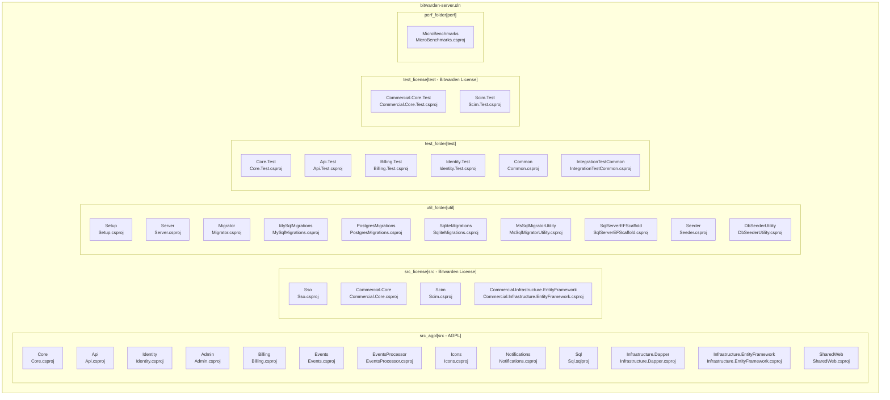
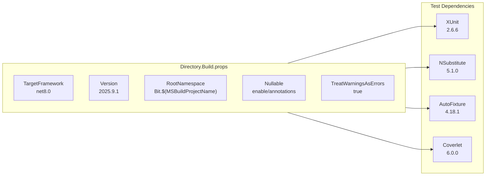
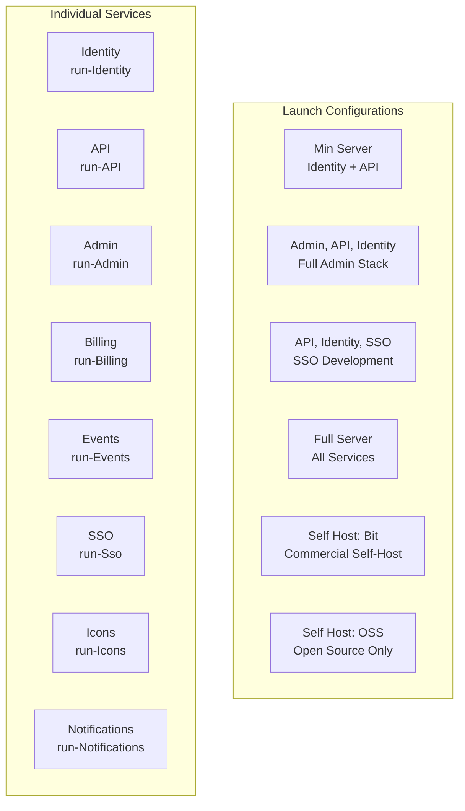
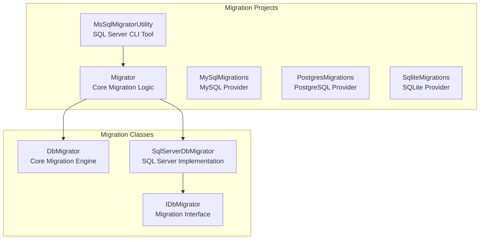
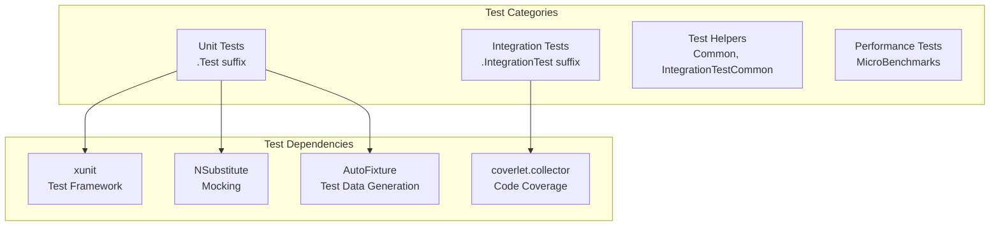

# Project Structure

<details>
<summary>Relevant source files</summary>

The following files were used as context for generating this wiki page:

- [Directory.Build.props](https://github.com/bitwarden/server/blob/39f38f50/Directory.Build.props)
- [bitwarden_license/src/Sso/Sso.csproj](https://github.com/bitwarden/server/blob/39f38f50/bitwarden_license/src/Sso/Sso.csproj)
- [src/Admin/Admin.csproj](https://github.com/bitwarden/server/blob/39f38f50/src/Admin/Admin.csproj)
- [src/Api/Api.csproj](https://github.com/bitwarden/server/blob/39f38f50/src/Api/Api.csproj)
- [src/Billing/Billing.csproj](https://github.com/bitwarden/server/blob/39f38f50/src/Billing/Billing.csproj)
- [src/Core/Core.csproj](https://github.com/bitwarden/server/blob/39f38f50/src/Core/Core.csproj)
- [src/Core/Utilities/AssemblyHelpers.cs](https://github.com/bitwarden/server/blob/39f38f50/src/Core/Utilities/AssemblyHelpers.cs)
- [src/Events/Events.csproj](https://github.com/bitwarden/server/blob/39f38f50/src/Events/Events.csproj)
- [src/EventsProcessor/EventsProcessor.csproj](https://github.com/bitwarden/server/blob/39f38f50/src/EventsProcessor/EventsProcessor.csproj)
- [src/Icons/Icons.csproj](https://github.com/bitwarden/server/blob/39f38f50/src/Icons/Icons.csproj)
- [src/Identity/Identity.csproj](https://github.com/bitwarden/server/blob/39f38f50/src/Identity/Identity.csproj)
- [src/Notifications/Notifications.csproj](https://github.com/bitwarden/server/blob/39f38f50/src/Notifications/Notifications.csproj)
- [test/Api.Test/Api.Test.csproj](https://github.com/bitwarden/server/blob/39f38f50/test/Api.Test/Api.Test.csproj)
- [test/Common/Common.csproj](https://github.com/bitwarden/server/blob/39f38f50/test/Common/Common.csproj)
- [test/Core.Test/Core.Test.csproj](https://github.com/bitwarden/server/blob/39f38f50/test/Core.Test/Core.Test.csproj)
- [test/Core.Test/Utilities/AssemblyHelpersTests.cs](https://github.com/bitwarden/server/blob/39f38f50/test/Core.Test/Utilities/AssemblyHelpersTests.cs)
- [test/Identity.Test/Identity.Test.csproj](https://github.com/bitwarden/server/blob/39f38f50/test/Identity.Test/Identity.Test.csproj)
- [util/Migrator/DbUpLogger.cs](https://github.com/bitwarden/server/blob/39f38f50/util/Migrator/DbUpLogger.cs)
- [util/Migrator/Migrator.csproj](https://github.com/bitwarden/server/blob/39f38f50/util/Migrator/Migrator.csproj)
- [util/Server/Server.csproj](https://github.com/bitwarden/server/blob/39f38f50/util/Server/Server.csproj)
- [util/Setup/Setup.csproj](https://github.com/bitwarden/server/blob/39f38f50/util/Setup/Setup.csproj)

</details>


This document provides an overview of the Bitwarden server repository's solution structure, build configuration, and development environment setup. It covers the physical organization of projects, build system configuration, and development workflows.

For information about the high-level microservices architecture and service dependencies, see [Architecture Overview](#1.1). For deployment and operational procedures, see [Deployment and Operations](#11).

## Solution Organization

The Bitwarden server repository is organized as a single Visual Studio solution containing multiple projects grouped by licensing and functional categories.

### Solution Structure Diagram



Sources: [bitwarden-server.sln:1-405](https://github.com/bitwarden/server/blob/39f38f50/bitwarden-server.sln#L1-L405)

### Project Categories

| Category | Purpose | Examples |
|----------|---------|----------|
| **Core Services** | Primary application services | `Api`, `Identity`, `Admin`, `Billing` |
| **Infrastructure** | Data access and shared infrastructure | `Core`, `Infrastructure.Dapper`, `SharedWeb` |
| **Commercial** | Licensed commercial features | `Sso`, `Commercial.Core`, `Scim` |
| **Utilities** | Development and deployment tools | `Migrator`, `Setup`, `MsSqlMigratorUtility` |
| **Tests** | Unit, integration, and performance tests | `Core.Test`, `Api.Test`, `MicroBenchmarks` |

Sources: [bitwarden-server.sln:6-401](https://github.com/bitwarden/server/blob/39f38f50/bitwarden-server.sln#L6-L401)

## Build Configuration

The solution uses MSBuild with centralized configuration through `Directory.Build.props` for consistent build settings across all projects.

### Global Build Properties



Key build configurations:
- **Target Framework**: .NET 8.0 for all projects
- **Versioning**: Centralized version `2025.9.1` with Git hash metadata
- **Nullable Reference Types**: Enabled for production code, annotations-only for tests  
- **Root Namespace**: Auto-generated as `Bit.{ProjectName}`
- **Code Quality**: Warnings treated as errors by default

Sources: [Directory.Build.props:1-50](https://github.com/bitwarden/server/blob/39f38f50/Directory.Build.props#L1-L50)

### Git Integration

The build system automatically embeds Git commit information:

```xml
<Target Name="SetSourceRevisionId" BeforeTargets="CoreGenerateAssemblyInfo">
  <Exec Command="git describe --long --always --dirty --exclude=* --abbrev=8" />
</Target>
```

Sources: [Directory.Build.props:37-49](https://github.com/bitwarden/server/blob/39f38f50/Directory.Build.props#L37-L49)

## Development Environment

The repository includes comprehensive development environment configuration for Visual Studio Code.

### Development Service Combinations



Sources: [.vscode/launch.json:6-272](https://github.com/bitwarden/server/blob/39f38f50/.vscode/launch.json#L6-L272)

### Build Tasks

The development environment includes automated build tasks:

| Task | Purpose | Dependencies |
|------|---------|--------------|
| `buildIdentityApi` | Minimal development setup | Identity, API |
| `buildFullServer` | Complete service stack | All services |
| `buildSelfHostBit` | Self-hosted commercial | Licensed services |
| `buildSelfHostOss` | Self-hosted OSS | Open source services only |

Sources: [.vscode/tasks.json:1-280](https://github.com/bitwarden/server/blob/39f38f50/.vscode/tasks.json#L1-L280)

### Port Configuration

| Service | Cloud Port | Self-Host Port | Purpose |
|---------|------------|----------------|---------|
| Identity | Default | 33657 | Authentication service |
| API | Default | 4001 | Primary API gateway |
| Admin | Default | 62912 | Administrative interface |
| SSO | Default | 51822 | Single sign-on |
| Notifications | Default | 61841 | Real-time notifications |
| Events | Default | 46274 | Event collection |

Sources: [.vscode/launch.json:460-596](https://github.com/bitwarden/server/blob/39f38f50/.vscode/launch.json#L460-L596)

## Database Migration System

The solution includes a comprehensive database migration system supporting multiple database providers.

### Migration Architecture



Key migration components:
- **DbMigrator**: Core migration engine using DbUp framework
- **SqlServerDbMigrator**: SQL Server-specific implementation  
- **Provider Projects**: Database-specific migration projects
- **CLI Utilities**: Command-line migration tools

Sources: [util/Migrator/DbMigrator.cs:1-205](https://github.com/bitwarden/server/blob/39f38f50/util/Migrator/DbMigrator.cs#L1-L205), [util/Migrator/SqlServerDbMigrator.cs:1-23](https://github.com/bitwarden/server/blob/39f38f50/util/Migrator/SqlServerDbMigrator.cs#L1-L23), [util/MsSqlMigratorUtility/Program.cs:1-45](https://github.com/bitwarden/server/blob/39f38f50/util/MsSqlMigratorUtility/Program.cs#L1-L45)

## Test Organization

The test projects follow a consistent naming convention and structure across the solution.

### Test Project Structure



Test project characteristics:
- **Naming Convention**: `{ServiceName}.Test` for unit tests, `{ServiceName}.IntegrationTest` for integration tests
- **Shared Dependencies**: All test projects use common test framework versions from `Directory.Build.props`
- **Helper Projects**: `Common` and `IntegrationTestCommon` provide shared test utilities
- **Automatic Detection**: Test projects are automatically detected by name suffix

Sources: [Directory.Build.props:12-33](https://github.com/bitwarden/server/blob/39f38f50/Directory.Build.props#L12-L33), [test/Common/Common.csproj:1-23](https://github.com/bitwarden/server/blob/39f38f50/test/Common/Common.csproj#L1-L23), [test/Core.Test/Core.Test.csproj:1-33](https://github.com/bitwarden/server/blob/39f38f50/test/Core.Test/Core.Test.csproj#L1-L33)

## Development Utilities

The solution includes several utility projects for development and deployment workflows.

### Utility Project Overview

| Project | Purpose | Type |
|---------|---------|------|
| `Setup` | Installation and configuration | Console App |
| `Server` | Development server host | Console App |
| `Seeder` | Test data generation | Library |
| `DbSeederUtility` | Database seeding CLI | Console App |
| `SqlServerEFScaffold` | Entity Framework scaffolding | Console App |

These utilities support various development workflows including database setup, test data generation, and Entity Framework model generation.