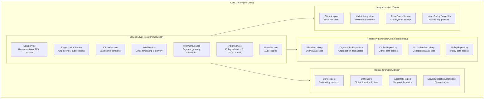
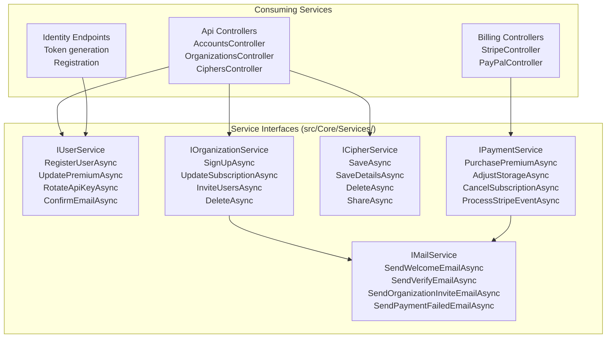
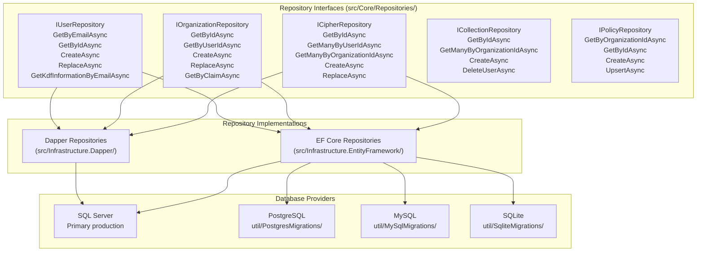
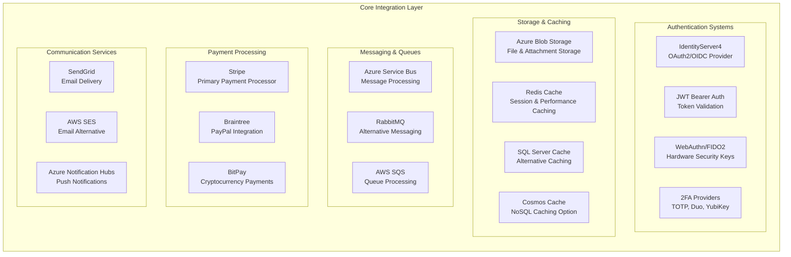

# Core Infrastructure

Relevant source files

The following files were used as context for generating this wiki page:

- [bitwarden_license/src/Sso/Sso.csproj](https://github.com/bitwarden/server/blob/39f38f50/bitwarden_license/src/Sso/Sso.csproj)
- [src/Admin/Admin.csproj](https://github.com/bitwarden/server/blob/39f38f50/src/Admin/Admin.csproj)
- [src/Api/Api.csproj](https://github.com/bitwarden/server/blob/39f38f50/src/Api/Api.csproj)
- [src/Billing/Billing.csproj](https://github.com/bitwarden/server/blob/39f38f50/src/Billing/Billing.csproj)
- [src/Core/Core.csproj](https://github.com/bitwarden/server/blob/39f38f50/src/Core/Core.csproj)
- [src/Events/Events.csproj](https://github.com/bitwarden/server/blob/39f38f50/src/Events/Events.csproj)
- [src/EventsProcessor/EventsProcessor.csproj](https://github.com/bitwarden/server/blob/39f38f50/src/EventsProcessor/EventsProcessor.csproj)
- [src/Icons/Icons.csproj](https://github.com/bitwarden/server/blob/39f38f50/src/Icons/Icons.csproj)
- [src/Identity/Identity.csproj](https://github.com/bitwarden/server/blob/39f38f50/src/Identity/Identity.csproj)
- [src/Notifications/Notifications.csproj](https://github.com/bitwarden/server/blob/39f38f50/src/Notifications/Notifications.csproj)
- [util/Server/Server.csproj](https://github.com/bitwarden/server/blob/39f38f50/util/Server/Server.csproj)
- [util/Setup/Setup.csproj](https://github.com/bitwarden/server/blob/39f38f50/util/Setup/Setup.csproj)

## Purpose and Scope

The Core Infrastructure consists of the `Core` library (`src/Core/Core.csproj`) that serves as the foundational dependency for all Bitwarden services. It provides shared business logic, data access abstractions, external service integrations, and common utilities. Every service in the Bitwarden architecture (Api, Identity, Billing, Admin, Events, Notifications, Icons, SSO, SCIM) depends on Core for consistent functionality.

The Core library is organized into three primary layers:
- **Service Layer**: Business logic implementations for users, organizations, ciphers, payments, and mail
- **Repository Layer**: Data access contracts and implementations for multiple database providers
- **Integration Layer**: Adapters for external systems (payment gateways, cloud services, email providers)

For details on how Core services are consumed, see [User Management](#5), [Organization Management](#6), [Vault and Cipher Management](#7), and [Billing and Payments](#8). For deployment infrastructure, see [Deployment and Operations](#12).

## Core Library Architecture

The Core library is structured in distinct layers with clear separation of concerns. The following diagram maps the conceptual layers to actual code directories and key classes:

### Package Dependencies

The Core library defines extensive external dependencies in [src/Core/Core.csproj:16-69](). Key dependency categories:

| Category | Key Packages | Purpose |
|----------|--------------|---------|
| **Authentication** | `Duende.IdentityServer` (v7.2.4), `Microsoft.AspNetCore.Authentication.JwtBearer`, `Fido2.AspNet` | OAuth2/OIDC provider, JWT validation, WebAuthn support |
| **Payment Gateways** | `Stripe.net` (v45.14.0), `Braintree` (v5.28.0), `BitPay.Light` | Payment processing integrations |
| **Cloud Services** | `Azure.Storage.Blobs`, `Azure.Storage.Queues`, `Azure.Messaging.ServiceBus`, `AWSSDK.SimpleEmail`, `AWSSDK.SQS` | Cloud storage and messaging |
| **Caching** | `Microsoft.Extensions.Caching.StackExchangeRedis`, `Microsoft.Extensions.Caching.SqlServer`, `Microsoft.Extensions.Caching.Cosmos` | Multi-provider caching support |
| **Email** | `MailKit` (v4.14.0), `SendGrid` (v9.29.3), `Handlebars.Net` (v2.1.6) | Email delivery and templating |
| **2FA Providers** | `Otp.NET`, `DuoUniversal`, `YubicoDotNetClient` | Two-factor authentication |
| **Feature Flags** | `LaunchDarkly.ServerSdk` (v8.10.1) | Feature toggle management |
| **Background Jobs** | `Quartz` (v3.14.0), `Quartz.Extensions.Hosting` | Scheduled task execution |
| **Logging** | `Serilog.AspNetCore`, `Sentry.Serilog` | Structured logging and error tracking |

**Sources:** [src/Core/Core.csproj:16-69](https://github.com/bitwarden/server/blob/39f38f50/src/Core/Core.csproj#L16-L69)

## Service Layer Components

The Core service layer provides business logic implementations that all services consume. Key service interfaces and their responsibilities:

Service implementations handle complex business workflows including validation, authorization checks, audit logging, and coordination across multiple repositories and external services.

**Sources:** [src/Core/Core.csproj:1-84](https://github.com/bitwarden/server/blob/39f38f50/src/Core/Core.csproj#L1-L84)

## Repository Pattern and Data Access

The Core library defines repository interfaces in `src/Core/Repositories/` that abstract data access across multiple database providers. Each repository provides both standard CRUD operations and domain-specific query methods.

The repository pattern provides two implementation strategies:
- **Dapper-based** (`src/Infrastructure.Dapper/`): Uses stored procedures for SQL Server, optimized for performance
- **Entity Framework Core** (`src/Infrastructure.EntityFramework/`): Cross-database support for PostgreSQL, MySQL, and SQLite

**Sources:** [src/Core/Core.csproj:1-84](https://github.com/bitwarden/server/blob/39f38f50/src/Core/Core.csproj#L1-L84), [util/PostgresMigrations/Migrations/DatabaseContextModelSnapshot.cs:1-30](https://github.com/bitwarden/server/blob/39f38f50/util/PostgresMigrations/Migrations/DatabaseContextModelSnapshot.cs#L1-L30), [util/MySqlMigrations/Migrations/DatabaseContextModelSnapshot.cs:1-30](https://github.com/bitwarden/server/blob/39f38f50/util/MySqlMigrations/Migrations/DatabaseContextModelSnapshot.cs#L1-L30), [util/SqliteMigrations/Migrations/DatabaseContextModelSnapshot.cs:1-30](https://github.com/bitwarden/server/blob/39f38f50/util/SqliteMigrations/Migrations/DatabaseContextModelSnapshot.cs#L1-L30)

## Service Dependencies on Core

Every Bitwarden service declares a project reference to the Core library, inheriting all its dependencies and registering Core services through dependency injection.

```mermaid
graph TB
    subgraph Services["All Services Reference Core"]
        Api["Api<br/>src/Api/Api.csproj<br/>ProjectReference: Core + SharedWeb"]
        Identity["Identity<br/>src/Identity/Identity.csproj<br/>ProjectReference: Core + SharedWeb"]
        Billing["Billing<br/>src/Billing/Billing.csproj<br/>ProjectReference: Core + SharedWeb"]
        Admin["Admin<br/>src/Admin/Admin.csproj<br/>ProjectReference: Core + SharedWeb"]
        Events["Events<br/>src/Events/Events.csproj<br/>ProjectReference: Core + SharedWeb"]
        Notifications["Notifications<br/>src/Notifications/Notifications.csproj<br/>ProjectReference: Core + SharedWeb"]
        Icons["Icons<br/>src/Icons/Icons.csproj<br/>ProjectReference: Core + SharedWeb"]
        EventsProcessor["EventsProcessor<br/>src/EventsProcessor/EventsProcessor.csproj<br/>ProjectReference: Core + SharedWeb"]
        Sso["SSO<br/>bitwarden_license/src/Sso/Sso.csproj<br/>ProjectReference: Core + SharedWeb"]
    end
    
    subgraph CoreInfra["Core Infrastructure"]
        CoreLib["Core Library<br/>src/Core/Core.csproj<br/>Business logic, repositories, integrations"]
        SharedWeb["SharedWeb<br/>Web middleware, filters, utilities"]
    end
    
    Api --> CoreLib
    Api --> SharedWeb
    Identity --> CoreLib
    Identity --> SharedWeb
    Billing --> CoreLib
    Billing --> SharedWeb
    Admin --> CoreLib
    Admin --> SharedWeb
    Events --> CoreLib
    Events --> SharedWeb
    Notifications --> CoreLib
    Notifications --> SharedWeb
    Icons --> CoreLib
    Icons --> SharedWeb
    EventsProcessor --> CoreLib
    EventsProcessor --> SharedWeb
    Sso --> CoreLib
    Sso --> SharedWeb
```

### Dependency Injection Registration

Each service's `Startup.cs` calls `ServiceCollectionExtensions` methods from Core to register shared dependencies:

| Extension Method | Purpose | Key Services Registered |
|------------------|---------|------------------------|
| `AddBaseServices()` | Core infrastructure | Logging, caching, configuration |
| `AddDefaultServices()` | Business services | `IUserService`, `IOrganizationService`, `ICipherService` |
| `AddRepositories()` | Data access | `IUserRepository`, `IOrganizationRepository`, `ICipherRepository` |
| `AddSqlServerRepositories()` | SQL Server repos | Dapper-based implementations |
| `AddEntityFrameworkRepositories()` | EF Core repos | Multi-database implementations |

**Sources:** [src/Api/Api.csproj:19-22](https://github.com/bitwarden/server/blob/39f38f50/src/Api/Api.csproj#L19-L22), [src/Identity/Identity.csproj:10-13](https://github.com/bitwarden/server/blob/39f38f50/src/Identity/Identity.csproj#L10-L13), [src/Billing/Billing.csproj:8-12](https://github.com/bitwarden/server/blob/39f38f50/src/Billing/Billing.csproj#L8-L12), [src/Admin/Admin.csproj:9-16](https://github.com/bitwarden/server/blob/39f38f50/src/Admin/Admin.csproj#L9-L16), [src/Events/Events.csproj:10-13](https://github.com/bitwarden/server/blob/39f38f50/src/Events/Events.csproj#L10-L13), [src/Notifications/Notifications.csproj:18-21](https://github.com/bitwarden/server/blob/39f38f50/src/Notifications/Notifications.csproj#L18-L21), [src/Icons/Icons.csproj:17-20](https://github.com/bitwarden/server/blob/39f38f50/src/Icons/Icons.csproj#L17-L20), [src/EventsProcessor/EventsProcessor.csproj:8-11](https://github.com/bitwarden/server/blob/39f38f50/src/EventsProcessor/EventsProcessor.csproj#L8-L11), [bitwarden_license/src/Sso/Sso.csproj:16-19](https://github.com/bitwarden/server/blob/39f38f50/bitwarden_license/src/Sso/Sso.csproj#L16-L19)

## Core Utilities and Helpers

The Core library provides several utility classes that offer shared functionality across all services.

### StaticStore

The `StaticStore` class (`src/Core/Utilities/StaticStore.cs`) provides in-memory access to global configuration data:

| Property | Type | Purpose | Data Source |
|----------|------|---------|-------------|
| `GlobalDomains` | `IEnumerable<GlobalEquivalentDomainsType>` | Domain equivalency for login matching | 96 predefined domain groups |
| `Plans` | `Dictionary<PlanType, Plan>` | Subscription plan definitions | Hardcoded plan configurations |
| `SponsoredPlans` | `Dictionary<PlanType, PlanSponsorshipType>` | Sponsorship mapping | Links enterprise orgs to family plans |

The `GlobalDomains` property enables unified login detection across related domains (e.g., google.com, youtube.com, gmail.com are treated as equivalent).

### CoreHelpers

The `CoreHelpers` static class provides utility methods for common operations:
- Password hashing and validation
- Random string generation
- Email address validation
- URL parsing and sanitization
- DateTime utilities
- GUID generation

### AssemblyHelpers

The `AssemblyHelpers` class provides version information for telemetry and diagnostics:
- `GetVersion()`: Returns semantic version from assembly
- `GetGitHash()`: Returns Git commit hash if available
- `GetAssemblyDate()`: Returns build timestamp

**Sources:** [src/Core/Utilities/StaticStore.cs:1-165](https://github.com/bitwarden/server/blob/39f38f50/src/Core/Utilities/StaticStore.cs#L1-L165)

## Embedded Resources

The Core library embeds several critical resources directly in the assembly:

| Resource Type | Location | Purpose |
|--------------|----------|---------|
| Licensing Certificates | `licensing.cer`, `licensing_dev.cer` | License validation for self-hosted deployments |
| Email Templates | `MailTemplates/Handlebars/**/*.hbs` | Handlebars templates for transactional emails |

These embedded resources are configured in [src/Core/Core.csproj:16-20]() and accessed at runtime through `Assembly.GetManifestResourceStream()`.

**Sources:** [src/Core/Core.csproj:16-20](https://github.com/bitwarden/server/blob/39f38f50/src/Core/Core.csproj#L16-L20)

## Infrastructure Integration Points

The Core system integrates with numerous external services and infrastructure components to provide comprehensive functionality:

These integrations are configured through the dependency injection system and can be swapped based on deployment requirements and feature flags.

**Sources:** [src/Core/Core.csproj:16-67](https://github.com/bitwarden/server/blob/39f38f50/src/Core/Core.csproj#L16-L67), [bitwarden_license/src/Sso/Sso.csproj:1-22](https://github.com/bitwarden/server/blob/39f38f50/bitwarden_license/src/Sso/Sso.csproj#L1-L22), [util/Setup/Setup.csproj:1-23](https://github.com/bitwarden/server/blob/39f38f50/util/Setup/Setup.csproj#L1-L23), [util/Server/Server.csproj:1-9](https://github.com/bitwarden/server/blob/39f38f50/util/Server/Server.csproj#L1-L9)