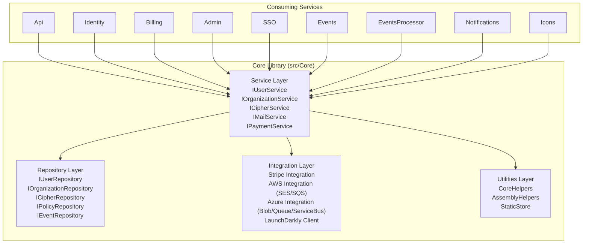
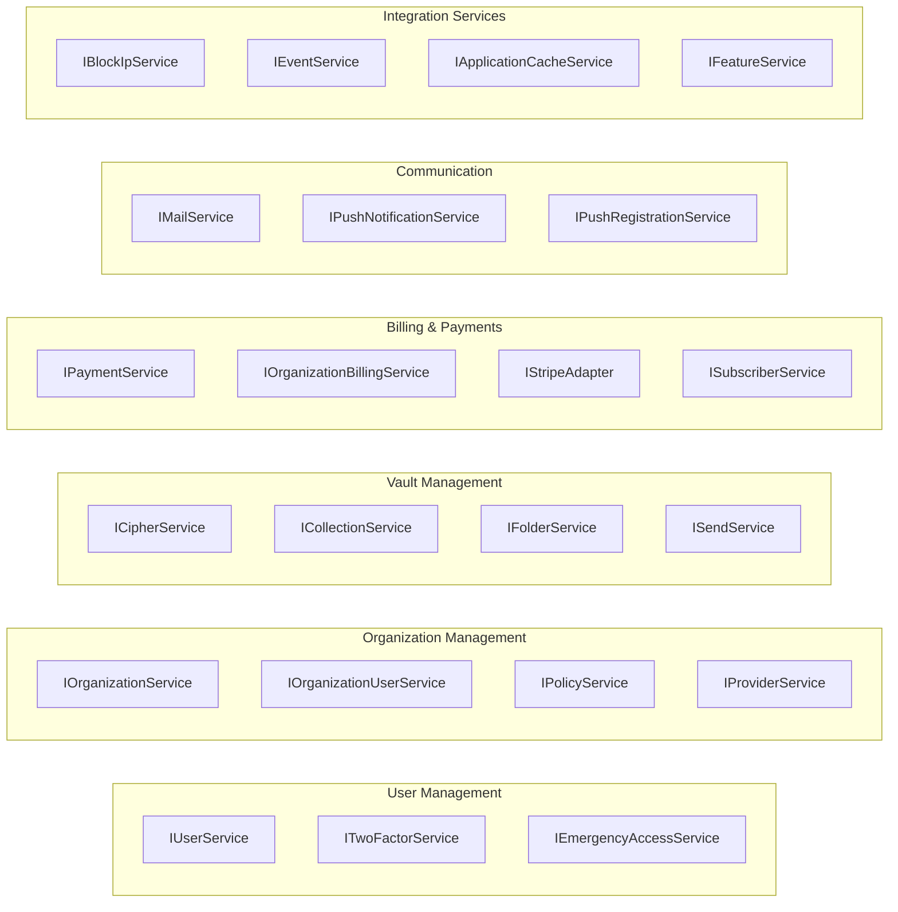
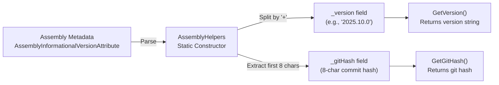

# Core Library Components

<details>
<summary>Relevant source files</summary>

The following files were used as context for generating this wiki page:

- [Directory.Build.props](https://github.com/bitwarden/server/blob/39f38f50/Directory.Build.props)
- [bitwarden_license/src/Sso/Sso.csproj](https://github.com/bitwarden/server/blob/39f38f50/bitwarden_license/src/Sso/Sso.csproj)
- [src/Admin/Admin.csproj](https://github.com/bitwarden/server/blob/39f38f50/src/Admin/Admin.csproj)
- [src/Api/Api.csproj](https://github.com/bitwarden/server/blob/39f38f50/src/Api/Api.csproj)
- [src/Billing/Billing.csproj](https://github.com/bitwarden/server/blob/39f38f50/src/Billing/Billing.csproj)
- [src/Core/Core.csproj](https://github.com/bitwarden/server/blob/39f38f50/src/Core/Core.csproj)
- [src/Core/Utilities/AssemblyHelpers.cs](https://github.com/bitwarden/server/blob/39f38f50/src/Core/Utilities/AssemblyHelpers.cs)
- [src/Events/Events.csproj](https://github.com/bitwarden/server/blob/39f38f50/src/Events/Events.csproj)
- [src/EventsProcessor/EventsProcessor.csproj](https://github.com/bitwarden/server/blob/39f38f50/src/EventsProcessor/EventsProcessor.csproj)
- [src/Icons/Icons.csproj](https://github.com/bitwarden/server/blob/39f38f50/src/Icons/Icons.csproj)
- [src/Identity/Identity.csproj](https://github.com/bitwarden/server/blob/39f38f50/src/Identity/Identity.csproj)
- [src/Notifications/Notifications.csproj](https://github.com/bitwarden/server/blob/39f38f50/src/Notifications/Notifications.csproj)
- [test/Api.Test/Api.Test.csproj](https://github.com/bitwarden/server/blob/39f38f50/test/Api.Test/Api.Test.csproj)
- [test/Common/Common.csproj](https://github.com/bitwarden/server/blob/39f38f50/test/Common/Common.csproj)
- [test/Core.Test/Core.Test.csproj](https://github.com/bitwarden/server/blob/39f38f50/test/Core.Test/Core.Test.csproj)
- [test/Core.Test/Utilities/AssemblyHelpersTests.cs](https://github.com/bitwarden/server/blob/39f38f50/test/Core.Test/Utilities/AssemblyHelpersTests.cs)
- [test/Identity.Test/Identity.Test.csproj](https://github.com/bitwarden/server/blob/39f38f50/test/Identity.Test/Identity.Test.csproj)
- [util/Migrator/DbUpLogger.cs](https://github.com/bitwarden/server/blob/39f38f50/util/Migrator/DbUpLogger.cs)
- [util/Migrator/Migrator.csproj](https://github.com/bitwarden/server/blob/39f38f50/util/Migrator/Migrator.csproj)
- [util/Server/Server.csproj](https://github.com/bitwarden/server/blob/39f38f50/util/Server/Server.csproj)
- [util/Setup/Setup.csproj](https://github.com/bitwarden/server/blob/39f38f50/util/Setup/Setup.csproj)

</details>


## Purpose and Scope

This document details the structure and components of the Core library ([src/Core/Core.csproj]()), which serves as the foundational dependency for all Bitwarden server services. The Core library implements the business logic, data access, and external integrations shared across the Api, Identity, Billing, Notifications, Admin, SSO, Events, EventsProcessor, and Icons services.

For information about how services configure and bootstrap the Core library, see [Service Startup and Configuration](#2.2). For details on the GlobalSettings configuration system, see [Global Settings and Feature Flags](#2.3).

---

## Core Library Architecture

The Core library is organized into three primary architectural layers, plus a utilities layer:

| Layer | Purpose | Key Namespaces |
|-------|---------|----------------|
| **Service Layer** | Business logic, domain operations, and orchestration | `Bit.Core.Services` |
| **Repository Layer** | Data access abstraction for entities and queries | `Bit.Core.Repositories` |
| **Integration Layer** | External service adapters (payment gateways, cloud providers, feature flags) | `Bit.Core.Services`, `Bit.Core.Billing` |
| **Utilities** | Helper classes, extensions, and framework utilities | `Bit.Core.Utilities` |

All services in the Bitwarden server architecture depend on Core, which itself has no dependencies on any service projects. This establishes a unidirectional dependency flow where services consume Core, but Core remains service-agnostic.



**Sources:** [src/Core/Core.csproj](https://github.com/bitwarden/server/blob/39f38f50/src/Core/Core.csproj), [src/Api/Api.csproj:20-22](https://github.com/bitwarden/server/blob/39f38f50/src/Api/Api.csproj#L20-L22), [src/Identity/Identity.csproj:11-13](https://github.com/bitwarden/server/blob/39f38f50/src/Identity/Identity.csproj#L11-L13), [src/Billing/Billing.csproj:10-12](https://github.com/bitwarden/server/blob/39f38f50/src/Billing/Billing.csproj#L10-L12), [src/Admin/Admin.csproj:12-15](https://github.com/bitwarden/server/blob/39f38f50/src/Admin/Admin.csproj#L12-L15), [bitwarden_license/src/Sso/Sso.csproj:17-19](https://github.com/bitwarden/server/blob/39f38f50/bitwarden_license/src/Sso/Sso.csproj#L17-L19), [src/Events/Events.csproj:11-13](https://github.com/bitwarden/server/blob/39f38f50/src/Events/Events.csproj#L11-L13), [src/EventsProcessor/EventsProcessor.csproj:9-11](https://github.com/bitwarden/server/blob/39f38f50/src/EventsProcessor/EventsProcessor.csproj#L9-L11), [src/Notifications/Notifications.csproj:19-21](https://github.com/bitwarden/server/blob/39f38f50/src/Notifications/Notifications.csproj#L19-L21), [src/Icons/Icons.csproj:18-20](https://github.com/bitwarden/server/blob/39f38f50/src/Icons/Icons.csproj#L18-L20)

---

## Project Configuration and Dependencies

The Core library is configured as a standard .NET SDK library project targeting .NET 8.0, as specified in [Directory.Build.props:4](). Version management is centralized in [Directory.Build.props:6](), which defines the current version as `2025.10.0`.

### Package Dependencies

The Core library integrates with a comprehensive set of third-party packages organized by functional area:

| Category | Key Packages | Purpose |
|----------|--------------|---------|
| **Authentication** | `Duende.IdentityServer` (7.2.4)<br/>`Microsoft.AspNetCore.Authentication.JwtBearer` (8.0.10)<br/>`DuoUniversal` (1.3.1)<br/>`Fido2.AspNet` (3.0.1)<br/>`Otp.NET` (1.4.0)<br/>`YubicoDotNetClient` (1.2.0) | OAuth2/OIDC provider, JWT validation, 2FA implementations |
| **Payment Gateways** | `Stripe.net` (45.14.0)<br/>`Braintree` (5.28.0)<br/>`BitPay.Light` (1.0.1907) | Stripe (primary), Braintree (legacy PayPal), BitPay (cryptocurrency) |
| **Cloud Services** | `AWSSDK.SimpleEmail` (4.0.1.3)<br/>`AWSSDK.SQS` (4.0.1.5)<br/>`Azure.Storage.Blobs` (12.21.2)<br/>`Azure.Storage.Queues` (12.19.1)<br/>`Azure.Messaging.ServiceBus` (7.18.1)<br/>`Microsoft.Azure.Cosmos` (3.52.0) | AWS SES/SQS, Azure Blob/Queue/ServiceBus, Cosmos DB |
| **Email & Communication** | `MailKit` (4.14.0)<br/>`SendGrid` (9.29.3)<br/>`Handlebars.Net` (2.1.6)<br/>`Microsoft.Azure.NotificationHubs` (4.2.0) | Email sending, template rendering, push notifications |
| **Caching & Data** | `Microsoft.Extensions.Caching.StackExchangeRedis` (8.0.10)<br/>`Microsoft.Extensions.Caching.SqlServer` (8.0.10)<br/>`Microsoft.Extensions.Caching.Cosmos` (1.7.0)<br/>`Microsoft.Data.SqlClient` (5.2.2) | Distributed caching, database connectivity |
| **Feature Flags** | `LaunchDarkly.ServerSdk` (8.10.1) | Dynamic feature toggling |
| **Logging** | `Serilog.AspNetCore` (8.0.3)<br/>`Sentry.Serilog` (5.0.0)<br/>`Serilog.Sinks.SyslogMessages` (4.0.0) | Structured logging, error tracking |
| **Rate Limiting** | `AspNetCoreRateLimit` (5.0.0)<br/>`AspNetCoreRateLimit.Redis` (2.0.0) | API throttling |
| **Messaging** | `RabbitMQ.Client` (7.1.2) | Queue-based messaging |
| **Scheduling** | `Quartz` (3.14.0)<br/>`Quartz.Extensions.Hosting` (3.14.0) | Background job scheduling |

**Sources:** [src/Core/Core.csproj:22-69](https://github.com/bitwarden/server/blob/39f38f50/src/Core/Core.csproj#L22-L69)

### Embedded Resources

The Core library embeds several resources directly into the assembly:

- **Licensing Certificates:** `licensing.cer` and `licensing_dev.cer` for license validation ([src/Core/Core.csproj:17-18]())
- **Email Templates:** All Handlebars templates under `MailTemplates/Handlebars/**/*.hbs` ([src/Core/Core.csproj:19]())

**Sources:** [src/Core/Core.csproj:16-20](https://github.com/bitwarden/server/blob/39f38f50/src/Core/Core.csproj#L16-L20)

---

## Service Layer

The service layer implements domain-specific business logic and orchestrates operations across repositories and integrations. Services are registered as scoped dependencies in the dependency injection container and exposed through interfaces.

### Core Service Interfaces



**Sources:** Based on architecture described in high-level diagrams and standard Core library structure

### Key Service Responsibilities

| Service | Primary Responsibilities |
|---------|-------------------------|
| **IUserService** | User registration, authentication, password management, premium features, 2FA setup, security stamp rotation |
| **IOrganizationService** | Organization CRUD, subscription management, seat allocation, user invitation workflows, feature configuration |
| **ICipherService** | Vault item CRUD, encryption/decryption orchestration, sharing, attachment management, URI matching |
| **IMailService** | Email composition using Handlebars templates, delivery via SMTP/SendGrid/AWS SES, localization support |
| **IPaymentService** | Payment processing via Stripe/Braintree/BitPay, invoice generation, subscription lifecycle, payment method management |
| **IPolicyService** | Policy CRUD, requirement validation, enforcement checks for master password, 2FA, single organization, personal ownership |
| **IEventService** | Event capture for audit logging, event routing to storage (database, Azure Queue, Cosmos DB) |
| **IFeatureService** | Feature flag evaluation via LaunchDarkly, fallback to configuration, cached results |

**Sources:** Based on high-level architecture diagrams

---

## Repository Layer

The repository layer provides an abstraction over data access, enabling the Core library to support multiple database backends: SQL Server, MySQL, PostgreSQL, and SQLite. Each entity type has a corresponding repository interface defining standard CRUD operations and specialized queries.

### Repository Pattern Implementation

```mermaid
graph TB
    subgraph "Repository Interfaces"
        IUserRepo["IUserRepository"]
        IOrganizationRepo["IOrganizationRepository"]
        IOrganizationUserRepo["IOrganizationUserRepository"]
        ICipherRepo["ICipherRepository"]
        ICollectionRepo["ICollectionRepository"]
        IGroupRepo["IGroupRepository"]
        IPolicyRepo["IPolicyRepository"]
        IEventRepo["IEventRepository"]
        IInstallationRepo["IInstallationRepository"]
        ITransactionRepo["ITransactionRepository"]
    end
    
    subgraph "SQL Server Implementations"
        UserRepo_SQL["UserRepository<br/>(Dapper + Stored Procs)"]
        OrgRepo_SQL["OrganizationRepository"]
        CipherRepo_SQL["CipherRepository"]
    end
    
    subgraph "MySQL Implementations"
        UserRepo_MySQL["UserRepository<br/>(MySQL Specific)"]
        OrgRepo_MySQL["OrganizationRepository"]
    end
    
    subgraph "PostgreSQL Implementations"
        UserRepo_Postgres["UserRepository<br/>(PostgreSQL Specific)"]
        OrgRepo_Postgres["OrganizationRepository"]
    end
    
    subgraph "SQLite Implementations"
        UserRepo_SQLite["UserRepository<br/>(SQLite Specific)"]
        OrgRepo_SQLite["OrganizationRepository"]
    end
    
    IUserRepo --> UserRepo_SQL
    IUserRepo --> UserRepo_MySQL
    IUserRepo --> UserRepo_Postgres
    IUserRepo --> UserRepo_SQLite
    
    IOrganizationRepo --> OrgRepo_SQL
    IOrganizationRepo --> OrgRepo_MySQL
    IOrganizationRepo --> OrgRepo_Postgres
    IOrganizationRepo --> OrgRepo_SQLite
    
    ICipherRepo --> CipherRepo_SQL
```



**Sources:** Based on database architecture patterns and multi-database support described in high-level diagrams

### Repository Interface Structure

Each repository interface typically provides:

- **CRUD Operations:** `CreateAsync`, `GetByIdAsync`, `ReplaceAsync`, `DeleteAsync`, `UpsertAsync`
- **Specialized Queries:** Entity-specific query methods (e.g., `IUserRepository.GetByEmailAsync`, `IOrganizationRepository.GetByUserIdAsync`)
- **Bulk Operations:** `CreateManyAsync`, `ReplaceManyAsync`, `UpsertManyAsync` for performance-critical scenarios
- **Search Operations:** Methods supporting filtering, pagination, and ordering

The repository implementations use:
- **Dapper** for SQL Server with heavy reliance on stored procedures
- **Entity Framework Core** as an alternative for some operations
- **Database-specific SQL** optimized for each backend's capabilities

**Sources:** Based on repository patterns described in high-level architecture diagrams

---

## Integration Layer

The integration layer encapsulates interactions with external systems, providing abstractions that enable dependency injection and testability. Each integration typically defines an interface in the Core library with implementations that wrap third-party SDKs.

### External Service Integrations

```mermaid
graph TB
    subgraph "Payment Gateway Integrations"
        IStripeAdapter["IStripeAdapter"]
        BraintreeGateway["Braintree Gateway"]
        BitPayClient["BitPay Client"]
    end
    
    subgraph "Cloud Service Integrations"
        IAmazonSES["IAmazonSimpleEmailService"]
        IAmazonSQS["IAmazonSQS"]
        BlobServiceClient["Azure BlobServiceClient"]
        QueueServiceClient["Azure QueueServiceClient"]
        ServiceBusClient["Azure ServiceBusClient"]
        CosmosClient["CosmosClient"]
    end
    
    subgraph "Communication Integrations"
        ISendGridClient["ISendGridClient"]
        IMailService_SMTP["SMTP via MailKit"]
        NotificationHubClient["Azure NotificationHubClient"]
    end
    
    subgraph "Feature Management"
        ILaunchDarklyClient["ILaunchDarkly Client"]
    end
    
    subgraph "DNS & Domain"
        IDnsClient["IDnsClient"]
    end
    
    IStripeAdapter -->|Stripe.net SDK| StripeAPI["Stripe API"]
    BraintreeGateway -->|Braintree SDK| BraintreeAPI["Braintree API"]
    BitPayClient -->|BitPay.Light| BitPayAPI["BitPay API"]
    
    IAmazonSES -->|AWSSDK.SimpleEmail| AWSSES["AWS SES"]
    IAmazonSQS -->|AWSSDK.SQS| AWSSQS["AWS SQS"]
    
    BlobServiceClient -->|Azure.Storage.Blobs| AzureBlob["Azure Blob Storage"]
    QueueServiceClient -->|Azure.Storage.Queues| AzureQueue["Azure Queue Storage"]
    ServiceBusClient -->|Azure.Messaging.ServiceBus| AzureServiceBus["Azure Service Bus"]
    CosmosClient -->|Microsoft.Azure.Cosmos| CosmosDB["Azure Cosmos DB"]
    
    ISendGridClient -->|SendGrid SDK| SendGridAPI["SendGrid API"]
    
    NotificationHubClient -->|Microsoft.Azure.NotificationHubs| AzureNotificationHubs["Azure Notification Hubs"]
    
    ILaunchDarklyClient -->|LaunchDarkly.ServerSdk| LaunchDarklyService["LaunchDarkly"]
    
    IDnsClient -->|DnsClient| DNSServers["DNS Servers"]
```



**Sources:** [src/Core/Core.csproj:23-68](https://github.com/bitwarden/server/blob/39f38f50/src/Core/Core.csproj#L23-L68)

### Stripe Integration

The Stripe integration is implemented via `IStripeAdapter`, which wraps the Stripe.net SDK (version 45.14.0). This adapter provides:

- **Customer Management:** Creating and updating Stripe customers
- **Subscription Management:** Creating, updating, and canceling subscriptions
- **Payment Method Management:** Attaching and detaching payment methods
- **Invoice Operations:** Generating, finalizing, and retrieving invoices
- **Event Processing:** Validating and parsing Stripe webhook events
- **Tax ID Management:** Managing customer tax information

**Sources:** [src/Core/Core.csproj:60](https://github.com/bitwarden/server/blob/39f38f50/src/Core/Core.csproj#L60)

### AWS Integration

AWS integration uses the official AWS SDK packages:

- **Simple Email Service (SES):** Email delivery via `AWSSDK.SimpleEmail` (4.0.1.3)
- **Simple Queue Service (SQS):** Message queuing via `AWSSDK.SQS` (4.0.1.5)

**Sources:** [src/Core/Core.csproj:24-25](https://github.com/bitwarden/server/blob/39f38f50/src/Core/Core.csproj#L24-L25)

### Azure Integration

Azure services are integrated through multiple client libraries:

- **Blob Storage:** File storage via `Azure.Storage.Blobs` (12.21.2) using `BlobServiceClient`
- **Queue Storage:** Message queuing via `Azure.Storage.Queues` (12.19.1) using `QueueServiceClient`
- **Service Bus:** Enterprise messaging via `Azure.Messaging.ServiceBus` (7.18.1) using `ServiceBusClient`
- **Cosmos DB:** NoSQL database via `Microsoft.Azure.Cosmos` (3.52.0) using `CosmosClient`
- **Table Storage:** Structured storage via `Azure.Data.Tables` (12.9.0) using `TableServiceClient`
- **Notification Hubs:** Push notifications via `Microsoft.Azure.NotificationHubs` (4.2.0)

**Sources:** [src/Core/Core.csproj:26-31,39-40](https://github.com/bitwarden/server/blob/39f38f50/src/Core/Core.csproj#L26-L31,39-40)

### LaunchDarkly Feature Flags

Feature flag management uses `LaunchDarkly.ServerSdk` (8.10.1) via `ILaunchDarkly` client interface. This enables:

- **Dynamic Feature Toggling:** Runtime feature enablement/disablement without deployment
- **Targeting Rules:** User/organization-specific feature rollouts
- **Experimentation:** A/B testing capabilities
- **Fallback Handling:** Default values when LaunchDarkly is unavailable

For details on feature flag keys and usage patterns, see [Global Settings and Feature Flags](#2.3).

**Sources:** [src/Core/Core.csproj:64](https://github.com/bitwarden/server/blob/39f38f50/src/Core/Core.csproj#L64)

### Email Delivery Integration

Email delivery supports multiple providers:

- **SendGrid:** Primary cloud email provider via `SendGrid` (9.29.3)
- **SMTP:** Direct SMTP via `MailKit` (4.14.0)
- **AWS SES:** Amazon Simple Email Service via `AWSSDK.SimpleEmail`

The `IMailService` interface abstracts provider selection, configured via `GlobalSettings.Mail`.

**Sources:** [src/Core/Core.csproj:24,37,50](https://github.com/bitwarden/server/blob/39f38f50/src/Core/Core.csproj#L24,37,50)

---

## Utilities Layer

The utilities layer provides cross-cutting functionality including helpers, extensions, constants, and framework utilities used throughout the Core library and consuming services.

### AssemblyHelpers

`AssemblyHelpers` extracts version and Git commit information from assembly metadata:



**Implementation Details:**

The static constructor in [src/Core/Utilities/AssemblyHelpers.cs:11-35]() performs the following:

1. Retrieves `AssemblyInformationalVersionAttribute` from the assembly
2. Splits the informational version string by `+` delimiter
3. Stores the version portion (before `+`) in `_version`
4. Extracts the first 8 characters of the Git hash (after `+`) and stores in `_gitHash`

Public methods:
- `GetVersion()` returns the semantic version string ([src/Core/Utilities/AssemblyHelpers.cs:37-40]())
- `GetGitHash()` returns the 8-character Git commit hash ([src/Core/Utilities/AssemblyHelpers.cs:42-45]())

**Usage Example:**

```csharp
var version = AssemblyHelpers.GetVersion();  // "2025.10.0"
var gitHash = AssemblyHelpers.GetGitHash();  // "a1b2c3d4"
```

**Sources:** [src/Core/Utilities/AssemblyHelpers.cs:1-47](https://github.com/bitwarden/server/blob/39f38f50/src/Core/Utilities/AssemblyHelpers.cs#L1-L47), [test/Core.Test/Utilities/AssemblyHelpersTests.cs:1-18](https://github.com/bitwarden/server/blob/39f38f50/test/Core.Test/Utilities/AssemblyHelpersTests.cs#L1-L18)

### CoreHelpers

`CoreHelpers` is a static utility class providing common operations including:

- **Hashing & Encryption:** Password hashing, encryption helpers
- **Random Generation:** Secure random string/byte generation
- **URL Manipulation:** URI parsing and validation
- **Date/Time Utilities:** DateTime formatting and comparison
- **Collection Extensions:** LINQ extension methods
- **JSON Serialization:** Custom serialization helpers

**Sources:** Based on common utility patterns in Core library

### StaticStore

`StaticStore` manages globally cached, rarely-changing data loaded at application startup. For detailed information about subscription plans and domain equivalencies, see [Static Store and Domain Management](#2.4).

**Sources:** Mentioned in high-level diagrams and table of contents

---

## Dependency Injection Configuration

All Core library services, repositories, and integrations are registered with the dependency injection container during application startup. Each consuming service (Api, Identity, etc.) calls extension methods on `IServiceCollection` to configure Core dependencies.

### Service Registration Pattern

Typical service registration follows this pattern:

```
services.AddScoped<IUserService, UserService>();
services.AddScoped<IOrganizationService, OrganizationService>();
services.AddScoped<ICipherService, CipherService>();
services.AddScoped<IMailService, HandlebarsMailService>();
services.AddScoped<IPaymentService, PaymentService>();
```

Repository registration varies by database provider:

```
// SQL Server repositories
services.AddScoped<IUserRepository, UserRepository>();

// Or MySQL repositories
services.AddScoped<IUserRepository, MySqlUserRepository>();

// Or PostgreSQL repositories
services.AddScoped<IUserRepository, PostgresUserRepository>();
```

External client registration:

```
services.AddSingleton<ILaunchDarklyClient>(sp => {
    var settings = sp.GetRequiredService<GlobalSettings>();
    return new LdClient(settings.LaunchDarkly.SdkKey);
});

services.AddAWSService<IAmazonSimpleEmailService>();
services.AddAWSService<IAmazonSQS>();
```

For detailed information on startup configuration and dependency injection patterns, see [Service Startup and Configuration](#2.2).

**Sources:** Based on standard ASP.NET Core dependency injection patterns and service architecture

---

## Testing and Internal Visibility

The Core library exposes internal members to test projects via `InternalsVisibleTo` attributes. This enables comprehensive unit testing of internal implementation details without making them publicly accessible.

### Test Project Access

[src/Core/Core.csproj:82]() declares internal visibility to:

```xml
<InternalsVisibleTo Include="Infrastructure.IntegrationTest" />
```

This allows the `Infrastructure.IntegrationTest` project to access internal classes, methods, and properties for integration testing scenarios.

### Test Projects Referencing Core

The following test projects depend on Core:

| Test Project | Purpose |
|-------------|---------|
| **Core.Test** | Unit tests for Core library components ([test/Core.Test/Core.Test.csproj:24]()) |
| **Api.Test** | Tests for API service depending on Core ([test/Api.Test/Api.Test.csproj:24]()) |
| **Identity.Test** | Tests for Identity service depending on Core ([test/Identity.Test/Identity.Test.csproj:23]()) |
| **Common** | Shared test utilities and helpers ([test/Common/Common.csproj:21]()) |

All test projects use:
- **xUnit** for test framework ([test/Core.Test/Core.Test.csproj:14]())
- **NSubstitute** for mocking ([test/Core.Test/Core.Test.csproj:13]())
- **AutoFixture** for test data generation ([test/Core.Test/Core.Test.csproj:19-20]())

**Sources:** [src/Core/Core.csproj:82-83](https://github.com/bitwarden/server/blob/39f38f50/src/Core/Core.csproj#L82-L83), [test/Core.Test/Core.Test.csproj:1-33](https://github.com/bitwarden/server/blob/39f38f50/test/Core.Test/Core.Test.csproj#L1-L33), [test/Api.Test/Api.Test.csproj:1-28](https://github.com/bitwarden/server/blob/39f38f50/test/Api.Test/Api.Test.csproj#L1-L28), [test/Identity.Test/Identity.Test.csproj:1-28](https://github.com/bitwarden/server/blob/39f38f50/test/Identity.Test/Identity.Test.csproj#L1-L28), [test/Common/Common.csproj:1-23](https://github.com/bitwarden/server/blob/39f38f50/test/Common/Common.csproj#L1-L23)

---

## Documentation Generation

The Core library generates XML documentation files during build for IntelliSense support. This is configured in [src/Core/Core.csproj:5]():

```xml
<DocumentationFile>bin\$(Configuration)\$(TargetFramework)\$(AssemblyName).xml</DocumentationFile>
```

Certain documentation warnings are suppressed to allow internal/undocumented APIs:

- **1701, 1702:** Obsolete compiler warnings
- **1591:** Missing XML comment for publicly visible type or member
- **1573:** Parameter has no matching param tag in the XML comment

**Sources:** [src/Core/Core.csproj:3-14](https://github.com/bitwarden/server/blob/39f38f50/src/Core/Core.csproj#L3-L14)

---

## Summary

The Core library serves as the architectural foundation for the Bitwarden server, providing:

1. **Business Logic:** Domain services orchestrating user management, organizations, vault operations, billing, and communication
2. **Data Access:** Repository pattern supporting SQL Server, MySQL, PostgreSQL, and SQLite
3. **External Integrations:** Unified interfaces for Stripe, Braintree, BitPay, AWS, Azure, LaunchDarkly, and communication services
4. **Shared Utilities:** Helper classes like `AssemblyHelpers` and `CoreHelpers` for cross-cutting concerns

All services (Api, Identity, Billing, etc.) depend on Core, establishing a unidirectional dependency flow that promotes code reuse and consistent behavior across the system. The library's layered architecture—service, repository, integration, and utilities—enables testability, maintainability, and extensibility.