# Service Startup and Configuration

<details>
<summary>Relevant source files</summary>

The following files were used as context for generating this wiki page:

- [bitwarden_license/src/Scim/Startup.cs](https://github.com/bitwarden/server/blob/39f38f50/bitwarden_license/src/Scim/Startup.cs)
- [bitwarden_license/src/Scim/Utilities/ApiKeyAuthenticationHandler.cs](https://github.com/bitwarden/server/blob/39f38f50/bitwarden_license/src/Scim/Utilities/ApiKeyAuthenticationHandler.cs)
- [src/Admin/Startup.cs](https://github.com/bitwarden/server/blob/39f38f50/src/Admin/Startup.cs)
- [src/Api/Startup.cs](https://github.com/bitwarden/server/blob/39f38f50/src/Api/Startup.cs)
- [src/Billing/Startup.cs](https://github.com/bitwarden/server/blob/39f38f50/src/Billing/Startup.cs)
- [src/Core/Utilities/CoreHelpers.cs](https://github.com/bitwarden/server/blob/39f38f50/src/Core/Utilities/CoreHelpers.cs)
- [src/Events/Startup.cs](https://github.com/bitwarden/server/blob/39f38f50/src/Events/Startup.cs)
- [src/EventsProcessor/Startup.cs](https://github.com/bitwarden/server/blob/39f38f50/src/EventsProcessor/Startup.cs)
- [src/Identity/Controllers/SsoController.cs](https://github.com/bitwarden/server/blob/39f38f50/src/Identity/Controllers/SsoController.cs)
- [src/Identity/IdentityServer/ApiResources.cs](https://github.com/bitwarden/server/blob/39f38f50/src/Identity/IdentityServer/ApiResources.cs)
- [src/Identity/Startup.cs](https://github.com/bitwarden/server/blob/39f38f50/src/Identity/Startup.cs)
- [src/Notifications/Startup.cs](https://github.com/bitwarden/server/blob/39f38f50/src/Notifications/Startup.cs)
- [test/Core.Test/Utilities/CoreHelpersTests.cs](https://github.com/bitwarden/server/blob/39f38f50/test/Core.Test/Utilities/CoreHelpersTests.cs)
- [util/Server/Program.cs](https://github.com/bitwarden/server/blob/39f38f50/util/Server/Program.cs)
- [util/Server/Startup.cs](https://github.com/bitwarden/server/blob/39f38f50/util/Server/Startup.cs)

</details>


Each Bitwarden service implements a `Startup` class that configures dependency injection and the middleware pipeline. This page documents the common startup patterns, service registration methods, and middleware configuration used across all services.

## Service Startup Pattern

All Bitwarden services follow the ASP.NET Core startup pattern with two key methods in the `Startup` class:
- **`ConfigureServices(IServiceCollection services)`**: Registers dependencies in the DI container
- **`Configure(IApplicationBuilder app, ...)`**: Configures the HTTP request pipeline

### Startup Class Structure

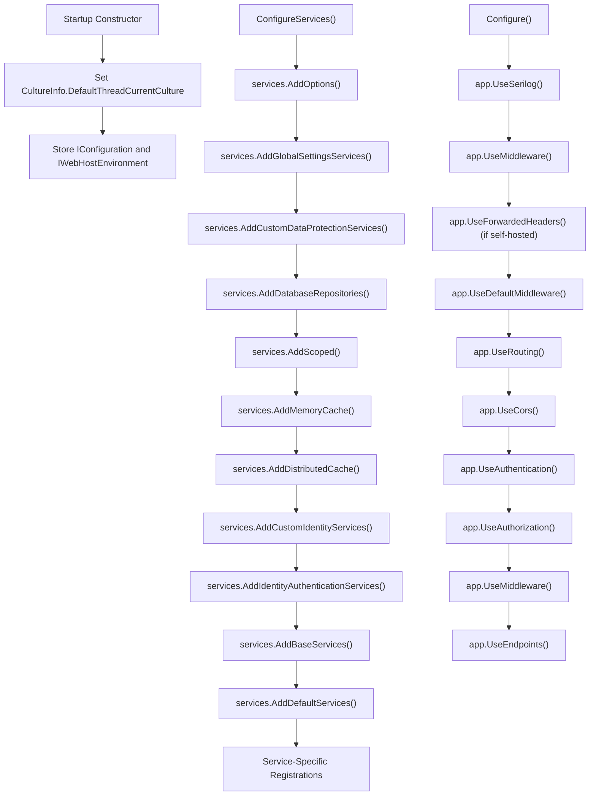

Sources: [src/Api/Startup.cs:48-331](https://github.com/bitwarden/server/blob/39f38f50/src/Api/Startup.cs#L48-L331), [src/Identity/Startup.cs:22-245](https://github.com/bitwarden/server/blob/39f38f50/src/Identity/Startup.cs#L22-L245), [src/Billing/Startup.cs:22-160](https://github.com/bitwarden/server/blob/39f38f50/src/Billing/Startup.cs#L22-L160)

### Service Comparison

| Service | Port | Authentication | Key Middleware | Specialized Features |
|---------|------|----------------|----------------|---------------------|
| Api | 5000 | JWT Bearer | `CurrentContextMiddleware`, `CustomIpRateLimitMiddleware` | Swagger, Rate Limiting, Health Checks |
| Identity | 5001 | OIDC + JWT | Cookie Authentication | IdentityServer, SSO Integration |
| Billing | 5002 | None | None | Webhook Handlers, Quartz Jobs |
| Notifications | 5003 | JWT Bearer | None | SignalR Hubs, Redis Backplane |
| Events | 5004 | JWT Bearer | `CurrentContextMiddleware` | RabbitMQ Listeners |
| Admin | 5005 | Cookie | None | Razor Pages, Database Migrator |
| SSO | 5006 | SAML 2.0 | None | SAML Response Handling |
| SCIM | 5007 | API Key | `ScimContextMiddleware` | SCIM 2.0 Protocol |
| EventsProcessor | 5008 | None | None | Azure Queue Listener |

Sources: [src/Api/Startup.cs:48-331](https://github.com/bitwarden/server/blob/39f38f50/src/Api/Startup.cs#L48-L331), [src/Identity/Startup.cs:22-245](https://github.com/bitwarden/server/blob/39f38f50/src/Identity/Startup.cs#L22-L245), [src/Billing/Startup.cs:22-160](https://github.com/bitwarden/server/blob/39f38f50/src/Billing/Startup.cs#L22-L160), [src/Notifications/Startup.cs:12-131](https://github.com/bitwarden/server/blob/39f38f50/src/Notifications/Startup.cs#L12-L131), [src/Events/Startup.cs:14-132](https://github.com/bitwarden/server/blob/39f38f50/src/Events/Startup.cs#L14-L132), [src/Admin/Startup.cs:22-166](https://github.com/bitwarden/server/blob/39f38f50/src/Admin/Startup.cs#L22-L166), [bitwarden_license/src/Scim/Startup.cs:17-135](https://github.com/bitwarden/server/blob/39f38f50/bitwarden_license/src/Scim/Startup.cs#L17-L135), [src/EventsProcessor/Startup.cs:9-62](https://github.com/bitwarden/server/blob/39f38f50/src/EventsProcessor/Startup.cs#L9-L62)

### Constructor Pattern

Every `Startup` class constructor sets the default culture to `en-US` and stores configuration objects:

```csharp
public Startup(IWebHostEnvironment env, IConfiguration configuration)
{
    CultureInfo.DefaultThreadCurrentCulture = new CultureInfo("en-US");
    Configuration = configuration;
    Environment = env;
}
```

Sources: [src/Api/Startup.cs:50-55](https://github.com/bitwarden/server/blob/39f38f50/src/Api/Startup.cs#L50-L55), [src/Identity/Startup.cs:24-29](https://github.com/bitwarden/server/blob/39f38f50/src/Identity/Startup.cs#L24-L29), [src/Billing/Startup.cs:24-29](https://github.com/bitwarden/server/blob/39f38f50/src/Billing/Startup.cs#L24-L29)

## Global Settings Configuration

### AddGlobalSettingsServices Extension

The `AddGlobalSettingsServices()` extension method (defined in `ServiceCollectionExtensions`) loads configuration from `appsettings.json` and binds it to the `GlobalSettings` class. This is the first step in every service's `ConfigureServices` method:

```csharp
var globalSettings = services.AddGlobalSettingsServices(Configuration, Environment);
```

**GlobalSettings Class Structure:**

```mermaid
graph TD
    GlobalSettings["GlobalSettings"] --> BaseServiceUri["BaseServiceUri"]
    GlobalSettings --> SqlSettings["SqlSettings"]
    GlobalSettings --> IdentityServer["IdentityServer"]
    GlobalSettings --> DataProtection["DataProtection"]
    GlobalSettings --> Stripe["Stripe"]
    GlobalSettings --> Mail["Mail"]
    GlobalSettings --> Storage["Storage"]
    GlobalSettings --> Notifications["Notifications"]
    GlobalSettings --> ServiceBus["ServiceBus"]
    
    BaseServiceUri --> Vault["Vault URI"]
    BaseServiceUri --> Api["Api URI"]
    BaseServiceUri --> Identity["Identity URI"]
    BaseServiceUri --> InternalSso["InternalSso URI"]
    
    SqlSettings --> ConnectionString["ConnectionString"]
    SqlSettings --> ReadOnlyConnectionString["ReadOnlyConnectionString"]
    
    IdentityServer --> CertificateThumbprint["CertificateThumbprint"]
    IdentityServer --> CertificatePassword["CertificatePassword"]
    IdentityServer --> RedisConnectionString["RedisConnectionString"]
    
    Stripe --> ApiKey["ApiKey"]
    Stripe --> MaxNetworkRetries["MaxNetworkRetries"]
```

**Key Configuration Patterns:**

- **Self-Hosted Detection**: `globalSettings.SelfHosted` controls feature availability
- **Certificate Loading**: `CoreHelpers.GetIdentityServerCertificate()` loads X509 certificates from thumbprint, file, or Azure Blob Storage
- **Database Provider**: `SqlSettings.DatabaseProvider` selects SQL Server, PostgreSQL, MySQL, or SQLite
- **Feature Flags**: `LaunchDarkly.SdkKey` enables feature flag service

Sources: [src/Api/Startup.cs:66-71](https://github.com/bitwarden/server/blob/39f38f50/src/Api/Startup.cs#L66-L71), [src/Identity/Startup.cs:40-45](https://github.com/bitwarden/server/blob/39f38f50/src/Identity/Startup.cs#L40-L45), [src/Core/Utilities/CoreHelpers.cs:662-684](https://github.com/bitwarden/server/blob/39f38f50/src/Core/Utilities/CoreHelpers.cs#L662-L684)

## Dependency Injection Registration

### Core Service Registration Methods

Services register dependencies through extension methods in `ServiceCollectionExtensions`. The registration follows this order:

**Dependency Registration Sequence:**

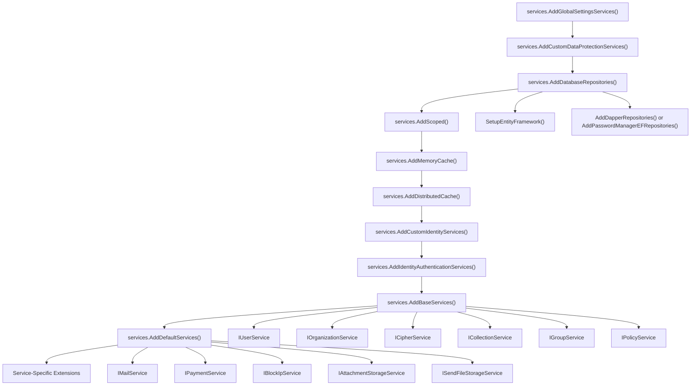

Sources: [src/Api/Startup.cs:60-224](https://github.com/bitwarden/server/blob/39f38f50/src/Api/Startup.cs#L60-L224), [src/Identity/Startup.cs:36-161](https://github.com/bitwarden/server/blob/39f38f50/src/Identity/Startup.cs#L36-L161)

### AddDatabaseRepositories Extension

The `AddDatabaseRepositories()` extension method detects the database provider and registers appropriate repository implementations:

**Database Provider Selection:**

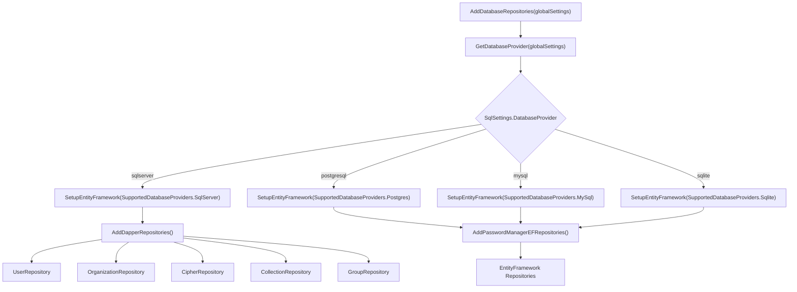

**Key Repository Interfaces:**

- `IUserRepository`: User account persistence
- `IOrganizationRepository`: Organization CRUD operations
- `ICipherRepository`: Vault item storage
- `ICollectionRepository`: Collection management
- `IOrganizationUserRepository`: Organization membership
- `IPolicyRepository`: Organization policy storage
- `IEventRepository`: Audit event logging

Sources: [src/Api/Startup.cs:87](https://github.com/bitwarden/server/blob/39f38f50/src/Api/Startup.cs#L87), [src/Identity/Startup.cs:51](https://github.com/bitwarden/server/blob/39f38f50/src/Identity/Startup.cs#L51)

### AddBaseServices and AddDefaultServices

**AddBaseServices Extension:**

Registers core business logic services:

```csharp
services.AddBaseServices(globalSettings);
```

Key services registered:
- `IUserService`: User management, password handling, 2FA
- `IOrganizationService`: Organization lifecycle, subscriptions, policies
- `ICipherService`: Vault item operations, encryption
- `ICollectionService`: Collection management and sharing
- `IGroupService`: Group management and permissions
- `IPolicyService`: Policy enforcement and validation
- `IEventService`: Event logging and audit trails
- `IApplicationCacheService`: Application-level caching

**AddDefaultServices Extension:**

Registers infrastructure and integration services:

```csharp
services.AddDefaultServices(globalSettings);
```

Key services registered:
- `IMailService`: Email sending via SendGrid, SMTP, or AWS SES
- `IPaymentService`: Stripe, Braintree, and BitPay integration
- `IAttachmentStorageService`: Azure Blob or local file storage
- `ISendFileStorageService`: Send file storage
- `IBlockIpService`: IP blocking for security
- `IReferenceEventService`: Event data reference management
- `IFeatureService`: LaunchDarkly feature flag service

Sources: [src/Api/Startup.cs:186-195](https://github.com/bitwarden/server/blob/39f38f50/src/Api/Startup.cs#L186-L195), [src/Identity/Startup.cs:147-151](https://github.com/bitwarden/server/blob/39f38f50/src/Identity/Startup.cs#L147-L151)

## Middleware Pipeline Configuration

### Configure Method Structure

The `Configure` method builds the HTTP request pipeline by adding middleware in a specific order. Each middleware component processes requests before passing to the next component:

**Api Service Middleware Pipeline:**

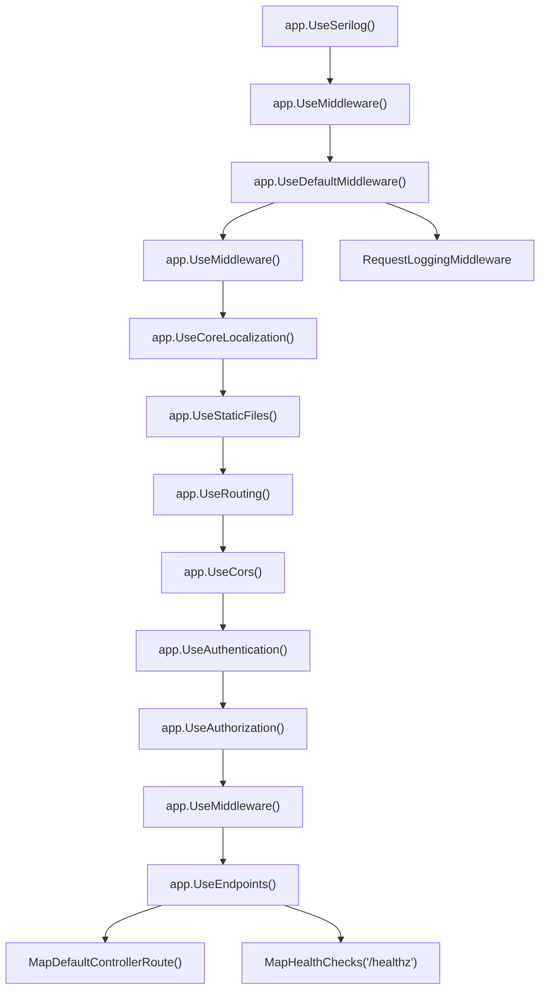

**Identity Service Middleware Pipeline:**

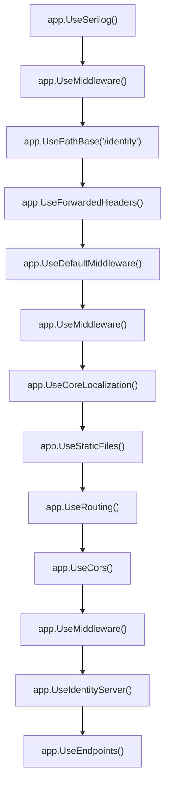

**Notifications Service Middleware Pipeline:**

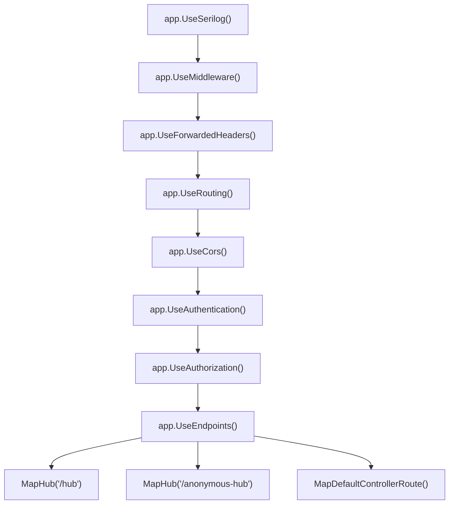

Sources: [src/Api/Startup.cs:237-297](https://github.com/bitwarden/server/blob/39f38f50/src/Api/Startup.cs#L237-L297), [src/Identity/Startup.cs:170-244](https://github.com/bitwarden/server/blob/39f38f50/src/Identity/Startup.cs#L170-L244), [src/Notifications/Startup.cs:81-130](https://github.com/bitwarden/server/blob/39f38f50/src/Notifications/Startup.cs#L81-L130)

### Middleware Components

**SecurityHeadersMiddleware:**

Adds security headers to all responses (CSP, X-Frame-Options, etc.). Applied first in the pipeline.

**CustomIpRateLimitMiddleware:**

Implements rate limiting for API endpoints using the `AspNetCoreRateLimit` library. Only enabled for cloud deployments (when `globalSettings.SelfHosted == false`). Configuration loaded from `IpRateLimitOptions` and `IpRateLimitPolicies` sections.

**CurrentContextMiddleware:**

Populates `ICurrentContext` with user information extracted from JWT claims. Provides `UserId`, `OrganizationIds`, `ProviderIds`, and permission information to downstream services.

**RequestLoggingMiddleware:**

Part of `UseDefaultMiddleware()`. Logs incoming requests with timing information.

Sources: [src/Api/Startup.cs:248-256](https://github.com/bitwarden/server/blob/39f38f50/src/Api/Startup.cs#L248-L256), [src/Api/Startup.cs:69-71](https://github.com/bitwarden/server/blob/39f38f50/src/Api/Startup.cs#L69-L71), [src/Api/Startup.cs:281](https://github.com/bitwarden/server/blob/39f38f50/src/Api/Startup.cs#L281), [src/Identity/Startup.cs:234](https://github.com/bitwarden/server/blob/39f38f50/src/Identity/Startup.cs#L234), [bitwarden_license/src/Scim/Startup.cs:123](https://github.com/bitwarden/server/blob/39f38f50/bitwarden_license/src/Scim/Startup.cs#L123)

## Authentication Configuration

### AddIdentityAuthenticationServices Extension

The `AddIdentityAuthenticationServices()` extension method configures JWT Bearer authentication for most services:

**JWT Bearer Configuration:**

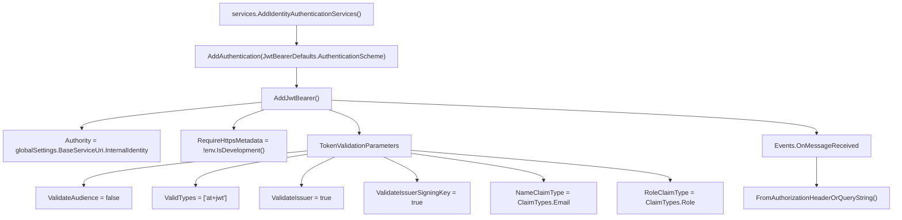

**Token Retrieval Logic:**

The `OnMessageReceived` event handler attempts to read the JWT token from:
1. `Authorization` header (standard Bearer token)
2. `access_token` query parameter (fallback for WebSocket connections)

Sources: [src/Api/Startup.cs:107-156](https://github.com/bitwarden/server/blob/39f38f50/src/Api/Startup.cs#L107-L156), [src/Events/Startup.cs:44-52](https://github.com/bitwarden/server/blob/39f38f50/src/Events/Startup.cs#L44-L52), [src/Notifications/Startup.cs:33-46](https://github.com/bitwarden/server/blob/39f38f50/src/Notifications/Startup.cs#L33-L46)

### Alternative Authentication Schemes

**Identity Service Cookie Authentication:**

The Identity service uses cookie-based authentication for its web UI and OIDC flows:

```csharp
services.AddAuthentication()
    .AddCookie(AuthenticationSchemes.BitwardenExternalCookieAuthenticationScheme)
    .AddOpenIdConnect("sso", "Single Sign On", options => { ... });
```

**SCIM Service API Key Authentication:**

The SCIM service uses a custom `ApiKeyAuthenticationHandler` that validates API keys from the `Authorization` header:

```csharp
services.AddAuthentication(ApiKeyAuthenticationOptions.DefaultScheme)
    .AddScheme<ApiKeyAuthenticationOptions, ApiKeyAuthenticationHandler>(
        ApiKeyAuthenticationOptions.DefaultScheme, null);
```

The handler validates organization API keys of type `OrganizationApiKeyType.Scim`.

Sources: [src/Identity/Startup.cs:95-138](https://github.com/bitwarden/server/blob/39f38f50/src/Identity/Startup.cs#L95-L138), [bitwarden_license/src/Scim/Startup.cs:53-55](https://github.com/bitwarden/server/blob/39f38f50/bitwarden_license/src/Scim/Startup.cs#L53-L55), [bitwarden_license/src/Scim/Utilities/ApiKeyAuthenticationHandler.cs:14-89](https://github.com/bitwarden/server/blob/39f38f50/bitwarden_license/src/Scim/Utilities/ApiKeyAuthenticationHandler.cs#L14-L89)

## Authorization Policies

### Api Service Authorization Policies

The Api service defines multiple authorization policies in the `AddIdentityAuthenticationServices()` configuration delegate:

**Policy Definitions:**

| Policy Name | Required Claims | Usage |
|-------------|----------------|-------|
| `Policies.Application` | `auth_method: Application/external`, `scope: api` | Standard API access for authenticated users |
| `Policies.Web` | `auth_method: Application/external`, `scope: api`, `client_id: web` | Web vault specific endpoints |
| `Policies.Push` | `scope: api.push` | Push notification endpoints |
| `Policies.Licensing` | `scope: api.licensing` | License verification endpoints |
| `Policies.Organization` | `scope: api.organization` | Organization management API |
| `Policies.Installation` | `scope: api.installation` | Installation management |
| `Policies.Secrets` | `scope: api` or `scope: api.secrets` | Secrets Manager access |
| `Policies.Send` | `scope: api.send`, claim `SendId` | Send access endpoints |

**Policy Configuration Example:**

```csharp
config.AddPolicy(Policies.Application, policy =>
{
    policy.RequireAuthenticatedUser();
    policy.RequireClaim(JwtClaimTypes.AuthenticationMethod, "Application", "external");
    policy.RequireClaim(JwtClaimTypes.Scope, ApiScopes.Api);
});

config.AddPolicy(Policies.Secrets, policy =>
{
    policy.RequireAuthenticatedUser();
    policy.RequireAssertion(ctx => ctx.User.HasClaim(c =>
        c.Type == JwtClaimTypes.Scope &&
        (c.Value.Contains(ApiScopes.Api) || c.Value.Contains(ApiScopes.ApiSecrets))
    ));
});
```

Sources: [src/Api/Startup.cs:109-156](https://github.com/bitwarden/server/blob/39f38f50/src/Api/Startup.cs#L109-L156)

### Events and Notifications Service Policies

Both Events and Notifications services use a simplified policy model:

```csharp
config.AddPolicy("Application", policy =>
{
    policy.RequireAuthenticatedUser();
    policy.RequireClaim(JwtClaimTypes.AuthenticationMethod, "Application", "external");
    policy.RequireClaim(JwtClaimTypes.Scope, ApiScopes.Api);
});
```

The Notifications service adds an additional `Internal` policy for service-to-service communication:

```csharp
config.AddPolicy("Internal", policy =>
{
    policy.RequireAuthenticatedUser();
    policy.RequireClaim(JwtClaimTypes.Scope, ApiScopes.Internal);
});
```

Sources: [src/Events/Startup.cs:46-52](https://github.com/bitwarden/server/blob/39f38f50/src/Events/Startup.cs#L46-L52), [src/Notifications/Startup.cs:35-46](https://github.com/bitwarden/server/blob/39f38f50/src/Notifications/Startup.cs#L35-L46)

### SCIM Service Authorization

The SCIM service uses a single policy requiring the `api.scim` scope:

```csharp
services.AddAuthorization(config =>
{
    config.AddPolicy("Scim", policy =>
    {
        policy.RequireAuthenticatedUser();
        policy.RequireClaim(JwtClaimTypes.Scope, "api.scim");
    });
});
```

Sources: [bitwarden_license/src/Scim/Startup.cs:57-64](https://github.com/bitwarden/server/blob/39f38f50/bitwarden_license/src/Scim/Startup.cs#L57-L64)

## Data Protection and Caching

### AddCustomDataProtectionServices Extension

The `AddCustomDataProtectionServices()` extension configures ASP.NET Core Data Protection for encrypting sensitive data at rest:

**Data Protection Configuration:**

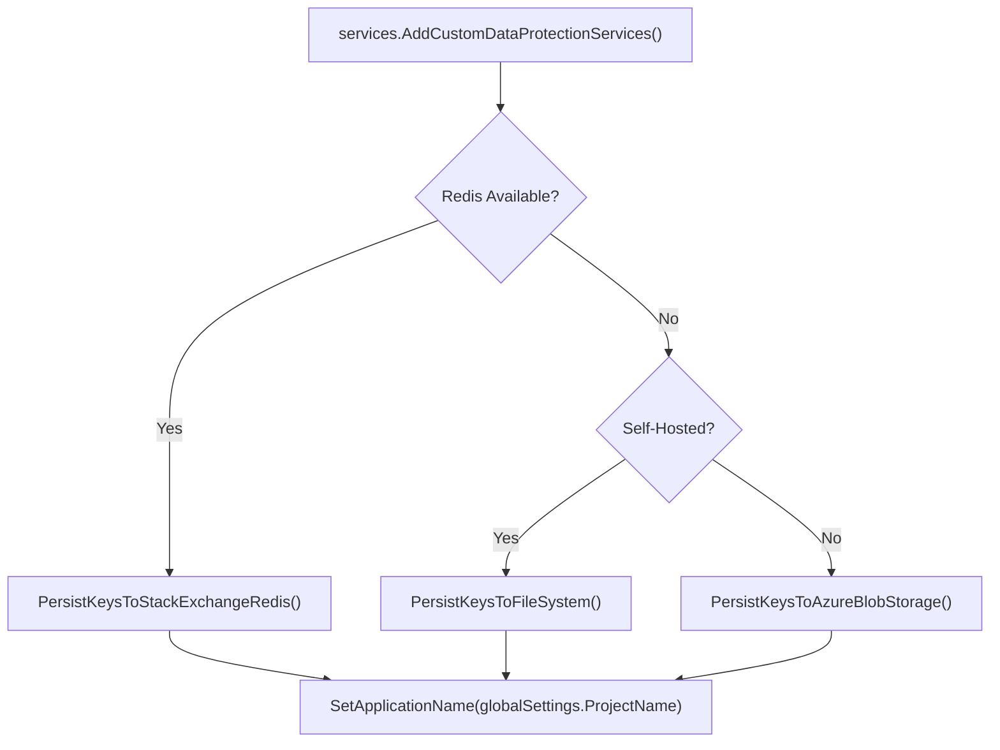

The application name ensures keys are shared across all instances of the same service but isolated from other services.

Sources: [src/Api/Startup.cs:74](https://github.com/bitwarden/server/blob/39f38f50/src/Api/Startup.cs#L74), [src/Identity/Startup.cs:48](https://github.com/bitwarden/server/blob/39f38f50/src/Identity/Startup.cs#L48), [src/Billing/Startup.cs:49](https://github.com/bitwarden/server/blob/39f38f50/src/Billing/Startup.cs#L49)

### Distributed Cache Configuration

The `AddDistributedCache()` extension selects a caching implementation based on available infrastructure:

**Cache Provider Selection:**

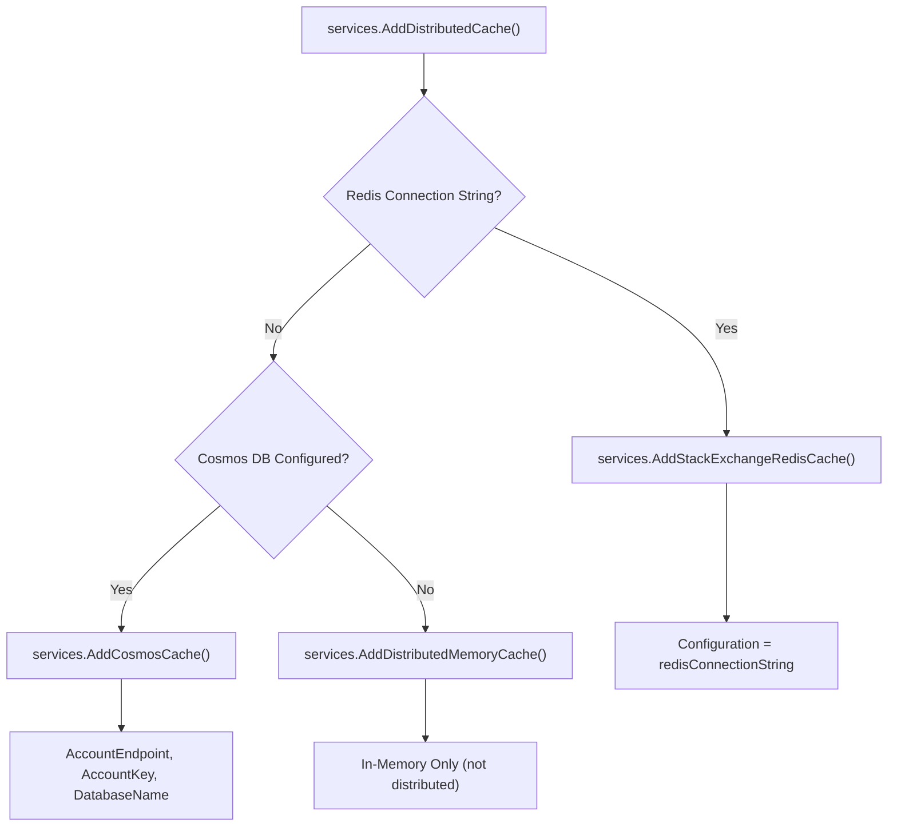

**Cache Usage:**

- `IDistributedCache`: Used for session storage, temporary data, and cross-service state
- Memory cache (`services.AddMemoryCache()`): Used for local, short-lived caching

Sources: [src/Api/Startup.cs:94-95](https://github.com/bitwarden/server/blob/39f38f50/src/Api/Startup.cs#L94-L95), [src/Identity/Startup.cs:58-59](https://github.com/bitwarden/server/blob/39f38f50/src/Identity/Startup.cs#L58-L59)

## Event Processing Configuration

### Service Bus Setup

Services configure event processing through Azure Service Bus or RabbitMQ:

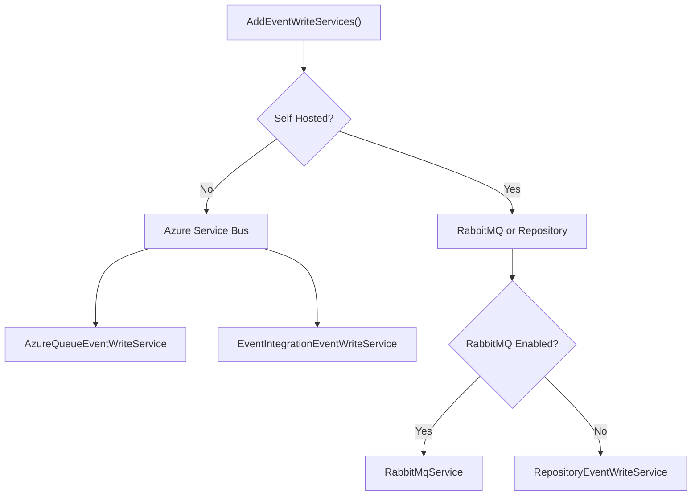