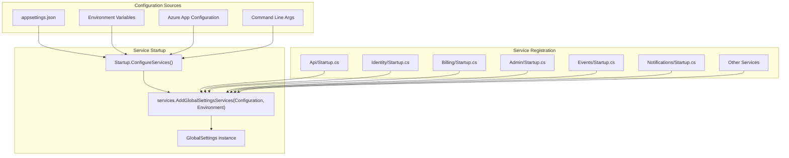
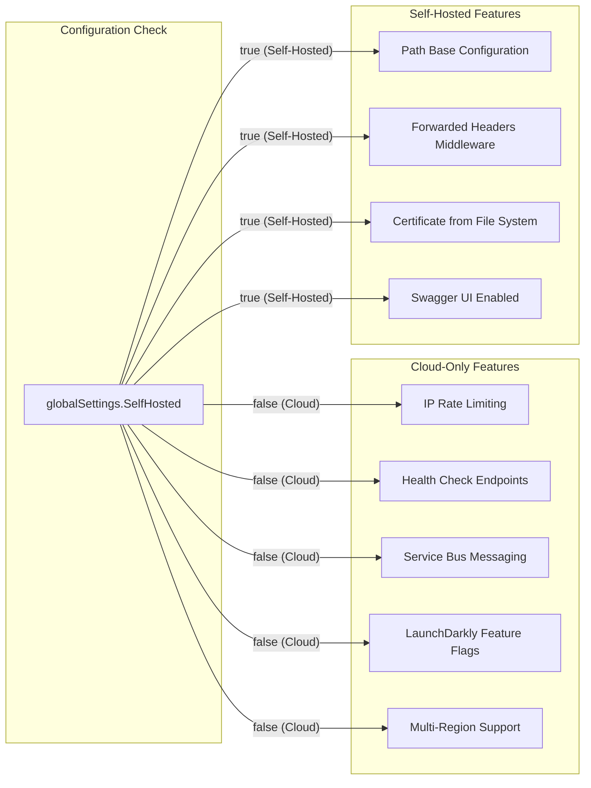
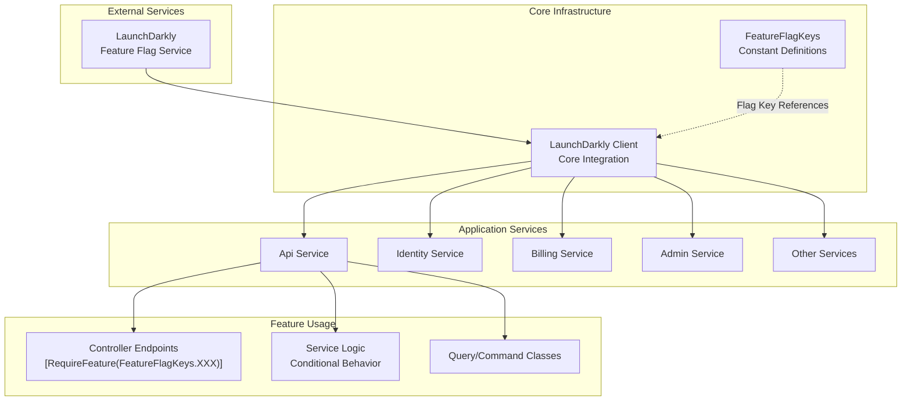
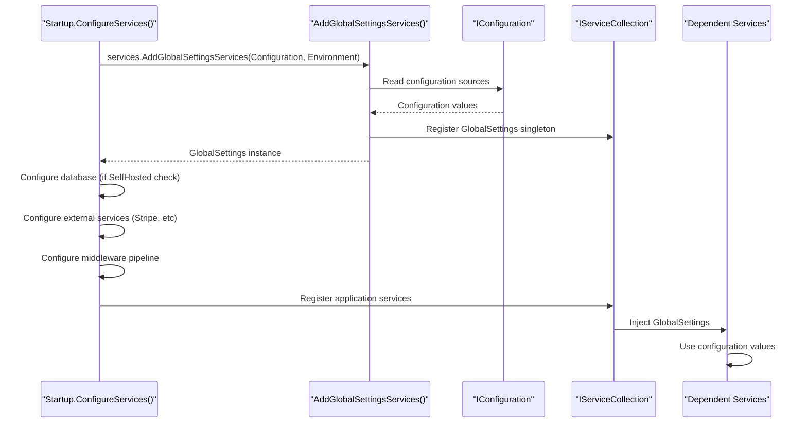

# Global Settings and Feature Flags

<details>
<summary>Relevant source files</summary>

The following files were used as context for generating this wiki page:

- [.gitignore](https://github.com/bitwarden/server/blob/39f38f50/.gitignore)
- [bitwarden_license/src/Scim/Startup.cs](https://github.com/bitwarden/server/blob/39f38f50/bitwarden_license/src/Scim/Startup.cs)
- [bitwarden_license/src/Scim/Utilities/ApiKeyAuthenticationHandler.cs](https://github.com/bitwarden/server/blob/39f38f50/bitwarden_license/src/Scim/Utilities/ApiKeyAuthenticationHandler.cs)
- [src/Admin/Startup.cs](https://github.com/bitwarden/server/blob/39f38f50/src/Admin/Startup.cs)
- [src/Api/AdminConsole/Models/Request/Organizations/OrganizationCreateRequestModel.cs](https://github.com/bitwarden/server/blob/39f38f50/src/Api/AdminConsole/Models/Request/Organizations/OrganizationCreateRequestModel.cs)
- [src/Api/AdminConsole/Models/Request/Organizations/OrganizationNoPaymentCreateRequest.cs](https://github.com/bitwarden/server/blob/39f38f50/src/Api/AdminConsole/Models/Request/Organizations/OrganizationNoPaymentCreateRequest.cs)
- [src/Api/Billing/Controllers/OrganizationBillingController.cs](https://github.com/bitwarden/server/blob/39f38f50/src/Api/Billing/Controllers/OrganizationBillingController.cs)
- [src/Api/Billing/Controllers/VNext/OrganizationBillingVNextController.cs](https://github.com/bitwarden/server/blob/39f38f50/src/Api/Billing/Controllers/VNext/OrganizationBillingVNextController.cs)
- [src/Api/Startup.cs](https://github.com/bitwarden/server/blob/39f38f50/src/Api/Startup.cs)
- [src/Billing/Services/Implementations/InvoiceCreatedHandler.cs](https://github.com/bitwarden/server/blob/39f38f50/src/Billing/Services/Implementations/InvoiceCreatedHandler.cs)
- [src/Billing/Startup.cs](https://github.com/bitwarden/server/blob/39f38f50/src/Billing/Startup.cs)
- [src/Core/Billing/Extensions/ServiceCollectionExtensions.cs](https://github.com/bitwarden/server/blob/39f38f50/src/Core/Billing/Extensions/ServiceCollectionExtensions.cs)
- [src/Core/Billing/Models/Sales/CustomerSetup.cs](https://github.com/bitwarden/server/blob/39f38f50/src/Core/Billing/Models/Sales/CustomerSetup.cs)
- [src/Core/Billing/Models/Sales/PremiumUserSale.cs](https://github.com/bitwarden/server/blob/39f38f50/src/Core/Billing/Models/Sales/PremiumUserSale.cs)
- [src/Core/Billing/Models/Sales/SubscriptionSetup.cs](https://github.com/bitwarden/server/blob/39f38f50/src/Core/Billing/Models/Sales/SubscriptionSetup.cs)
- [src/Core/Billing/Organizations/Models/OrganizationMetadata.cs](https://github.com/bitwarden/server/blob/39f38f50/src/Core/Billing/Organizations/Models/OrganizationMetadata.cs)
- [src/Core/Billing/Organizations/Queries/GetOrganizationMetadataQuery.cs](https://github.com/bitwarden/server/blob/39f38f50/src/Core/Billing/Organizations/Queries/GetOrganizationMetadataQuery.cs)
- [src/Core/Billing/Organizations/Services/OrganizationBillingService.cs](https://github.com/bitwarden/server/blob/39f38f50/src/Core/Billing/Organizations/Services/OrganizationBillingService.cs)
- [src/Core/Billing/Services/IPremiumUserBillingService.cs](https://github.com/bitwarden/server/blob/39f38f50/src/Core/Billing/Services/IPremiumUserBillingService.cs)
- [src/Core/Constants.cs](https://github.com/bitwarden/server/blob/39f38f50/src/Core/Constants.cs)
- [src/Core/Models/Business/OrganizationSignup.cs](https://github.com/bitwarden/server/blob/39f38f50/src/Core/Models/Business/OrganizationSignup.cs)
- [src/Core/Utilities/CoreHelpers.cs](https://github.com/bitwarden/server/blob/39f38f50/src/Core/Utilities/CoreHelpers.cs)
- [src/Events/Startup.cs](https://github.com/bitwarden/server/blob/39f38f50/src/Events/Startup.cs)
- [src/EventsProcessor/Startup.cs](https://github.com/bitwarden/server/blob/39f38f50/src/EventsProcessor/Startup.cs)
- [src/Identity/Controllers/SsoController.cs](https://github.com/bitwarden/server/blob/39f38f50/src/Identity/Controllers/SsoController.cs)
- [src/Identity/IdentityServer/ApiResources.cs](https://github.com/bitwarden/server/blob/39f38f50/src/Identity/IdentityServer/ApiResources.cs)
- [src/Identity/Startup.cs](https://github.com/bitwarden/server/blob/39f38f50/src/Identity/Startup.cs)
- [src/Notifications/Startup.cs](https://github.com/bitwarden/server/blob/39f38f50/src/Notifications/Startup.cs)
- [test/Api.Test/Billing/Controllers/OrganizationBillingControllerTests.cs](https://github.com/bitwarden/server/blob/39f38f50/test/Api.Test/Billing/Controllers/OrganizationBillingControllerTests.cs)
- [test/Core.Test/Billing/Organizations/Queries/GetOrganizationMetadataQueryTests.cs](https://github.com/bitwarden/server/blob/39f38f50/test/Core.Test/Billing/Organizations/Queries/GetOrganizationMetadataQueryTests.cs)
- [test/Core.Test/Billing/Services/OrganizationBillingServiceTests.cs](https://github.com/bitwarden/server/blob/39f38f50/test/Core.Test/Billing/Services/OrganizationBillingServiceTests.cs)
- [test/Core.Test/Utilities/CoreHelpersTests.cs](https://github.com/bitwarden/server/blob/39f38f50/test/Core.Test/Utilities/CoreHelpersTests.cs)
- [util/Server/Program.cs](https://github.com/bitwarden/server/blob/39f38f50/util/Server/Program.cs)
- [util/Server/Startup.cs](https://github.com/bitwarden/server/blob/39f38f50/util/Server/Startup.cs)

</details>


This document describes the configuration management system and feature flag infrastructure used throughout the Bitwarden server codebase. Global settings provide runtime configuration for database connections, external service integrations, and deployment-specific parameters. Feature flags enable controlled rollout of new functionality across the system.

For information about service startup and dependency injection configuration, see [Service Startup and Configuration](#2.2).

## Purpose and Scope

The global settings system provides centralized configuration management across all services through the `GlobalSettings` class. Feature flags enable gradual feature rollouts and A/B testing through LaunchDarkly integration. This page documents:

- `GlobalSettings` structure and configuration sources
- `FeatureFlagKeys` constants and organization
- Configuration loading in service startup
- Local development overrides and testing approaches

---

## GlobalSettings Configuration System

### Configuration Loading Process

All services load `GlobalSettings` during startup through a common pattern in their `Startup.cs` files. The configuration system reads from multiple sources including `appsettings.json`, environment variables, and Azure configuration stores.



**Sources:**
- [src/Api/Startup.cs:60-66](https://github.com/bitwarden/server/blob/39f38f50/src/Api/Startup.cs#L60-L66)
- [src/Identity/Startup.cs:34-40](https://github.com/bitwarden/server/blob/39f38f50/src/Identity/Startup.cs#L34-L40)
- [src/Billing/Startup.cs:34-42](https://github.com/bitwarden/server/blob/39f38f50/src/Billing/Startup.cs#L34-L42)
- [src/Admin/Startup.cs:34-41](https://github.com/bitwarden/server/blob/39f38f50/src/Admin/Startup.cs#L34-L41)
- [src/Events/Startup.cs:26-32](https://github.com/bitwarden/server/blob/39f38f50/src/Events/Startup.cs#L26-L32)
- [src/Notifications/Startup.cs:24-30](https://github.com/bitwarden/server/blob/39f38f50/src/Notifications/Startup.cs#L24-L30)

### Key Configuration Areas

The `GlobalSettings` object contains numerous configuration sections used throughout the application:

| Configuration Area | Purpose | Key Properties |
|-------------------|---------|---------------|
| **Database** | Database provider and connection strings | Database provider selection, connection strings for SQL Server/MySQL/PostgreSQL |
| **Stripe Integration** | Payment gateway configuration | `Stripe.ApiKey`, `Stripe.MaxNetworkRetries` |
| **BaseServiceUri** | Service endpoint URLs | `Api`, `Identity`, `Vault`, `InternalSso`, `CloudRegion` |
| **Storage** | Blob storage configuration | `ConnectionString` for Azure Blob Storage |
| **ServiceBus** | Message queue configuration | `ConnectionString`, `ApplicationCacheTopicName`, `ApplicationCacheSubscriptionName` |
| **IdentityServer** | OAuth/OIDC provider settings | Certificate location, thumbprint, password |
| **Mail** | Email delivery configuration | Connection strings, SMTP settings |
| **Notifications** | Real-time notification settings | Redis connection string for SignalR backplane |
| **SelfHosted** | Deployment mode flag | Boolean indicating self-hosted vs cloud deployment |

**Sources:**
- [src/Api/Startup.cs:66-84](https://github.com/bitwarden/server/blob/39f38f50/src/Api/Startup.cs#L66-L84)
- [src/Billing/Startup.cs:40-46](https://github.com/bitwarden/server/blob/39f38f50/src/Billing/Startup.cs#L40-L46)
- [src/Admin/Startup.cs:40-48](https://github.com/bitwarden/server/blob/39f38f50/src/Admin/Startup.cs#L40-L48)

### Self-Hosted vs Cloud Configuration

The `GlobalSettings.SelfHosted` flag determines deployment-specific behavior throughout the codebase:



**Sources:**
- [src/Api/Startup.cs:67-71](https://github.com/bitwarden/server/blob/39f38f50/src/Api/Startup.cs#L67-L71)
- [src/Api/Startup.cs:253-261](https://github.com/bitwarden/server/blob/39f38f50/src/Api/Startup.cs#L253-L261)
- [src/Api/Startup.cs:288-296](https://github.com/bitwarden/server/blob/39f38f50/src/Api/Startup.cs#L288-L296)
- [src/Identity/Startup.cs:41-45](https://github.com/bitwarden/server/blob/39f38f50/src/Identity/Startup.cs#L41-L45)
- [src/Identity/Startup.cs:194-198](https://github.com/bitwarden/server/blob/39f38f50/src/Identity/Startup.cs#L194-L198)
- [src/Admin/Startup.cs:80-86](https://github.com/bitwarden/server/blob/39f38f50/src/Admin/Startup.cs#L80-L86)

### Stripe Configuration

Stripe API configuration is set globally during service startup for payment processing:

```csharp
// Pattern used across Api, Billing, Admin, and Scim services
StripeConfiguration.ApiKey = globalSettings.Stripe.ApiKey;
StripeConfiguration.MaxNetworkRetries = globalSettings.Stripe.MaxNetworkRetries;
```

**Sources:**
- [src/Api/Startup.cs:82-84](https://github.com/bitwarden/server/blob/39f38f50/src/Api/Startup.cs#L82-L84)
- [src/Billing/Startup.cs:44-46](https://github.com/bitwarden/server/blob/39f38f50/src/Billing/Startup.cs#L44-L46)
- [src/Admin/Startup.cs:46-48](https://github.com/bitwarden/server/blob/39f38f50/src/Admin/Startup.cs#L46-L48)
- [bitwarden_license/src/Scim/Startup.cs:41-43](https://github.com/bitwarden/server/blob/39f38f50/bitwarden_license/src/Scim/Startup.cs#L41-L43)

### Common Setting Validation

The `CoreHelpers.SettingHasValue()` utility validates that configuration values are properly set and not placeholder values:

```csharp
public static bool SettingHasValue([NotNullWhen(true)] string? setting)
{
    var normalizedSetting = setting?.ToLowerInvariant();
    return !string.IsNullOrWhiteSpace(normalizedSetting) && 
           !normalizedSetting.Equals("secret") &&
           !normalizedSetting.Equals("replace");
}
```

This prevents services from using placeholder values like "secret" or "replace" from configuration templates.

**Sources:**
- [src/Core/Utilities/CoreHelpers.cs:358-363](https://github.com/bitwarden/server/blob/39f38f50/src/Core/Utilities/CoreHelpers.cs#L358-L363)
- [src/Events/Startup.cs:55-56](https://github.com/bitwarden/server/blob/39f38f50/src/Events/Startup.cs#L55-L56)
- [src/Identity/Startup.cs:157-158](https://github.com/bitwarden/server/blob/39f38f50/src/Identity/Startup.cs#L157-L158)

---

## Feature Flag System

### FeatureFlagKeys Constants

Feature flags are defined as string constants in the `FeatureFlagKeys` static class, organized by team ownership. Each constant represents a LaunchDarkly feature flag key.

```mermaid
graph TB
    subgraph "FeatureFlagKeys Class"
        FeatureFlagKeys["FeatureFlagKeys<br/>src/Core/Constants.cs"]
    end
    
    subgraph "Team-Organized Constants"
        AdminConsole["Admin Console Team<br/>PolicyRequirements<br/>ScimInviteUserOptimization<br/>EventBasedOrganizationIntegrations<br/>SeparateCustomRolePermissions<br/>CreateDefaultLocation<br/>PM23845_VNextApplicationCache"]
        Auth["Auth Team<br/>TwoFactorExtensionDataPersistence<br/>EmailVerification<br/>BrowserExtensionLoginApproval<br/>SetInitialPasswordRefactor<br/>ChangeExistingPasswordRefactor<br/>Otp6Digits<br/>FailedTwoFactorEmail<br/>DisableAlternateLoginMethods"]
        Billing["Billing Team<br/>TrialPayment<br/>PM17772_AdminInitiatedSponsorships<br/>UsePricingService<br/>PM19422_AllowAutomaticTaxUpdates<br/>PM21821_ProviderPortalTakeover<br/>PM22415_TaxIDWarnings<br/>PM25379_UseNewOrganizationMetadataStructure"]
        KeyMgmt["Key Management Team<br/>ReturnErrorOnExistingKeypair<br/>PM4154BulkEncryptionService<br/>PrivateKeyRegeneration<br/>Argon2Default<br/>UserkeyRotationV2<br/>SSHKeyItemVaultItem"]
        Mobile["Mobile Team<br/>AndroidImportLoginsFlow<br/>AndroidMutualTls<br/>SingleTapPasskeyCreation<br/>SingleTapPasskeyAuthentication<br/>MobileErrorReporting<br/>AndroidChromeAutofill"]
        Vault["Vault Team<br/>PM8851_BrowserOnboardingNudge<br/>PM9111ExtensionPersistAddEditForm<br/>CipherKeyEncryption<br/>EndUserNotifications<br/>PhishingDetection<br/>RemoveCardItemTypePolicy"]
    end
    
    subgraph "Utility Methods"
        GetAllKeys["GetAllKeys()<br/>Returns List<string>"]
        GetLocalOverrides["GetLocalOverrideFlagValues()<br/>Returns Dictionary<string, string>?"]
    end
    
    FeatureFlagKeys --> AdminConsole
    FeatureFlagKeys --> Auth
    FeatureFlagKeys --> Billing
    FeatureFlagKeys --> KeyMgmt
    FeatureFlagKeys --> Mobile
    FeatureFlagKeys --> Vault
    
    FeatureFlagKeys --> GetAllKeys
    FeatureFlagKeys --> GetLocalOverrides
```



**Sources:**
- [src/Core/Constants.cs:135-258](https://github.com/bitwarden/server/blob/39f38f50/src/Core/Constants.cs#L135-L258)

### Complete Feature Flag Reference

The following table shows all feature flags organized by team:

| Team | Feature Flag Constant | Description |
|------|----------------------|-------------|
| **Admin Console** | `PolicyRequirements` | Policy requirements system (pm-14439) |
| | `ScimInviteUserOptimization` | Optimize SCIM invite flow (pm-16811) |
| | `EventBasedOrganizationIntegrations` | Event-driven org integrations |
| | `SeparateCustomRolePermissions` | Custom role permission separation (pm-19917) |
| | `CreateDefaultLocation` | Default location creation (pm-19467) |
| | `PM23845_VNextApplicationCache` | Refactored application cache (pm-24957) |
| **Auth** | `TwoFactorExtensionDataPersistence` | 2FA extension data persistence (pm-9115) |
| | `EmailVerification` | Email verification feature |
| | `BrowserExtensionLoginApproval` | Browser extension login approvals (pm-14938) |
| | `SetInitialPasswordRefactor` | Initial password refactor (pm-16117) |
| | `ChangeExistingPasswordRefactor` | Password change refactor (pm-16117) |
| | `Otp6Digits` | 6-digit OTP support (pm-18612) |
| | `FailedTwoFactorEmail` | Failed 2FA email notifications (pm-24425) |
| | `DisableAlternateLoginMethods` | Disable alternate login methods (pm-22110) |
| **Billing** | `TrialPayment` | Trial payment handling (PM-8163) |
| | `PM17772_AdminInitiatedSponsorships` | Admin-initiated sponsorships |
| | `UsePricingService` | New pricing service usage |
| | `PM19422_AllowAutomaticTaxUpdates` | Automatic tax updates |
| | `PM21821_ProviderPortalTakeover` | Provider portal takeover |
| | `PM22415_TaxIDWarnings` | Tax ID validation warnings |
| | `PM25379_UseNewOrganizationMetadataStructure` | New org metadata structure |
| **Key Management** | `ReturnErrorOnExistingKeypair` | Error on existing keypair |
| | `PM4154BulkEncryptionService` | Bulk encryption service |
| | `PrivateKeyRegeneration` | Private key regeneration (pm-12241) |
| | `Argon2Default` | Argon2 as default KDF |
| | `UserkeyRotationV2` | User key rotation v2 |
| | `SSHKeyItemVaultItem` | SSH key vault items |
| | `ForceUpdateKDFSettings` | Force KDF settings update (pm-18021) |
| **Mobile** | `AndroidImportLoginsFlow` | Android import flow |
| | `AndroidMutualTls` | Android mutual TLS |
| | `SingleTapPasskeyCreation` | Single-tap passkey creation |
| | `SingleTapPasskeyAuthentication` | Single-tap passkey auth |
| | `MobileErrorReporting` | Mobile error reporting |
| | `AndroidChromeAutofill` | Android Chrome autofill |
| **Vault** | `CipherKeyEncryption` | Cipher key encryption |
| | `EndUserNotifications` | End user notifications (pm-10609) |
| | `PhishingDetection` | Phishing detection |
| | `RemoveCardItemTypePolicy` | Remove card type policy (pm-16442) |

**Sources:**
- [src/Core/Constants.cs:136-244](https://github.com/bitwarden/server/blob/39f38f50/src/Core/Constants.cs#L136-L244)

### Feature Flag Utility Methods

The `FeatureFlagKeys` class provides two utility methods for working with feature flags:

#### GetAllKeys()

Returns a list of all feature flag keys defined in the class using reflection:

```csharp
public static List<string> GetAllKeys()
{
    return typeof(FeatureFlagKeys)
        .GetFields(BindingFlags.Public | BindingFlags.Static | BindingFlags.FlattenHierarchy)
        .Where(fi => fi.IsLiteral && !fi.IsInitOnly && fi.FieldType == typeof(string))
        .Select(x => (string)x.GetRawConstantValue())
        .ToList();
}
```

#### GetLocalOverrideFlagValues()

Allows local development overrides of feature flag values for offline testing:

```csharp
public static Dictionary<string, string> GetLocalOverrideFlagValues()
{
    // place overriding values when needed locally (offline), or return null
    return null;
}
```

**Sources:**
- [src/Core/Constants.cs:245-257](https://github.com/bitwarden/server/blob/39f38f50/src/Core/Constants.cs#L245-L257)

---

## LaunchDarkly Integration

### Architecture Overview

The system integrates with LaunchDarkly for feature flag management in cloud deployments. Self-hosted deployments may have limited feature flag functionality.



**Sources:**
- Architecture diagrams (Diagram 1, Diagram 2)
- [src/Core/Constants.cs:135-258](https://github.com/bitwarden/server/blob/39f38f50/src/Core/Constants.cs#L135-L258)

### Feature Flag Usage in Controllers

Feature flags gate access to API endpoints using the `RequireFeature` attribute:

```csharp
[Authorize<MemberOrProviderRequirement>]
[HttpGet("metadata")]
[RequireFeature(FeatureFlagKeys.PM25379_UseNewOrganizationMetadataStructure)]
[InjectOrganization]
public async Task<IResult> GetMetadataAsync(
    [BindNever] Organization organization)
{
    var metadata = await getOrganizationMetadataQuery.Run(organization);
    
    if (metadata == null)
    {
        return TypedResults.NotFound();
    }
    
    return TypedResults.Ok(metadata);
}
```

**Sources:**
- [src/Api/Billing/Controllers/VNext/OrganizationBillingVNextController.cs:118-133](https://github.com/bitwarden/server/blob/39f38f50/src/Api/Billing/Controllers/VNext/OrganizationBillingVNextController.cs#L118-L133)

---

## Configuration in Service Startup

### Standard Startup Pattern

All services follow a consistent pattern for loading global settings and configuring dependencies:



**Sources:**
- [src/Api/Startup.cs:60-105](https://github.com/bitwarden/server/blob/39f38f50/src/Api/Startup.cs#L60-L105)
- [src/Identity/Startup.cs:34-73](https://github.com/bitwarden/server/blob/39f38f50/src/Identity/Startup.cs#L34-L73)
- [src/Billing/Startup.cs:34-94](https://github.com/bitwarden/server/blob/39f38f50/src/Billing/Startup.cs#L34-L94)

### Conditional Service Registration

Services conditionally register features based on `GlobalSettings` values:

```csharp
// Example: Service Bus integration for application cache
if (CoreHelpers.SettingHasValue(globalSettings.ServiceBus.ConnectionString) &&
    CoreHelpers.SettingHasValue(globalSettings.ServiceBus.ApplicationCacheTopicName))
{
    services.AddHostedService<Core.HostedServices.ApplicationCacheHostedService>();
}

// Example: IP rate limiting (cloud only)
if (!globalSettings.SelfHosted)
{
    services.AddIpRateLimiting(globalSettings);
}

// Example: Health checks (cloud only)
if (!globalSettings.SelfHosted)
{
    services.AddHealthChecks(globalSettings);
}
```

**Sources:**
- [src/Api/Startup.cs:100-104](https://github.com/bitwarden/server/blob/39f38f50/src/Api/Startup.cs#L100-L104)
- [src/Api/Startup.cs:201-204](https://github.com/bitwarden/server/blob/39f38f50/src/Api/Startup.cs#L201-L204)
- [src/Api/Startup.cs:226-230](https://github.com/bitwarden/server/blob/39f38f50/src/Api/Startup.cs#L226-L230)
- [src/Identity/Startup.cs:157-161](https://github.com/bitwarden/server/blob/39f38f50/src/Identity/Startup.cs#L157-L161)

---

## Local Development Configuration

### Local Override Strategy

Developers can override configuration values locally without committing changes to the repository. The `.gitignore` file excludes configuration override files:

```
*.override.env
**/flags.json
```

**Sources:**
- [.gitignore:206](https://github.com/bitwarden/server/blob/39f38f50/.gitignore#L206)
- [.gitignore:229](https://github.com/bitwarden/server/blob/39f38f50/.gitignore#L229)

### Feature Flag Local Overrides

The `FeatureFlagKeys.GetLocalOverrideFlagValues()` method provides a hook for local feature flag overrides during development. Developers can modify this method to return a dictionary of flag overrides without affecting production code:

```csharp
public static Dictionary<string, string> GetLocalOverrideFlagValues()
{
    // Example local override (not committed):
    // return new Dictionary<string, string>
    // {
    //     { PolicyRequirements, "true" },
    //     { UsePricingService, "false" }
    // };
    
    return null; // Default: no overrides
}
```

**Sources:**
- [src/Core/Constants.cs:253-257](https://github.com/bitwarden/server/blob/39f38f50/src/Core/Constants.cs#L253-L257)

### Self-Hosted Development

When developing with `GlobalSettings.SelfHosted = true`, several features behave differently:

- Swagger UI remains enabled in production mode
- Path base configuration (e.g., `/admin`, `/identity`) is applied
- Forwarded headers middleware processes proxy headers
- Certificates can be loaded from the file system
- Rate limiting and health checks are disabled

**Sources:**
- [src/Api/Startup.cs:258-261](https://github.com/bitwarden/server/blob/39f38f50/src/Api/Startup.cs#L258-L261)
- [src/Api/Startup.cs:300-326](https://github.com/bitwarden/server/blob/39f38f50/src/Api/Startup.cs#L300-L326)
- [src/Identity/Startup.cs:194-198](https://github.com/bitwarden/server/blob/39f38f50/src/Identity/Startup.cs#L194-L198)
- [src/Admin/Startup.cs:145-149](https://github.com/bitwarden/server/blob/39f38f50/src/Admin/Startup.cs#L145-L149)

---

## Common Constants

### Other Constant Values

The `Constants` class contains additional system-wide constants beyond feature flags:

| Constant | Value | Purpose |
|----------|-------|---------|
| `BypassFiltersEventId` | `12482444` | Event ID for logging filter bypasses |
| `FailedSecretVerificationDelay` | `2000` | Delay in ms for failed verification attempts |
| `SelfHostedMaxStorageGb` | `10240` | Maximum storage limit for self-hosted (10 TB) |
| `FileSize101mb` | `101 * 1024 * 1024` | 101 MB file size limit (with cushion) |
| `FileSize501mb` | `501 * 1024 * 1024` | 501 MB file size limit (with cushion) |
| `DatabaseFieldProtectorPurpose` | `"DatabaseFieldProtection"` | Data protection purpose string |
| `DatabaseFieldProtectedPrefix` | `"P|"` | Prefix for protected database fields |
| `OrganizationSelfHostSubscriptionGracePeriodDays` | `60` | Grace period for expired licenses |
| `IdentityProvider` | `"bitwarden"` | IdentityServer provider identifier |

**Sources:**
- [src/Core/Constants.cs:8-45](https://github.com/bitwarden/server/blob/39f38f50/src/Core/Constants.cs#L8-L45)

### Billing-Related Constants

```csharp
// Stripe proration behaviors
public const string CreateProrations = "create_prorations";
public const string AlwaysInvoice = "always_invoice";

// Country abbreviations
public static class CountryAbbreviations
{
    public const string UnitedStates = "US";
}

// Browser extension IDs
public static class BrowserExtensions
{
    public const string ChromeId = "chrome-extension://nngceckbapebfimnlniiiahkandclblb/";
    public const string EdgeId = "chrome-extension://jbkfoedolllekgbhcbcoahefnbanhhlh/";
    public const string OperaId = "chrome-extension://ccnckbpmaceehanjmeomladnmlffdjgn/";
}
```

**Sources:**
- [src/Core/Constants.cs:47-84](https://github.com/bitwarden/server/blob/39f38f50/src/Core/Constants.cs#L47-L84)

### Authentication Constants

The `AuthConstants` class defines password hashing parameters:

```csharp
public static class AuthConstants
{
    public static readonly RangeConstant PBKDF2_ITERATIONS = new(600_000, 2_000_000, 600_000);
    
    public static readonly RangeConstant ARGON2_ITERATIONS = new(2, 10, 3);
    public static readonly RangeConstant ARGON2_MEMORY = new(15, 1024, 64);
    public static readonly RangeConstant ARGON2_PARALLELISM = new(1, 16, 4);
    
    public static readonly string NewDeviceVerificationExceptionCacheKeyFormat = 
        "NewDeviceVerificationException_{0}";
}
```

**Sources:**
- [src/Core/Constants.cs:86-94](https://github.com/bitwarden/server/blob/39f38f50/src/Core/Constants.cs#L86-L94)

---

## Configuration Usage Examples

### Checking Configuration Values

Use `CoreHelpers.SettingHasValue()` to validate configuration before using it:

```csharp
// Service Bus configuration check
var usingServiceBusAppCache = 
    CoreHelpers.SettingHasValue(globalSettings.ServiceBus.ConnectionString) &&
    CoreHelpers.SettingHasValue(globalSettings.ServiceBus.ApplicationCacheTopicName);

if (usingServiceBusAppCache)
{
    services.AddHostedService<Core.HostedServices.ApplicationCacheHostedService>();
}

// Mail service configuration check
if (CoreHelpers.SettingHasValue(globalSettings.Mail.ConnectionString))
{
    services.AddHostedService<HostedServices.AzureQueueMailHostedService>();
}
```

**Sources:**
- [src/Events/Startup.cs:55-62](https://github.com/bitwarden/server/blob/39f38f50/src/Events/Startup.cs#L55-L62)
- [src/Admin/Startup.cs:127-131](https://github.com/bitwarden/server/blob/39f38f50/src/Admin/Startup.cs#L127-L131)

### CORS Configuration

Global settings define allowed origins for CORS policy:

```csharp
public static bool IsCorsOriginAllowed(string origin, GlobalSettings globalSettings)
{
    return
        // Web vault
        origin == globalSettings.BaseServiceUri.Vault ||
        // Safari extension origin
        origin == "file://" ||
        // Product website
        (!globalSettings.SelfHosted && origin == "https://bitwarden.com");
}
```

**Sources:**
- [src/Core/Utilities/CoreHelpers.cs:651-660](https://github.com/bitwarden/server/blob/39f38f50/src/Core/Utilities/CoreHelpers.cs#L651-L660)

### Identity Server Certificate Loading

The system supports multiple certificate sources based on configuration:

```csharp
public static X509Certificate2? GetIdentityServerCertificate(GlobalSettings globalSettings)
{
    if (globalSettings.SelfHosted &&
        SettingHasValue(globalSettings.IdentityServer.CertificatePassword) &&
        File.Exists(globalSettings.IdentityServer.CertificateLocation))
    {
        // Load from file system (self-hosted)
        return GetCertificate(
            globalSettings.IdentityServer.CertificateLocation,
            globalSettings.IdentityServer.CertificatePassword);
    }
    else if (SettingHasValue(globalSettings.IdentityServer.CertificateThumbprint))
    {
        // Load from certificate store
        return GetCertificate(globalSettings.IdentityServer.CertificateThumbprint);
    }
    else if (!globalSettings.SelfHosted &&
        SettingHasValue(globalSettings.Storage?.ConnectionString) &&
        SettingHasValue(globalSettings.IdentityServer.CertificatePassword))
    {
        // Load from Azure Blob Storage (cloud)
        return GetBlobCertificateAsync(
            globalSettings.Storage.ConnectionString,
            "certificates",
            "identity.pfx",
            globalSettings.IdentityServer.CertificatePassword).GetAwaiter().GetResult();
    }
    return null;
}
```

**Sources:**