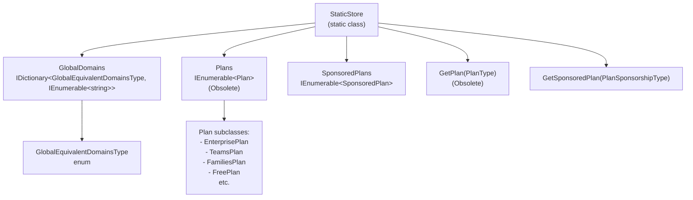
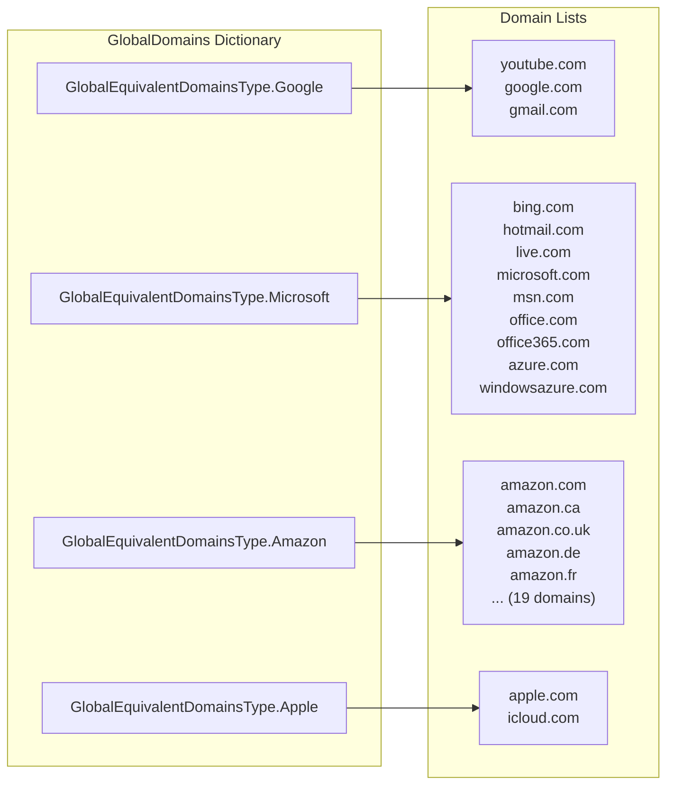
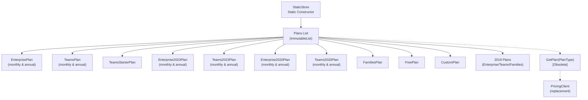
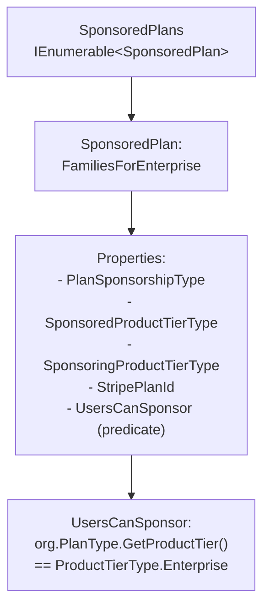

# Static Store and Domain Management

<details>
<summary>Relevant source files</summary>

The following files were used as context for generating this wiki page:

- [src/Core/Enums/GlobalEquivalentDomainsType.cs](https://github.com/bitwarden/server/blob/39f38f50/src/Core/Enums/GlobalEquivalentDomainsType.cs)
- [src/Core/Utilities/StaticStore.cs](https://github.com/bitwarden/server/blob/39f38f50/src/Core/Utilities/StaticStore.cs)
- [src/Sql/dbo/Stored Procedures/Organization_Create.sql](https://github.com/bitwarden/server/blob/39f38f50/src/Sql/dbo/Stored Procedures/Organization_Create.sql)
- [src/Sql/dbo/Stored Procedures/Organization_Update.sql](https://github.com/bitwarden/server/blob/39f38f50/src/Sql/dbo/Stored Procedures/Organization_Update.sql)
- [src/Sql/dbo/Tables/Organization.sql](https://github.com/bitwarden/server/blob/39f38f50/src/Sql/dbo/Tables/Organization.sql)
- [src/Sql/dbo/Views/OrganizationUserOrganizationDetailsView.sql](https://github.com/bitwarden/server/blob/39f38f50/src/Sql/dbo/Views/OrganizationUserOrganizationDetailsView.sql)

</details>


## Purpose and Scope

The StaticStore is a centralized utility in the Core library that manages two primary types of reference data: **global domain equivalencies** and **subscription plans**. Global domain equivalencies group related domains together (e.g., google.com, youtube.com, and gmail.com are all considered equivalent "Google" domains) to improve vault login matching. The subscription plan data in StaticStore is deprecated and being migrated to a new pricing system.

For information about URI matching and how domain equivalencies are applied to vault items, see [URI Match Types and Domain Equivalence](#7.2). For details on active subscription management, see [Subscription Plans and Pricing](#8.4).

**Sources:** [src/Core/Utilities/StaticStore.cs:1-165](https://github.com/bitwarden/server/blob/39f38f50/src/Core/Utilities/StaticStore.cs#L1-L165)

## StaticStore Architecture



**Sources:** [src/Core/Utilities/StaticStore.cs:14-164](https://github.com/bitwarden/server/blob/39f38f50/src/Core/Utilities/StaticStore.cs#L14-L164)

## Global Domain Equivalencies

### Overview

Global domain equivalencies define groups of domains that should be treated as equivalent when matching login URIs in the vault. This allows users to store a single login for "Google" and have it match across youtube.com, gmail.com, and other Google properties.

The StaticStore initializes these mappings in its static constructor, creating a dictionary that maps each `GlobalEquivalentDomainsType` enum value to a list of domain strings.

**Sources:** [src/Core/Utilities/StaticStore.cs:16-112](https://github.com/bitwarden/server/blob/39f38f50/src/Core/Utilities/StaticStore.cs#L16-L112)

### Domain Groups Structure



**Sources:** [src/Core/Utilities/StaticStore.cs:22-112](https://github.com/bitwarden/server/blob/39f38f50/src/Core/Utilities/StaticStore.cs#L22-L112)

### GlobalEquivalentDomainsType Enum

The `GlobalEquivalentDomainsType` enum defines 96 distinct domain groups, each representing a major service provider or brand. The enum uses byte values (0-95) for efficient storage.

| Enum Value | Domain Group | Example Domains |
|------------|--------------|-----------------|
| `Google` (0) | Google services | youtube.com, google.com, gmail.com |
| `Microsoft` (10) | Microsoft services | bing.com, hotmail.com, live.com, microsoft.com, office.com, azure.com |
| `Amazon` (18) | Amazon regional sites | amazon.com, amazon.ca, amazon.co.uk, amazon.de (19 total) |
| `Apple` (1) | Apple services | apple.com, icloud.com |
| `PayPal` (14) | PayPal services | paypal.com, paypal-search.com |
| `Facebook` (51) | Facebook services | facebook.com, messenger.com |
| `Atlassian` (89) | Atlassian products | atlassian.com, bitbucket.org, trello.com, jira.com |
| `Discord` (81) | Discord services | discordapp.com, discord.com |
| `Proton` (85) | Proton services | proton.me, protonmail.com, protonvpn.com |

**Notable Groups:**
- **Financial services**: BoA, WellsFargo, Citi, Merrill, MorganStanley, Schwab
- **Cloud providers**: Microsoft, Amazon, Google
- **E-commerce**: Amazon, Ebay, Shopify
- **Gaming platforms**: Steam, Playstation, Discord
- **Enterprise SaaS**: Atlassian, Zendesk, Docusign

**Deprecated entries:**
- `Mozilla` (67) - Marked as deprecated in the enum

**Sources:** [src/Core/Enums/GlobalEquivalentDomainsType.cs:1-97](https://github.com/bitwarden/server/blob/39f38f50/src/Core/Enums/GlobalEquivalentDomainsType.cs#L1-L97)

### Example Domain Mappings

Here are some notable domain equivalency groups from the StaticStore initialization:

```
GlobalEquivalentDomainsType.Google:
  - youtube.com
  - google.com
  - gmail.com

GlobalEquivalentDomainsType.Microsoft:
  - bing.com, hotmail.com, live.com, microsoft.com, msn.com
  - passport.net, windows.com, microsoftonline.com
  - office.com, office365.com, microsoftstore.com
  - xbox.com, azure.com, windowsazure.com

GlobalEquivalentDomainsType.Amazon:
  - amazon.com, amazon.com.be, amazon.ae, amazon.ca
  - amazon.co.uk, amazon.com.au, amazon.com.br
  - amazon.com.mx, amazon.com.tr, amazon.de, amazon.es
  - amazon.fr, amazon.in, amazon.it, amazon.nl
  - amazon.pl, amazon.sa, amazon.se, amazon.sg

GlobalEquivalentDomainsType.Airbnb:
  - 59 different country-specific Airbnb domains

GlobalEquivalentDomainsType.Wikimedia:
  - mediawiki.org, wikibooks.org, wikidata.org
  - wikimedia.org, wikinews.org, wikipedia.org
  - wikiquote.org, wikisource.org, wikiversity.org
  - wikivoyage.org, wiktionary.org
```

**Sources:** [src/Core/Utilities/StaticStore.cs:22-112](https://github.com/bitwarden/server/blob/39f38f50/src/Core/Utilities/StaticStore.cs#L22-L112)

### Usage in URI Matching

The global domain equivalencies are used when matching vault login items to websites. When a user visits a site, the client can query whether that domain is part of a global equivalency group, and if so, return all vault items that match any domain in that group.

**Integration Points:**
- The `GlobalDomains` dictionary is accessed directly by services that need to match URIs
- The vault system uses these equivalencies when `UriMatchType` is set to match global equivalents
- Self-hosted and cloud deployments use the same static domain mappings

**Sources:** [src/Core/Utilities/StaticStore.cs:143](https://github.com/bitwarden/server/blob/39f38f50/src/Core/Utilities/StaticStore.cs#L143)

## Subscription Plans (Deprecated)

### Plans Collection

The StaticStore historically managed subscription plan definitions in the `Plans` collection. This collection is now marked as `[Obsolete]` and developers are directed to use the `PricingClient` instead.



**Sources:** [src/Core/Utilities/StaticStore.cs:114-141](https://github.com/bitwarden/server/blob/39f38f50/src/Core/Utilities/StaticStore.cs#L114-L141), [src/Core/Utilities/StaticStore.cs:144-145](https://github.com/bitwarden/server/blob/39f38f50/src/Core/Utilities/StaticStore.cs#L144-L145), [src/Core/Utilities/StaticStore.cs:159-160](https://github.com/bitwarden/server/blob/39f38f50/src/Core/Utilities/StaticStore.cs#L159-L160)

### Plan Types Included

The StaticStore initializes the following plan types in its static constructor:

| Plan Class | Variants | Description |
|------------|----------|-------------|
| `EnterprisePlan` | Monthly, Annual | Current enterprise plan |
| `TeamsPlan` | Monthly, Annual | Current teams plan |
| `TeamsStarterPlan` | Single | Teams starter plan |
| `Enterprise2023Plan` | Monthly, Annual | 2023 enterprise plan version |
| `Teams2023Plan` | Monthly, Annual | 2023 teams plan version |
| `Enterprise2020Plan` | Monthly, Annual | 2020 enterprise plan version |
| `Teams2020Plan` | Monthly, Annual | 2020 teams plan version |
| `FamiliesPlan` | Single | Families plan (formerly Families2019Plan) |
| `FreePlan` | Single | Free tier |
| `CustomPlan` | Single | Custom/negotiated plans |
| `Enterprise2019Plan` | Monthly, Annual | Legacy 2019 enterprise plan |
| `Teams2019Plan` | Monthly, Annual | Legacy 2019 teams plan |
| `Families2019Plan` | Single | Legacy 2019 families plan |

**Note:** The Plans collection includes multiple versions of enterprise and teams plans to support legacy subscriptions while introducing updated pricing structures.

**Sources:** [src/Core/Utilities/StaticStore.cs:114-141](https://github.com/bitwarden/server/blob/39f38f50/src/Core/Utilities/StaticStore.cs#L114-L141)

### Deprecation and Migration

The `Plans` property and `GetPlan` method are both marked with `[Obsolete]` attributes directing developers to use alternative approaches:

```csharp
[Obsolete("Use PricingClient.ListPlans to retrieve all plans.")]
public static IEnumerable<Plan> Plans { get; }

[Obsolete("Use PricingClient.GetPlan to retrieve a plan.")]
public static Plan GetPlan(PlanType planType)
```

The migration to `PricingClient` allows for more dynamic plan management rather than static initialization, enabling:
- Runtime plan configuration changes
- Regional pricing variations
- Feature flag controlled plan availability
- Easier testing and mocking

**Sources:** [src/Core/Utilities/StaticStore.cs:144-145](https://github.com/bitwarden/server/blob/39f38f50/src/Core/Utilities/StaticStore.cs#L144-L145), [src/Core/Utilities/StaticStore.cs:159-160](https://github.com/bitwarden/server/blob/39f38f50/src/Core/Utilities/StaticStore.cs#L159-L160)

## Sponsored Plans

### SponsoredPlans Collection

The `SponsoredPlans` collection manages plan sponsorship configurations, where one organization type can sponsor premium access for users in another organization type. Unlike the deprecated `Plans` collection, `SponsoredPlans` remains active.



**Sources:** [src/Core/Utilities/StaticStore.cs:146-157](https://github.com/bitwarden/server/blob/39f38f50/src/Core/Utilities/StaticStore.cs#L146-L157)

### Families for Enterprise Sponsorship

Currently, the only sponsored plan is the "Families for Enterprise" program, which allows enterprise organizations to sponsor Families plan subscriptions for their members.

**Configuration Details:**

| Property | Value |
|----------|-------|
| `PlanSponsorshipType` | `FamiliesForEnterprise` |
| `SponsoredProductTierType` | `ProductTierType.Families` |
| `SponsoringProductTierType` | `ProductTierType.Enterprise` |
| `StripePlanId` | `"2021-family-for-enterprise-annually"` |
| `UsersCanSponsor` | Predicate checking if org tier is Enterprise |

The `UsersCanSponsor` predicate verifies that the sponsoring organization has an Enterprise-tier plan:

```csharp
UsersCanSponsor = (OrganizationUserOrganizationDetails org) =>
    org.PlanType.GetProductTier() == ProductTierType.Enterprise
```

**Sources:** [src/Core/Utilities/StaticStore.cs:146-157](https://github.com/bitwarden/server/blob/39f38f50/src/Core/Utilities/StaticStore.cs#L146-L157)

### GetSponsoredPlan Method

The `GetSponsoredPlan` method retrieves a sponsored plan configuration by its sponsorship type:

```csharp
public static SponsoredPlan GetSponsoredPlan(PlanSponsorshipType planSponsorshipType) =>
    SponsoredPlans.FirstOrDefault(p => p.PlanSponsorshipType == planSponsorshipType);
```

This method is actively used in the billing and organization management systems to determine sponsorship eligibility and configure sponsored subscriptions.

**Sources:** [src/Core/Utilities/StaticStore.cs:162-163](https://github.com/bitwarden/server/blob/39f38f50/src/Core/Utilities/StaticStore.cs#L162-L163)

## Database Integration

### Organization Plan Storage

While the StaticStore defines plan configurations, the actual plan assignments for organizations are stored in the database. The Organization table tracks both a string `Plan` name and a numeric `PlanType` enumeration.

**Organization Table Plan Fields:**

| Column | Type | Description |
|--------|------|-------------|
| `Plan` | `NVARCHAR(50)` | String identifier for the plan |
| `PlanType` | `TINYINT` | Numeric enum value for the plan type |

**Related Feature Flags:**

Organizations also have numerous boolean flags that correspond to plan features:
- `UsePolicies`, `UseSso`, `UseGroups`, `UseDirectory`, `UseEvents`
- `UseTotp`, `Use2fa`, `UseApi`, `UseResetPassword`
- `UseKeyConnector`, `UseScim`, `UseCustomPermissions`
- `UseSecretsManager`, `UsePasswordManager`
- `UseRiskInsights`, `UseOrganizationDomains`, `UseAdminSponsoredFamilies`

**Sources:** [src/Sql/dbo/Tables/Organization.sql:12-13](https://github.com/bitwarden/server/blob/39f38f50/src/Sql/dbo/Tables/Organization.sql#L12-L13), [src/Sql/dbo/Tables/Organization.sql:16-60](https://github.com/bitwarden/server/blob/39f38f50/src/Sql/dbo/Tables/Organization.sql#L16-L60)

### Organization Creation and Updates

The stored procedures for creating and updating organizations accept plan-related parameters:

```sql
@Plan NVARCHAR(50),
@PlanType TINYINT,
@Seats INT,
@MaxCollections SMALLINT,
-- Feature flags for plan capabilities
@UsePolicies BIT,
@UseSso BIT,
-- ... additional feature flags
```

These values are set based on the plan configuration, either from StaticStore (for legacy integrations) or from the PricingClient (for new implementations).

**Sources:** [src/Sql/dbo/Stored Procedures/Organization_Create.sql:12-13](https://github.com/bitwarden/server/blob/39f38f50/src/Sql/dbo/Stored Procedures/Organization_Create.sql#L12-L13), [src/Sql/dbo/Stored Procedures/Organization_Update.sql:12-13](https://github.com/bitwarden/server/blob/39f38f50/src/Sql/dbo/Stored Procedures/Organization_Update.sql#L12-L13)

### OrganizationUserOrganizationDetailsView

The `OrganizationUserOrganizationDetailsView` exposes organization plan information to organization users, including:
- `PlanType` - The numeric plan type
- Feature flags (UsePolicies, UseSso, UseSecretsManager, etc.)
- Seat counts (`Seats`, `SmSeats`)
- Storage limits (`MaxStorageGb`)

This view is used throughout the application to determine what features are available to users based on their organization's plan.

**Sources:** [src/Sql/dbo/Views/OrganizationUserOrganizationDetailsView.sql:9](https://github.com/bitwarden/server/blob/39f38f50/src/Sql/dbo/Views/OrganizationUserOrganizationDetailsView.sql#L9), [src/Sql/dbo/Views/OrganizationUserOrganizationDetailsView.sql:10-56](https://github.com/bitwarden/server/blob/39f38f50/src/Sql/dbo/Views/OrganizationUserOrganizationDetailsView.sql#L10-L56)

## Implementation Notes

### Static Initialization

The StaticStore uses a static constructor to initialize all data at application startup. This ensures that global domains and plans are immediately available without additional initialization code:

```csharp
static StaticStore()
{
    // Initialize GlobalDomains dictionary
    GlobalDomains = new Dictionary<GlobalEquivalentDomainsType, IEnumerable<string>>();
    GlobalDomains.Add(GlobalEquivalentDomainsType.Google, new List<string> { ... });
    // ... more domain mappings
    
    // Initialize Plans list (obsolete)
    Plans = new List<Plan> { ... }.ToImmutableList();
}
```

**Sources:** [src/Core/Utilities/StaticStore.cs:16-141](https://github.com/bitwarden/server/blob/39f38f50/src/Core/Utilities/StaticStore.cs#L16-L141)

### Thread Safety

The StaticStore is thread-safe by design:
- `GlobalDomains` is initialized once in the static constructor
- `Plans` is an `ImmutableList`, preventing modification after initialization
- `SponsoredPlans` is an array, which is immutable once created
- All access is read-only through public properties

### Null Safety

The file header indicates that null safety has not been fully implemented:

```csharp
// FIXME: Update this file to be null safe and then delete the line below
#nullable disable
```

This is a known technical debt item that should be addressed in future refactoring.

**Sources:** [src/Core/Utilities/StaticStore.cs:1-2](https://github.com/bitwarden/server/blob/39f38f50/src/Core/Utilities/StaticStore.cs#L1-L2)

### Performance Considerations

**Global Domains:**
- Dictionary lookup is O(1) for retrieving domain lists
- Domain lists are small (typically 2-60 domains per group)
- Static initialization ensures no runtime overhead

**Plans (Deprecated):**
- `GetPlan` performs a linear search with `SingleOrDefault`, which is O(n)
- The Plans list contains approximately 21 plan variants
- This is acceptable performance for a deprecated API being replaced