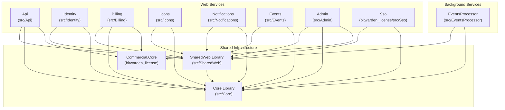
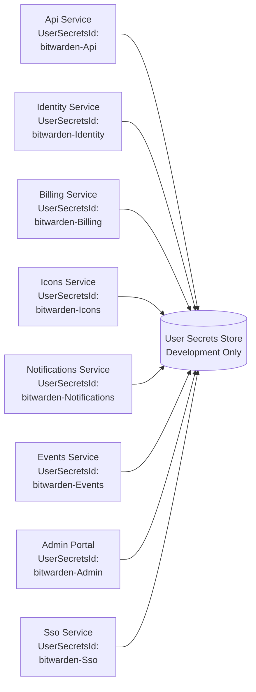
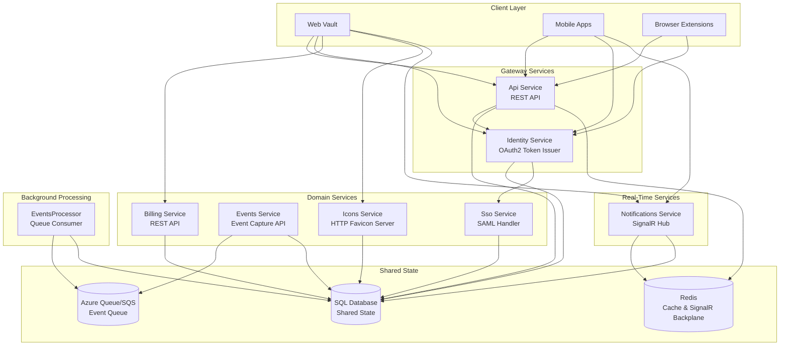

# Web Services

<details>
<summary>Relevant source files</summary>

The following files were used as context for generating this wiki page:

- [bitwarden_license/src/Sso/Sso.csproj](https://github.com/bitwarden/server/blob/39f38f50/bitwarden_license/src/Sso/Sso.csproj)
- [src/Admin/Admin.csproj](https://github.com/bitwarden/server/blob/39f38f50/src/Admin/Admin.csproj)
- [src/Api/Api.csproj](https://github.com/bitwarden/server/blob/39f38f50/src/Api/Api.csproj)
- [src/Billing/Billing.csproj](https://github.com/bitwarden/server/blob/39f38f50/src/Billing/Billing.csproj)
- [src/Core/Core.csproj](https://github.com/bitwarden/server/blob/39f38f50/src/Core/Core.csproj)
- [src/Events/Events.csproj](https://github.com/bitwarden/server/blob/39f38f50/src/Events/Events.csproj)
- [src/EventsProcessor/EventsProcessor.csproj](https://github.com/bitwarden/server/blob/39f38f50/src/EventsProcessor/EventsProcessor.csproj)
- [src/Icons/Icons.csproj](https://github.com/bitwarden/server/blob/39f38f50/src/Icons/Icons.csproj)
- [src/Identity/Identity.csproj](https://github.com/bitwarden/server/blob/39f38f50/src/Identity/Identity.csproj)
- [src/Notifications/Notifications.csproj](https://github.com/bitwarden/server/blob/39f38f50/src/Notifications/Notifications.csproj)
- [util/Server/Server.csproj](https://github.com/bitwarden/server/blob/39f38f50/util/Server/Server.csproj)
- [util/Setup/Setup.csproj](https://github.com/bitwarden/server/blob/39f38f50/util/Setup/Setup.csproj)

</details>


## Purpose and Scope

This page provides an overview of the distinct web services that compose the Bitwarden server architecture. The system is implemented as a collection of independent ASP.NET Core web applications, each handling specific domain responsibilities. All services share common infrastructure through the Core library for business logic and the SharedWeb library for web utilities.

For detailed information about individual services, see:
- [API Service](#3.1) - Main REST API
- [Identity Service](#3.2) - OAuth2/OIDC authentication
- [Billing Service](#3.3) - Subscription management
- [SSO Service](#3.4) - SAML 2.0 enterprise authentication
- [Admin Portal](#3.5) - Administrative interface
- [Supporting Services](#3.6) - Icons, Notifications, Events

For information about background processing services, see the EventsProcessor section. For the Core library that all services depend on, see [Core Library Components](#2.1).

## Service Architecture Overview

The Bitwarden server implements a microservices architecture with 9+ distinct web services. Each service is independently deployable and scalable, sharing common infrastructure through project references.

### Service Dependency Architecture



**Sources:** [src/Api/Api.csproj:19-31](https://github.com/bitwarden/server/blob/39f38f50/src/Api/Api.csproj#L19-L31), [src/Identity/Identity.csproj:10-13](https://github.com/bitwarden/server/blob/39f38f50/src/Identity/Identity.csproj#L10-L13), [src/Billing/Billing.csproj:8-12](https://github.com/bitwarden/server/blob/39f38f50/src/Billing/Billing.csproj#L8-L12), [src/Icons/Icons.csproj:17-20](https://github.com/bitwarden/server/blob/39f38f50/src/Icons/Icons.csproj#L17-L20), [src/Notifications/Notifications.csproj:18-21](https://github.com/bitwarden/server/blob/39f38f50/src/Notifications/Notifications.csproj#L18-L21), [src/Events/Events.csproj:10-13](https://github.com/bitwarden/server/blob/39f38f50/src/Events/Events.csproj#L10-L13), [src/Admin/Admin.csproj:9-25](https://github.com/bitwarden/server/blob/39f38f50/src/Admin/Admin.csproj#L9-L25), [bitwarden_license/src/Sso/Sso.csproj:16-19](https://github.com/bitwarden/server/blob/39f38f50/bitwarden_license/src/Sso/Sso.csproj#L16-L19), [src/EventsProcessor/EventsProcessor.csproj:8-11](https://github.com/bitwarden/server/blob/39f38f50/src/EventsProcessor/EventsProcessor.csproj#L8-L11)

## Service Inventory

| Service | Project Path | Purpose | Dependencies |
|---------|-------------|---------|--------------|
| **Api** | `src/Api` | Main REST API for vault operations, user management, and client interactions | Core, SharedWeb, Commercial.Core |
| **Identity** | `src/Identity` | OAuth2/OIDC provider using Duende IdentityServer for authentication | Core, SharedWeb |
| **Billing** | `src/Billing` | REST API for subscription management, payment methods, and invoices | Core, SharedWeb, Commercial.Core |
| **Icons** | `src/Icons` | Favicon retrieval service for vault login items | Core, SharedWeb |
| **Notifications** | `src/Notifications` | SignalR hub for real-time push notifications to clients | Core, SharedWeb |
| **Events** | `src/Events` | Event capture API for audit logging | Core, SharedWeb |
| **Admin** | `src/Admin` | Administrative web portal for system management | Core, SharedWeb, Commercial.Core, Migrator utilities |
| **Sso** | `bitwarden_license/src/Sso` | SAML 2.0 service for enterprise single sign-on | Core, SharedWeb |
| **EventsProcessor** | `src/EventsProcessor` | Background queue consumer for asynchronous event processing | Core, SharedWeb |

**Sources:** [src/Api/Api.csproj](https://github.com/bitwarden/server/blob/39f38f50/src/Api/Api.csproj), [src/Identity/Identity.csproj](https://github.com/bitwarden/server/blob/39f38f50/src/Identity/Identity.csproj), [src/Billing/Billing.csproj](https://github.com/bitwarden/server/blob/39f38f50/src/Billing/Billing.csproj), [src/Icons/Icons.csproj](https://github.com/bitwarden/server/blob/39f38f50/src/Icons/Icons.csproj), [src/Notifications/Notifications.csproj](https://github.com/bitwarden/server/blob/39f38f50/src/Notifications/Notifications.csproj), [src/Events/Events.csproj](https://github.com/bitwarden/server/blob/39f38f50/src/Events/Events.csproj), [src/Admin/Admin.csproj](https://github.com/bitwarden/server/blob/39f38f50/src/Admin/Admin.csproj), [bitwarden_license/src/Sso/Sso.csproj](https://github.com/bitwarden/server/blob/39f38f50/bitwarden_license/src/Sso/Sso.csproj), [src/EventsProcessor/EventsProcessor.csproj](https://github.com/bitwarden/server/blob/39f38f50/src/EventsProcessor/EventsProcessor.csproj)

## Project Structure and Configuration

All web services follow a standard ASP.NET Core project structure with common configuration patterns:

### Common Project Elements

Each service's `.csproj` file contains:
- **UserSecretsId**: Unique identifier for development secrets (e.g., `bitwarden-Api`, `bitwarden-Identity`)
- **Project References**: Dependencies on Core and SharedWeb libraries
- **Package References**: Service-specific NuGet packages
- **Run Configurations**: Named configurations for different hosting scenarios (self-hosted vs cloud)

### User Secrets Configuration



**Sources:** [src/Api/Api.csproj:3](https://github.com/bitwarden/server/blob/39f38f50/src/Api/Api.csproj#L3), [src/Identity/Identity.csproj:4](https://github.com/bitwarden/server/blob/39f38f50/src/Identity/Identity.csproj#L4), [src/Billing/Billing.csproj:4](https://github.com/bitwarden/server/blob/39f38f50/src/Billing/Billing.csproj#L4), [src/Icons/Icons.csproj:4](https://github.com/bitwarden/server/blob/39f38f50/src/Icons/Icons.csproj#L4), [src/Notifications/Notifications.csproj:4](https://github.com/bitwarden/server/blob/39f38f50/src/Notifications/Notifications.csproj#L4), [src/Events/Events.csproj:4](https://github.com/bitwarden/server/blob/39f38f50/src/Events/Events.csproj#L4), [src/Admin/Admin.csproj:4](https://github.com/bitwarden/server/blob/39f38f50/src/Admin/Admin.csproj#L4), [bitwarden_license/src/Sso/Sso.csproj:4](https://github.com/bitwarden/server/blob/39f38f50/bitwarden_license/src/Sso/Sso.csproj#L4)

### Run Configurations

Services support multiple run configurations for different deployment scenarios:

| Service | Self-Hosted Configuration | Cloud Configuration |
|---------|--------------------------|---------------------|
| Api | `Api-SelfHost` | `Api` |
| Identity | `Identity-SelfHost` | `Identity` |
| Notifications | `Notifications-SelfHost` | `Notifications` |
| Events | `Events-SelfHost` | `Events` |
| Admin | `Admin-SelfHost` | `Admin` |
| Sso | `Sso-SelfHost` | `Sso` |

**Sources:** [src/Api/Api.csproj:17-18](https://github.com/bitwarden/server/blob/39f38f50/src/Api/Api.csproj#L17-L18), [src/Identity/Identity.csproj:8-9](https://github.com/bitwarden/server/blob/39f38f50/src/Identity/Identity.csproj#L8-L9), [src/Notifications/Notifications.csproj:7-8](https://github.com/bitwarden/server/blob/39f38f50/src/Notifications/Notifications.csproj#L7-L8), [src/Events/Events.csproj:8-9](https://github.com/bitwarden/server/blob/39f38f50/src/Events/Events.csproj#L8-L9), [src/Admin/Admin.csproj:7-8](https://github.com/bitwarden/server/blob/39f38f50/src/Admin/Admin.csproj#L7-L8), [bitwarden_license/src/Sso/Sso.csproj:7-8](https://github.com/bitwarden/server/blob/39f38f50/bitwarden_license/src/Sso/Sso.csproj#L7-L8)

## Service Dependencies on Core Infrastructure

All services depend on the Core library for business logic and the SharedWeb library for web utilities. The dependency structure enforces a consistent architecture:

### Core Library Dependencies

The Core library ([src/Core/Core.csproj]()) provides shared functionality including:

| Functionality | NuGet Packages |
|--------------|----------------|
| **Authentication** | `Microsoft.AspNetCore.Authentication.JwtBearer`, `Duende.IdentityServer` |
| **Payment Processing** | `Stripe.net`, `Braintree`, `BitPay.Light` |
| **Two-Factor Auth** | `Otp.NET`, `YubicoDotNetClient`, `DuoUniversal`, `Fido2.AspNet` |
| **Email Services** | `SendGrid`, `AWSSDK.SimpleEmail`, `MailKit` |
| **Cloud Storage** | `Azure.Storage.Blobs`, `Azure.Storage.Queues`, `AWSSDK.SQS` |
| **Messaging** | `Azure.Messaging.ServiceBus`, `RabbitMQ.Client` |
| **Caching** | `Microsoft.Extensions.Caching.StackExchangeRedis`, `Microsoft.Extensions.Caching.SqlServer`, `Microsoft.Azure.Cosmos` |
| **Feature Flags** | `LaunchDarkly.ServerSdk` |
| **Job Scheduling** | `Quartz`, `Quartz.Extensions.Hosting` |
| **Templating** | `Handlebars.Net` |

**Sources:** [src/Core/Core.csproj:23-68](https://github.com/bitwarden/server/blob/39f38f50/src/Core/Core.csproj#L23-L68)

### Service-Specific Package Dependencies

Individual services include specialized packages beyond the Core dependencies:

**Api Service** ([src/Api/Api.csproj:34-38]()):
- `AspNetCore.HealthChecks.SqlServer` - Database health checks
- `AspNetCore.HealthChecks.Uris` - HTTP endpoint health checks
- `Azure.Messaging.EventGrid` - Azure Event Grid integration
- `Swashbuckle.AspNetCore` - Swagger/OpenAPI documentation

**Billing Service** ([src/Billing/Billing.csproj:14-15]()):
- `MarkDig` - Markdown processing for billing documentation
- `Swashbuckle.AspNetCore` - API documentation

**Icons Service** ([src/Icons/Icons.csproj:10]()):
- `AngleSharp` - HTML parsing for favicon extraction

**Notifications Service** ([src/Notifications/Notifications.csproj:10-11]()):
- `Microsoft.AspNetCore.SignalR.Protocols.MessagePack` - Binary protocol for SignalR
- `Microsoft.AspNetCore.SignalR.StackExchangeRedis` - Redis backplane for scale-out

**SSO Service** ([bitwarden_license/src/Sso/Sso.csproj:10-13]()):
- `Sustainsys.Saml2.AspNetCore2` - SAML 2.0 authentication
- `Microsoft.AspNetCore.Http` - HTTP abstractions for SAML

## Service Communication Patterns

Services communicate through several patterns:



**Sources:** [src/Api/Api.csproj](https://github.com/bitwarden/server/blob/39f38f50/src/Api/Api.csproj), [src/Identity/Identity.csproj](https://github.com/bitwarden/server/blob/39f38f50/src/Identity/Identity.csproj), [src/Billing/Billing.csproj](https://github.com/bitwarden/server/blob/39f38f50/src/Billing/Billing.csproj), [src/Events/Events.csproj](https://github.com/bitwarden/server/blob/39f38f50/src/Events/Events.csproj), [src/Icons/Icons.csproj](https://github.com/bitwarden/server/blob/39f38f50/src/Icons/Icons.csproj), [src/Notifications/Notifications.csproj](https://github.com/bitwarden/server/blob/39f38f50/src/Notifications/Notifications.csproj), [bitwarden_license/src/Sso/Sso.csproj](https://github.com/bitwarden/server/blob/39f38f50/bitwarden_license/src/Sso/Sso.csproj), [src/EventsProcessor/EventsProcessor.csproj](https://github.com/bitwarden/server/blob/39f38f50/src/EventsProcessor/EventsProcessor.csproj)

### Communication Patterns

1. **HTTP REST** - Primary pattern for synchronous service-to-service calls (Api ↔ Identity, clients ↔ services)
2. **SignalR WebSocket** - Real-time push notifications from Notifications service to clients
3. **Shared Database** - Services read/write to common SQL database through Core repositories
4. **Message Queues** - Asynchronous event processing through Azure Queue Storage or AWS SQS
5. **Redis Cache** - Shared caching and SignalR backplane for horizontal scaling

## Service Initialization and Startup

All services follow a standard ASP.NET Core startup pattern with service-specific customization. The initialization process:

1. **Configuration Loading** - GlobalSettings from environment variables, user secrets, or configuration files
2. **Dependency Injection** - Services registered in `Startup.cs` or `Program.cs`
3. **Middleware Pipeline** - Authentication, authorization, exception handling configured
4. **Database Connectivity** - Repository registrations and connection pool initialization
5. **External Integrations** - Payment gateways, email services, feature flags initialized

For detailed startup configuration, see [Service Startup and Configuration](#2.2).

## Commercial vs Open Source Services

Some services include dependencies on commercial-licensed code in the `bitwarden_license` folder:

| Service | Commercial Dependencies | Conditional Compilation |
|---------|------------------------|------------------------|
| **Api** | Commercial.Core, Commercial.Infrastructure.EntityFramework | Yes - excluded when `OSS` defined |
| **Billing** | Commercial.Core | Always included |
| **Admin** | Commercial.Core, Commercial.Infrastructure.EntityFramework | Yes - excluded when `OSS` defined |
| **Sso** | None (entire service is commercial) | N/A - separate project |

**Sources:** [src/Api/Api.csproj:24-31](https://github.com/bitwarden/server/blob/39f38f50/src/Api/Api.csproj#L24-L31), [src/Billing/Billing.csproj:9](https://github.com/bitwarden/server/blob/39f38f50/src/Billing/Billing.csproj#L9), [src/Admin/Admin.csproj:18-25](https://github.com/bitwarden/server/blob/39f38f50/src/Admin/Admin.csproj#L18-L25), [bitwarden_license/src/Sso/Sso.csproj](https://github.com/bitwarden/server/blob/39f38f50/bitwarden_license/src/Sso/Sso.csproj)

The `Choose` element in project files conditionally includes commercial references:

```xml
<Choose>
  <When Condition="!$(DefineConstants.Contains('OSS'))">
    <ItemGroup>
      <ProjectReference Include="..\..\bitwarden_license\src\Commercial.Core\Commercial.Core.csproj" />
    </ItemGroup>
  </When>
</Choose>
```

This allows the same codebase to build both open-source and commercial editions.

## Documentation Generation

### API Service Swagger Documentation

The Api service generates XML documentation for Swagger/OpenAPI:

- **DocumentationFile** configuration in [src/Api/Api.csproj:5]() enables XML doc generation
- **NoWarn** settings suppress documentation warnings for public APIs
- Swagger package ([src/Api/Api.csproj:37]()) generates interactive API documentation

The Billing service also generates Swagger documentation with the same configuration pattern ([src/Billing/Billing.csproj:15]()).

### Documentation Suppression

Services suppress specific compiler warnings related to missing XML documentation:

| Warning | Description |
|---------|-------------|
| `1591` | Missing XML comment for publicly visible type or member |
| `1573` | Parameter has no matching param tag in the XML comment |
| `1701`, `1702` | Assembly reference mismatch warnings |

**Sources:** [src/Api/Api.csproj:10-14](https://github.com/bitwarden/server/blob/39f38f50/src/Api/Api.csproj#L10-L14), [src/Core/Core.csproj:9-14](https://github.com/bitwarden/server/blob/39f38f50/src/Core/Core.csproj#L9-L14)

## Database Migration Support

The Admin service includes special support for database migrations across multiple database providers:

**Migration Project References** ([src/Admin/Admin.csproj:10-15]()):
- `MySqlMigrations` - MySQL/MariaDB migration scripts
- `PostgresMigrations` - PostgreSQL migration scripts  
- `SqliteMigrations` - SQLite migration scripts
- `Migrator` - Core migration utility using DbUp

This allows the Admin portal to perform database migrations for all supported database backends. For details on the migration system, see [Database Migrations](#12.5).

## Embedded Resources

Services embed specific resources in their assemblies:

**Core Library** ([src/Core/Core.csproj:17-19]()):
- `licensing.cer` - Production license validation certificate
- `licensing_dev.cer` - Development license validation certificate
- `MailTemplates/Handlebars/**/*.hbs` - Handlebars email templates

**Icons Service** ([src/Icons/Icons.csproj:14]()):
- `Resources/public_suffix_list.dat` - Public suffix list for domain parsing

These resources are compiled into the assemblies and accessed at runtime through reflection.

## Service-to-Service Authentication

Services that call other services use JWT bearer tokens issued by the Identity service:

1. **Identity Service** - Issues JWT tokens with claims for user identity, roles, and organizations
2. **Api Service** - Validates tokens and populates `CurrentContext` from claims
3. **Other Services** - Can validate the same tokens for authenticated requests

The authentication flow is detailed in [Authentication and Authorization](#4).

## Health Checks

The Api service implements health checks for monitoring and load balancer integration:

**Health Check Packages** ([src/Api/Api.csproj:34-35]()):
- `AspNetCore.HealthChecks.SqlServer` - Monitors database connectivity
- `AspNetCore.HealthChecks.Uris` - Monitors dependent service availability

Health check endpoints enable:
- Kubernetes readiness/liveness probes
- Load balancer health monitoring
- Automated service recovery

## Summary

The Bitwarden server architecture consists of 9 specialized web services, each with focused responsibilities:

- **Api** and **Identity** form the core gateway layer for client interactions
- **Billing**, **Events**, **Icons**, **Notifications** provide domain-specific functionality
- **Admin** and **Sso** support enterprise and administrative scenarios
- **EventsProcessor** handles background asynchronous processing

All services depend on the Core library for shared business logic and maintain separation of concerns through project references. The architecture supports both open-source and commercial editions through conditional compilation, and accommodates multiple deployment scenarios (cloud vs self-hosted) through run configurations.