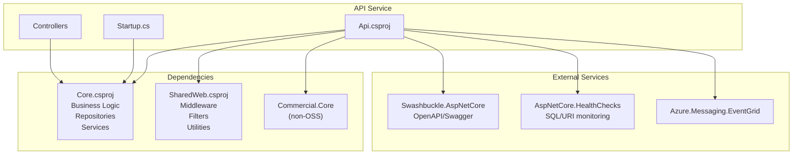
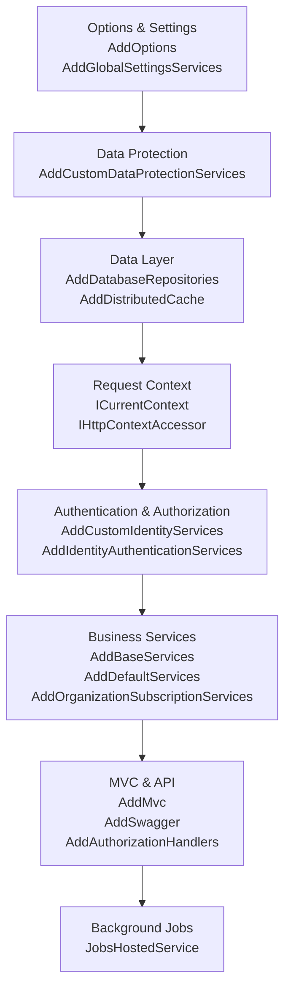
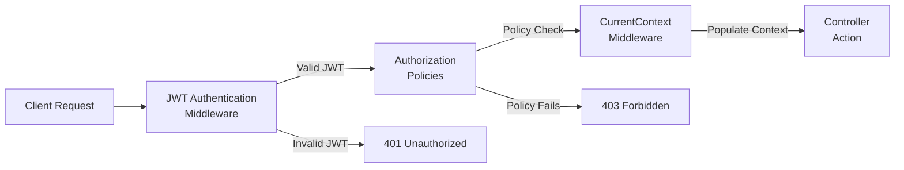
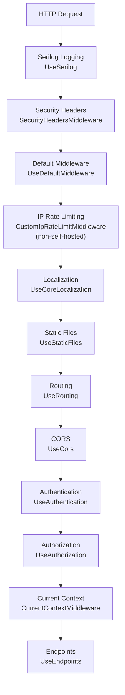
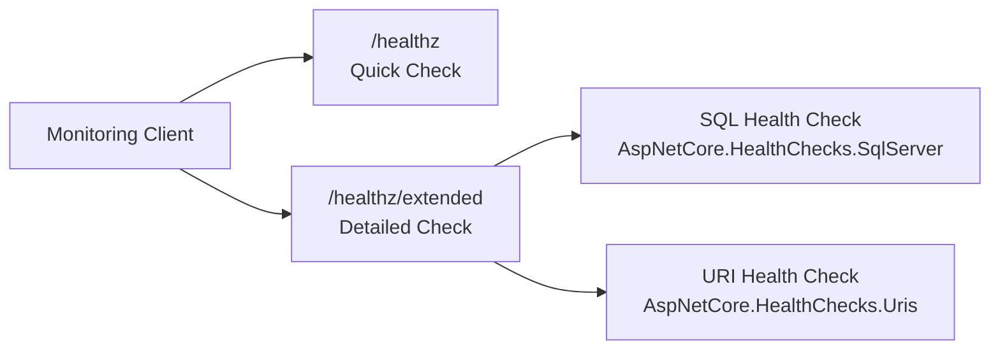
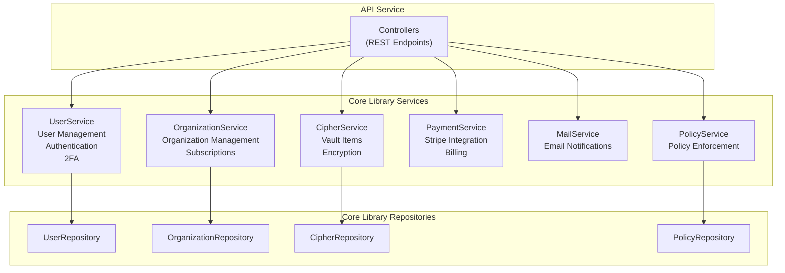

# API Service

<details>
<summary>Relevant source files</summary>

The following files were used as context for generating this wiki page:

- [bitwarden_license/src/Scim/Startup.cs](https://github.com/bitwarden/server/blob/39f38f50/bitwarden_license/src/Scim/Startup.cs)
- [bitwarden_license/src/Scim/Utilities/ApiKeyAuthenticationHandler.cs](https://github.com/bitwarden/server/blob/39f38f50/bitwarden_license/src/Scim/Utilities/ApiKeyAuthenticationHandler.cs)
- [bitwarden_license/src/Sso/Sso.csproj](https://github.com/bitwarden/server/blob/39f38f50/bitwarden_license/src/Sso/Sso.csproj)
- [src/Admin/Admin.csproj](https://github.com/bitwarden/server/blob/39f38f50/src/Admin/Admin.csproj)
- [src/Admin/Startup.cs](https://github.com/bitwarden/server/blob/39f38f50/src/Admin/Startup.cs)
- [src/Api/Api.csproj](https://github.com/bitwarden/server/blob/39f38f50/src/Api/Api.csproj)
- [src/Api/Startup.cs](https://github.com/bitwarden/server/blob/39f38f50/src/Api/Startup.cs)
- [src/Billing/Billing.csproj](https://github.com/bitwarden/server/blob/39f38f50/src/Billing/Billing.csproj)
- [src/Billing/Startup.cs](https://github.com/bitwarden/server/blob/39f38f50/src/Billing/Startup.cs)
- [src/Core/Core.csproj](https://github.com/bitwarden/server/blob/39f38f50/src/Core/Core.csproj)
- [src/Core/Utilities/CoreHelpers.cs](https://github.com/bitwarden/server/blob/39f38f50/src/Core/Utilities/CoreHelpers.cs)
- [src/Events/Events.csproj](https://github.com/bitwarden/server/blob/39f38f50/src/Events/Events.csproj)
- [src/Events/Startup.cs](https://github.com/bitwarden/server/blob/39f38f50/src/Events/Startup.cs)
- [src/EventsProcessor/EventsProcessor.csproj](https://github.com/bitwarden/server/blob/39f38f50/src/EventsProcessor/EventsProcessor.csproj)
- [src/EventsProcessor/Startup.cs](https://github.com/bitwarden/server/blob/39f38f50/src/EventsProcessor/Startup.cs)
- [src/Icons/Icons.csproj](https://github.com/bitwarden/server/blob/39f38f50/src/Icons/Icons.csproj)
- [src/Identity/Controllers/SsoController.cs](https://github.com/bitwarden/server/blob/39f38f50/src/Identity/Controllers/SsoController.cs)
- [src/Identity/Identity.csproj](https://github.com/bitwarden/server/blob/39f38f50/src/Identity/Identity.csproj)
- [src/Identity/IdentityServer/ApiResources.cs](https://github.com/bitwarden/server/blob/39f38f50/src/Identity/IdentityServer/ApiResources.cs)
- [src/Identity/Startup.cs](https://github.com/bitwarden/server/blob/39f38f50/src/Identity/Startup.cs)
- [src/Notifications/Notifications.csproj](https://github.com/bitwarden/server/blob/39f38f50/src/Notifications/Notifications.csproj)
- [src/Notifications/Startup.cs](https://github.com/bitwarden/server/blob/39f38f50/src/Notifications/Startup.cs)
- [test/Core.Test/Utilities/CoreHelpersTests.cs](https://github.com/bitwarden/server/blob/39f38f50/test/Core.Test/Utilities/CoreHelpersTests.cs)
- [util/Server/Program.cs](https://github.com/bitwarden/server/blob/39f38f50/util/Server/Program.cs)
- [util/Server/Server.csproj](https://github.com/bitwarden/server/blob/39f38f50/util/Server/Server.csproj)
- [util/Server/Startup.cs](https://github.com/bitwarden/server/blob/39f38f50/util/Server/Startup.cs)
- [util/Setup/Setup.csproj](https://github.com/bitwarden/server/blob/39f38f50/util/Setup/Setup.csproj)

</details>


## Purpose and Scope

The API Service is the main REST API gateway for the Bitwarden server system. It provides HTTP endpoints for all client applications (Web Vault, Mobile Apps, Browser Extensions, CLI tools) to interact with vault data, user accounts, organizations, and administrative functions. This document covers the API Service's configuration, authentication/authorization policies, middleware pipeline, and endpoint structure.

For authentication token generation and OAuth2/OIDC flows, see [Identity Service](#3.2). For payment and billing endpoints, see [Billing Service](#3.3). For organization SSO integration, see [SSO Service](#3.4).

---

## Project Structure and Dependencies

The API Service is defined in [src/Api/Api.csproj:1-41]() and depends on two primary libraries:

| Dependency | Purpose |
|------------|---------|
| `Core` | Provides business logic services, repositories, and domain entities |
| `SharedWeb` | Provides common web utilities, middleware, and filters |
| `Commercial.Core` (non-OSS) | Provides commercial features like Secrets Manager |
| `Commercial.Infrastructure.EntityFramework` (non-OSS) | Provides EF Core repositories for commercial features |

Key packages include:

- **Swashbuckle.AspNetCore** (9.0.4): OpenAPI/Swagger documentation generation
- **AspNetCore.HealthChecks.SqlServer** (8.0.2): SQL Server health monitoring
- **AspNetCore.HealthChecks.Uris** (8.0.1): External URI health monitoring
- **Azure.Messaging.EventGrid** (4.25.0): Event publishing to Azure Event Grid



**Sources:** [src/Api/Api.csproj:1-41](https://github.com/bitwarden/server/blob/39f38f50/src/Api/Api.csproj#L1-L41)

---

## Service Configuration and Startup

The API Service configures itself in [src/Api/Startup.cs:48-331](). The `ConfigureServices` method follows a layered registration pattern:

### Configuration Layers



**Sources:** [src/Api/Startup.cs:60-235](https://github.com/bitwarden/server/blob/39f38f50/src/Api/Startup.cs#L60-L235)

### Global Settings Configuration

Global settings are loaded from configuration sources and environment variables:

[src/Api/Startup.cs:66-84]()

```
var globalSettings = services.AddGlobalSettingsServices(Configuration, Environment);
```

Key settings configured:
- **IP Rate Limiting**: Configured for non-self-hosted deployments to prevent abuse
- **Stripe Configuration**: API key and retry settings for payment processing
- **Event Grid Key**: For publishing events to Azure Event Grid (if configured)

**Sources:** [src/Api/Startup.cs:66-84](https://github.com/bitwarden/server/blob/39f38f50/src/Api/Startup.cs#L66-L84)

---

## Authentication and Authorization

### JWT Token Validation

The API Service validates JWT tokens issued by the Identity Service. Authentication is configured via `AddIdentityAuthenticationServices`:

[src/Api/Startup.cs:107-156]()

The service validates tokens against the Identity Service's OAuth2/OIDC endpoints and requires:
- Valid JWT signature from Identity Service
- Required claims based on the policy
- Non-expired tokens

### Authorization Policies

The API Service defines seven distinct authorization policies:

| Policy | Required Claims | Purpose |
|--------|----------------|---------|
| `Policies.Application` | `AuthenticationMethod`: Application/external<br/>`Scope`: api | Standard authenticated user access |
| `Policies.Web` | `AuthenticationMethod`: Application/external<br/>`Scope`: api<br/>`ClientId`: web | Web vault specific endpoints |
| `Policies.Push` | `Scope`: api.push | Push notification registration |
| `Policies.Licensing` | `Scope`: api.licensing | License validation endpoints |
| `Policies.Organization` | `Scope`: api.organization | Organization API key access |
| `Policies.Installation` | `Scope`: api.installation | Installation management |
| `Policies.Secrets` | `Scope`: api OR api.secrets | Secrets Manager access |
| `Policies.Send` | `Scope`: api.sendaccess<br/>Claim: SendId | Send file access |



**Sources:** [src/Api/Startup.cs:107-156](https://github.com/bitwarden/server/blob/39f38f50/src/Api/Startup.cs#L107-L156)

### Current Context Population

After successful authentication, `CurrentContextMiddleware` populates `ICurrentContext` with user information from JWT claims:

[src/Api/Startup.cs:281]()

This provides controllers with access to:
- User ID and email
- Organization memberships and roles
- Provider associations
- Premium status
- Device information

**Sources:** [src/Api/Startup.cs:276-282](https://github.com/bitwarden/server/blob/39f38f50/src/Api/Startup.cs#L276-L282)

---

## Middleware Pipeline

The middleware pipeline processes requests in the following order:



### Key Middleware Components

**Security Headers** [src/Api/Startup.cs:248]():
- Adds CSP, X-Frame-Options, X-Content-Type-Options headers

**IP Rate Limiting** [src/Api/Startup.cs:253-261]():
- Only enabled for non-self-hosted deployments
- Uses `CustomIpRateLimitMiddleware` with Redis backing
- Configured via `IpRateLimitOptions` and `IpRateLimitPolicies`

**CORS** [src/Api/Startup.cs:273-274]():
- Validates origin using `CoreHelpers.IsCorsOriginAllowed`
- Allows requests from Web Vault, Safari extensions, and bitwarden.com
- Permits credentials and all methods/headers

**Sources:** [src/Api/Startup.cs:237-298](https://github.com/bitwarden/server/blob/39f38f50/src/Api/Startup.cs#L237-L298)

---

## Key Rotation System

The API Service implements a comprehensive key rotation validation system for encrypted entities:

[src/Api/Startup.cs:160-183]()

### Rotation Validators

| Validator | Entity Type | Purpose |
|-----------|-------------|---------|
| `CipherRotationValidator` | `Cipher` | Validates vault item re-encryption |
| `FolderRotationValidator` | `Folder` | Validates folder re-encryption |
| `SendRotationValidator` | `Send` | Validates Send re-encryption |
| `EmergencyAccessRotationValidator` | `EmergencyAccess` | Validates emergency access key rotation |
| `OrganizationUserRotationValidator` | `OrganizationUser` | Validates organization user key rotation |
| `WebAuthnLoginKeyRotationValidator` | `WebAuthnLoginRotateKeyData` | Validates WebAuthn credential rotation |
| `DeviceRotationValidator` | `Device` | Validates device key rotation |

Each validator implements `IRotationValidator<TRequest, TEntity>` and verifies that:
- All required entities are present
- Entity ownership is correct
- Key rotation is cryptographically valid

For more details on the key rotation architecture, see [Key Rotation System](#5.4).

**Sources:** [src/Api/Startup.cs:160-183](https://github.com/bitwarden/server/blob/39f38f50/src/Api/Startup.cs#L160-L183)

---

## API Documentation and Health Checks

### Swagger/OpenAPI

The API Service exposes OpenAPI documentation at `/specs/{documentName}/swagger.json` and an interactive UI at `/docs`:

[src/Api/Startup.cs:222]()

Configuration:
- **Route Template**: `/specs/{documentName}/swagger.json`
- **UI Route**: `/docs`
- **Server URL**: Configured from `globalSettings.BaseServiceUri.Api`
- **Development Only**: Authorization persistence enabled in development mode

Access the Swagger UI:
```
GET /docs
```

**Sources:** [src/Api/Startup.cs:299-326](https://github.com/bitwarden/server/blob/39f38f50/src/Api/Startup.cs#L299-L326)

### Health Checks

Health check endpoints are available for non-self-hosted deployments:

| Endpoint | Response | Purpose |
|----------|----------|---------|
| `/healthz` | Status code only | Basic liveness check |
| `/healthz/extended` | Detailed JSON | Comprehensive health information including SQL, URI checks |

[src/Api/Startup.cs:200-204]()

The extended health check includes:
- SQL Server connectivity
- External URI reachability
- Service availability metrics



**Sources:** [src/Api/Startup.cs:200-204](https://github.com/bitwarden/server/blob/39f38f50/src/Api/Startup.cs#L200-L204), [src/Api/Startup.cs:288-296](https://github.com/bitwarden/server/blob/39f38f50/src/Api/Startup.cs#L288-L296)

---

## Background Services

### Jobs Hosted Service

The API Service hosts background jobs via `JobsHostedService`:

[src/Api/Startup.cs:223-224]()

Jobs include:
- Scheduled maintenance tasks
- Periodic data cleanup
- Cache refresh operations

### Application Cache Hosted Service

If Service Bus is configured, the API Service subscribes to application cache invalidation messages:

[src/Api/Startup.cs:226-230]()

This enables distributed cache invalidation across multiple API Service instances in a cloud deployment.

**Sources:** [src/Api/Startup.cs:223-230](https://github.com/bitwarden/server/blob/39f38f50/src/Api/Startup.cs#L223-L230)

---

## Integration with Core Library

The API Service extensively uses the Core library for all business logic:



Controllers delegate to Core services rather than implementing business logic directly. This ensures:
- Consistent business rules across all services
- Reusability of logic between API, Admin, and other services
- Centralized validation and policy enforcement

For detailed information on Core library components, see [Core Library Components](#2.1).

**Sources:** [src/Api/Startup.cs:186-198](https://github.com/bitwarden/server/blob/39f38f50/src/Api/Startup.cs#L186-L198)

---

## Service Extensions and Feature Flags

### Service Extensions

The API Service registers several service extension groups:

[src/Api/Startup.cs:186-198]()

- **Base Services**: Core infrastructure services (logging, event bus, etc.)
- **Default Services**: Standard business services (user, organization, cipher services)
- **Organization Subscription Services**: Subscription management
- **Core Localization Services**: Multi-language support
- **Billing Operations**: Payment processing and invoicing
- **Reporting Services**: Event reporting and analytics
- **Import Services**: Vault data import from other password managers
- **Phishing Domain Services**: Domain reputation checking
- **Send Services**: Secure file/text sharing

### Commercial Features

For non-OSS builds, additional services are registered:

[src/Api/Startup.cs:206-213]()

- **Commercial Core Services**: Enterprise features
- **Secrets Manager Services**: Secrets management functionality
- **Secrets Manager EF Repositories**: Entity Framework repositories for Secrets Manager

**Sources:** [src/Api/Startup.cs:186-213](https://github.com/bitwarden/server/blob/39f38f50/src/Api/Startup.cs#L186-L213)

---

## Request Routing

### MVC Configuration

The API Service uses attribute routing with custom conventions:

[src/Api/Startup.cs:216-220]()

```csharp
services.AddMvc(config =>
{
    config.Conventions.Add(new ApiExplorerGroupConvention());
    config.Conventions.Add(new PublicApiControllersModelConvention());
});
```

Conventions applied:
- `ApiExplorerGroupConvention`: Groups API endpoints for Swagger documentation
- `PublicApiControllersModelConvention`: Marks public API controllers for OpenAPI generation

### Endpoint Mapping

[src/Api/Startup.cs:284-297]()

```
endpoints.MapDefaultControllerRoute();
```

This maps standard controller routes using the pattern: `{controller}/{action}/{id?}`

**Sources:** [src/Api/Startup.cs:216-220](https://github.com/bitwarden/server/blob/39f38f50/src/Api/Startup.cs#L216-L220), [src/Api/Startup.cs:284-297](https://github.com/bitwarden/server/blob/39f38f50/src/Api/Startup.cs#L284-L297)

---

## Self-Hosted vs Cloud Configuration

The API Service behaves differently based on the `GlobalSettings.SelfHosted` flag:

| Feature | Self-Hosted | Cloud |
|---------|-------------|-------|
| IP Rate Limiting | ❌ Disabled | ✅ Enabled |
| Health Checks | ❌ Not exposed | ✅ Exposed at /healthz |
| Forwarded Headers | ✅ Enabled | ❌ Disabled |
| Swagger UI | ✅ Always available | ⚠️ Development only |

### Self-Hosted Specific Configuration

[src/Api/Startup.cs:259-261]()

When self-hosted:
- Uses forwarded headers middleware to correctly determine client IP behind reverse proxies
- Skips cloud-specific features like Azure Event Grid integration
- Always enables Swagger UI for API exploration

**Sources:** [src/Api/Startup.cs:67-71](https://github.com/bitwarden/server/blob/39f38f50/src/Api/Startup.cs#L67-L71), [src/Api/Startup.cs:100-103](https://github.com/bitwarden/server/blob/39f38f50/src/Api/Startup.cs#L100-L103), [src/Api/Startup.cs:200-204](https://github.com/bitwarden/server/blob/39f38f50/src/Api/Startup.cs#L200-L204), [src/Api/Startup.cs:253-261](https://github.com/bitwarden/server/blob/39f38f50/src/Api/Startup.cs#L253-L261)

---

## External Service Integrations

### Stripe Integration

Stripe is configured globally at startup:

[src/Api/Startup.cs:83-84]()

```csharp
StripeConfiguration.ApiKey = globalSettings.Stripe.ApiKey;
StripeConfiguration.MaxNetworkRetries = globalSettings.Stripe.MaxNetworkRetries;
```

### Azure Event Grid

If configured, the API Service can publish events to Azure Event Grid:

[src/Api/Startup.cs:76-80]()

```csharp
if (!string.IsNullOrWhiteSpace(globalSettings.EventGridKey))
{
    ApiHelpers.EventGridKey = globalSettings.EventGridKey;
}
```

### BitPay

BitPay client is registered for cryptocurrency payment processing:

[src/Api/Startup.cs:98]()

```csharp
services.AddSingleton<BitPayClient>();
```

### Slack and Teams

OAuth integration services for Slack and Teams are conditionally added:

[src/Api/Startup.cs:232-234]()

These enable users to integrate their Bitwarden accounts with Slack workspaces and Microsoft Teams for notifications and access requests.