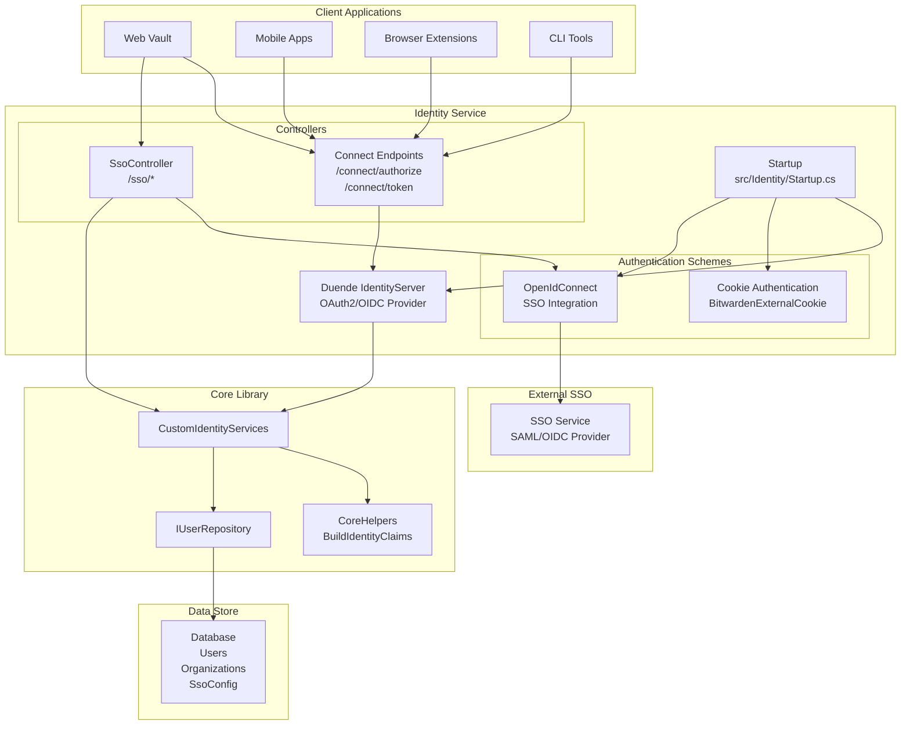
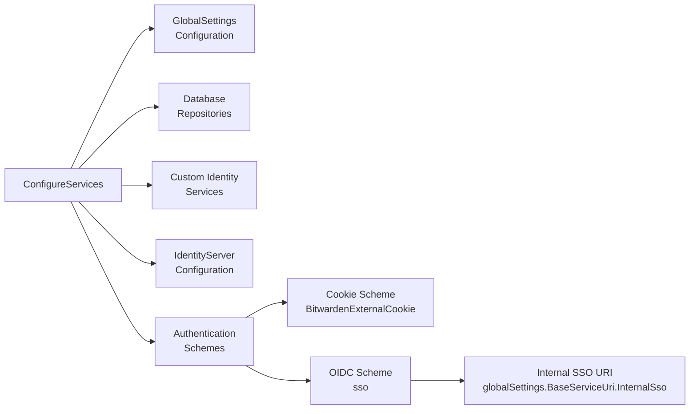
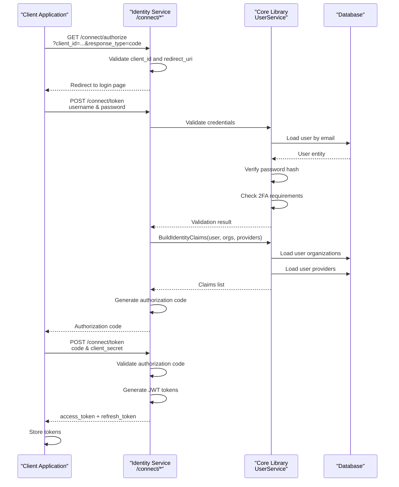
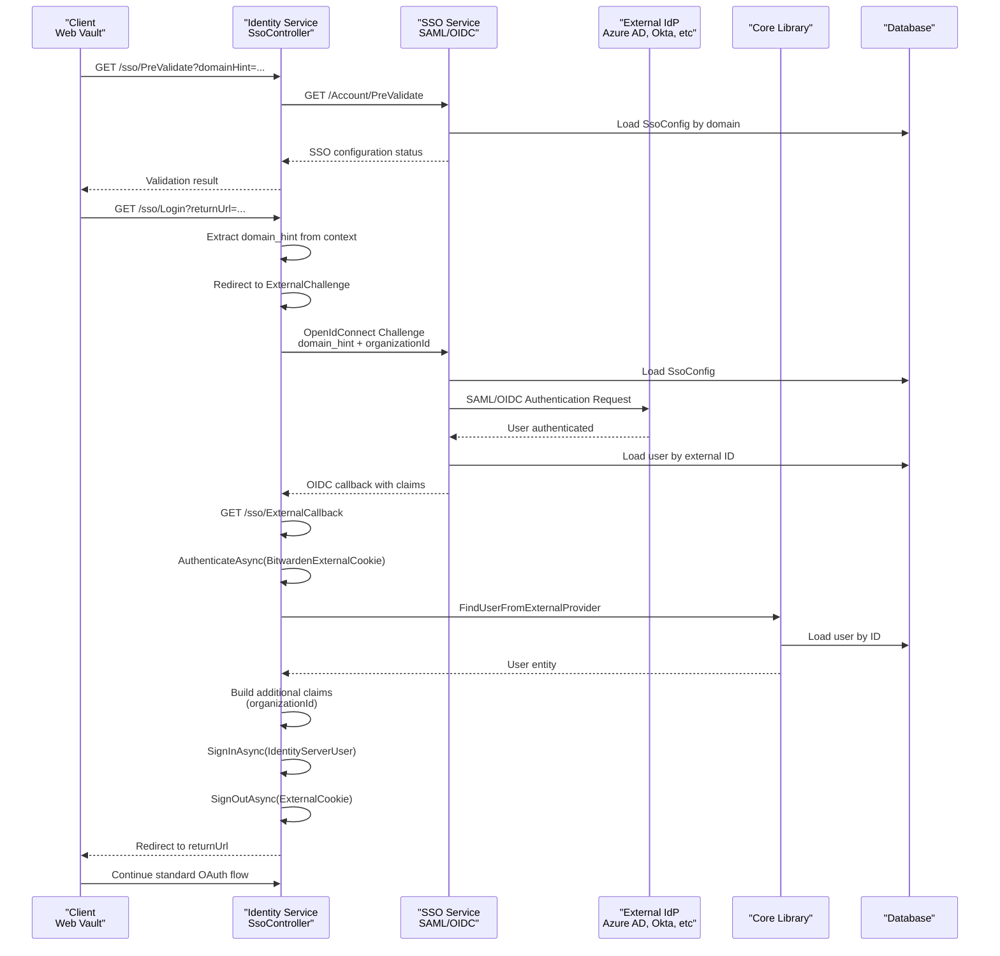
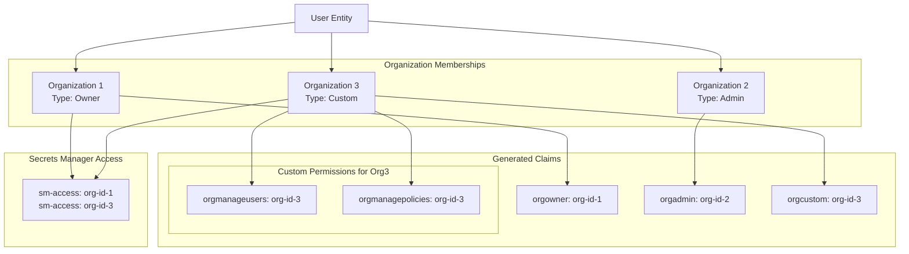
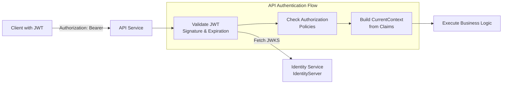

# Identity Service

Relevant source files

The following files were used as context for generating this wiki page:

- [bitwarden_license/src/Scim/Startup.cs](https://github.com/bitwarden/server/blob/39f38f50/bitwarden_license/src/Scim/Startup.cs)
- [bitwarden_license/src/Scim/Utilities/ApiKeyAuthenticationHandler.cs](https://github.com/bitwarden/server/blob/39f38f50/bitwarden_license/src/Scim/Utilities/ApiKeyAuthenticationHandler.cs)
- [src/Admin/Startup.cs](https://github.com/bitwarden/server/blob/39f38f50/src/Admin/Startup.cs)
- [src/Api/Startup.cs](https://github.com/bitwarden/server/blob/39f38f50/src/Api/Startup.cs)
- [src/Billing/Startup.cs](https://github.com/bitwarden/server/blob/39f38f50/src/Billing/Startup.cs)
- [src/Core/Utilities/CoreHelpers.cs](https://github.com/bitwarden/server/blob/39f38f50/src/Core/Utilities/CoreHelpers.cs)
- [src/Events/Startup.cs](https://github.com/bitwarden/server/blob/39f38f50/src/Events/Startup.cs)
- [src/EventsProcessor/Startup.cs](https://github.com/bitwarden/server/blob/39f38f50/src/EventsProcessor/Startup.cs)
- [src/Identity/Controllers/SsoController.cs](https://github.com/bitwarden/server/blob/39f38f50/src/Identity/Controllers/SsoController.cs)
- [src/Identity/IdentityServer/ApiResources.cs](https://github.com/bitwarden/server/blob/39f38f50/src/Identity/IdentityServer/ApiResources.cs)
- [src/Identity/Startup.cs](https://github.com/bitwarden/server/blob/39f38f50/src/Identity/Startup.cs)
- [src/Notifications/Startup.cs](https://github.com/bitwarden/server/blob/39f38f50/src/Notifications/Startup.cs)
- [test/Core.Test/Utilities/CoreHelpersTests.cs](https://github.com/bitwarden/server/blob/39f38f50/test/Core.Test/Utilities/CoreHelpersTests.cs)
- [util/Server/Program.cs](https://github.com/bitwarden/server/blob/39f38f50/util/Server/Program.cs)
- [util/Server/Startup.cs](https://github.com/bitwarden/server/blob/39f38f50/util/Server/Startup.cs)

## Purpose and Scope

The Identity Service functions as the OAuth2/OIDC authentication provider for the Bitwarden server ecosystem. It issues JWT tokens, manages authentication flows, and integrates with external identity providers for enterprise SSO. The service is built on Duende IdentityServer and handles both standard username/password authentication and federated SSO authentication.

For information about authorization policy enforcement and token validation in consuming services, see [Authorization Policies](#4.3). For SSO configuration and SAML integration, see [SSO Service](#3.4). For user authentication logic and credential validation, see [User Service and Lifecycle](#5.1).

---

## Service Architecture

The Identity service operates as a standalone ASP.NET Core web application that serves as the central authentication authority for all Bitwarden clients and services.

**Identity Service Architecture**

Sources: [src/Identity/Startup.cs:1-246](https://github.com/bitwarden/server/blob/39f38f50/src/Identity/Startup.cs#L1-L246), [src/Identity/Controllers/SsoController.cs:1-277](https://github.com/bitwarden/server/blob/39f38f50/src/Identity/Controllers/SsoController.cs#L1-L277)

---

## Startup and Service Configuration

The Identity service configures its middleware pipeline and dependency injection in `Startup.cs`.

### Service Registration

| Service Category | Configuration Method | Key Components |
|-----------------|---------------------|----------------|
| Settings | `AddGlobalSettingsServices` | GlobalSettings, IpRateLimitOptions |
| Data Protection | `AddCustomDataProtectionServices` | Certificate-based key encryption |
| Repositories | `AddDatabaseRepositories` | User, Organization, SsoConfig repositories |
| Caching | `AddMemoryCache`, `AddDistributedCache` | In-memory and distributed caching |
| Identity | `AddDistributedIdentityServices`, `AddCustomIdentityServices` | ASP.NET Core Identity integration |
| IdentityServer | `AddCustomIdentityServerServices` | Duende IdentityServer configuration |
| Authentication | Cookie + OpenIdConnect schemes | Standard and SSO authentication |

The service registers two authentication schemes at [src/Identity/Startup.cs:95-138]():

1. **Cookie Authentication** (`BitwardenExternalCookieAuthenticationScheme`): Used as a temporary authentication store during SSO flows
2. **OpenIdConnect** (`"sso"`): Connects to the SSO service for federated authentication

**Service Configuration Flow**

Sources: [src/Identity/Startup.cs:34-168](https://github.com/bitwarden/server/blob/39f38f50/src/Identity/Startup.cs#L34-L168)

### Middleware Pipeline

The middleware pipeline at [src/Identity/Startup.cs:170-244]() establishes the request processing order:

1. **Serilog Logging**: Request/response logging
2. **SecurityHeadersMiddleware**: Security headers (CSP, X-Frame-Options, etc.)
3. **PathBase** (self-hosted only): Mounts at `/identity` path
4. **DefaultMiddleware**: Exception handling, static files
5. **CustomIpRateLimitMiddleware**: Rate limiting (cloud only)
6. **Localization**: Culture/language support
7. **Routing**: Endpoint routing
8. **CORS**: Cross-origin resource sharing
9. **CurrentContextMiddleware**: Request context population
10. **IdentityServer**: OAuth2/OIDC protocol handlers
11. **MVC Controllers**: Controller endpoint mapping

Sources: [src/Identity/Startup.cs:170-244](https://github.com/bitwarden/server/blob/39f38f50/src/Identity/Startup.cs#L170-L244)

---

## IdentityServer Configuration

The Identity service uses Duende IdentityServer to implement OAuth2 and OpenID Connect protocols. IdentityServer is configured through `AddCustomIdentityServerServices` in the Core library.

### API Resources and Scopes

The service defines multiple API resources to support different client types and authorization requirements at [src/Identity/IdentityServer/ApiResources.cs:10-42]():

| API Resource | Scope | Claims Included |
|-------------|-------|-----------------|
| `"api"` | Main API access | Name, Email, Premium, Device, Organization roles, Provider roles, SecretsManager access |
| `ApiScopes.ApiSendAccess` | Send file access | Subject, SendId |
| `ApiScopes.Internal` | Internal service communication | Subject |
| `ApiScopes.ApiPush` | Push notification access | Subject |
| `ApiScopes.ApiLicensing` | License validation | Subject |
| `ApiScopes.ApiOrganization` | Organization-only API | Subject |
| `ApiScopes.ApiInstallation` | Installation management | Subject |
| `ApiScopes.ApiSecrets` | Secrets Manager API | Subject, Organization |

```mermaid
graph TB
    subgraph "API Resources"
        ApiResource["api<br/>Main API Resource"]
        SendResource["api.sendaccess<br/>Send Access"]
        InternalResource["internal<br/>Internal Services"]
        PushResource["api.push<br/>Push Notifications"]
        LicensingResource["api.licensing<br/>Licensing"]
        OrgResource["api.organization<br/>Organization API"]
        InstallResource["api.installation<br/>Installation"]
        SecretsResource["api.secrets<br/>Secrets Manager"]
    end
    
    subgraph "Claims in 'api' Resource"
        NameClaim["JwtClaimTypes.Name"]
        EmailClaim["JwtClaimTypes.Email"]
        PremiumClaim["Claims.Premium"]
        DeviceClaim["Claims.Device"]
        OrgOwnerClaim["Claims.OrganizationOwner"]
        OrgAdminClaim["Claims.OrganizationAdmin"]
        OrgUserClaim["Claims.OrganizationUser"]
        OrgCustomClaim["Claims.OrganizationCustom"]
        ProviderAdminClaim["Claims.ProviderAdmin"]
        ProviderServiceClaim["Claims.ProviderServiceUser"]
        SmAccessClaim["Claims.SecretsManagerAccess"]
    end
    
    ApiResource --> NameClaim
    ApiResource --> EmailClaim
    ApiResource --> PremiumClaim
    ApiResource --> DeviceClaim
    ApiResource --> OrgOwnerClaim
    ApiResource --> OrgAdminClaim
    ApiResource --> OrgUserClaim
    ApiResource --> OrgCustomClaim
    ApiResource --> ProviderAdminClaim
    ApiResource --> ProviderServiceClaim
    ApiResource --> SmAccessClaim
```

**API Resources and Claims Structure**

Sources: [src/Identity/IdentityServer/ApiResources.cs:10-42](https://github.com/bitwarden/server/blob/39f38f50/src/Identity/IdentityServer/ApiResources.cs#L10-L42)

### Certificate Configuration

IdentityServer requires a signing certificate for JWT token generation. The certificate loading logic at [src/Core/Utilities/CoreHelpers.cs:662-684]() supports multiple deployment scenarios:

1. **Self-hosted with file**: Load from `CertificateLocation` with `CertificatePassword`
2. **Thumbprint-based**: Load from certificate store using `CertificateThumbprint`
3. **Cloud blob storage**: Load from Azure Blob Storage at `certificates/identity.pfx`

Sources: [src/Core/Utilities/CoreHelpers.cs:662-684](https://github.com/bitwarden/server/blob/39f38f50/src/Core/Utilities/CoreHelpers.cs#L662-L684)

---

## Authentication Flows

### Standard Authentication Flow

The standard authentication flow for username/password authentication follows the OAuth2 Authorization Code flow:

**Standard OAuth2 Authentication Flow**

Sources: [src/Api/Startup.cs:105-156](https://github.com/bitwarden/server/blob/39f38f50/src/Api/Startup.cs#L105-L156), [src/Core/Utilities/CoreHelpers.cs:710-805](https://github.com/bitwarden/server/blob/39f38f50/src/Core/Utilities/CoreHelpers.cs#L710-L805)

### SSO Authentication Flow

SSO authentication integrates with external SAML/OIDC providers through the SSO service:

**SSO Authentication Flow via OpenIdConnect**

Sources: [src/Identity/Controllers/SsoController.cs:78-226](https://github.com/bitwarden/server/blob/39f38f50/src/Identity/Controllers/SsoController.cs#L78-L226), [src/Identity/Startup.cs:99-138](https://github.com/bitwarden/server/blob/39f38f50/src/Identity/Startup.cs#L99-L138)

### SSO Controller Endpoints

The `SsoController` provides three key endpoints:

| Endpoint | Method | Purpose |
|---------|--------|---------|
| `/sso/PreValidate` | GET | Validates that SSO is configured for a domain before initiating authentication |
| `/sso/Login` | GET | Initiates SSO authentication flow for a given domain hint |
| `/sso/ExternalChallenge` | GET | Redirects to OpenIdConnect provider with authentication properties |
| `/sso/ExternalCallback` | GET | Processes the OIDC callback and issues Bitwarden authentication cookie |

The `PreValidate` endpoint at [src/Identity/Controllers/SsoController.cs:44-76]() forwards requests to the SSO service to check if SSO is enabled for a domain before redirecting users.

The `ExternalChallenge` method at [src/Identity/Controllers/SsoController.cs:105-143]() constructs authentication properties including:
- `domain_hint`: Organization identifier
- `organizationId`: Organization GUID
- `user_identifier`: Optional user hint
- `ssoToken`: Optional tokenizable for additional validation

The `ExternalCallback` method at [src/Identity/Controllers/SsoController.cs:146-226]() processes the OIDC response by:
1. Authenticating the temporary external cookie
2. Extracting claims from the external provider
3. Loading the user from the database via `FindUserFromExternalProviderAsync`
4. Building additional local claims (organizationId)
5. Signing in with `IdentityServerUser` for IdentityServer integration
6. Cleaning up the temporary external cookie
7. Redirecting back to the original return URL

Sources: [src/Identity/Controllers/SsoController.cs:44-226](https://github.com/bitwarden/server/blob/39f38f50/src/Identity/Controllers/SsoController.cs#L44-L226)

---

## JWT Claims Building

The Identity service builds JWT claims using `CoreHelpers.BuildIdentityClaims` at [src/Core/Utilities/CoreHelpers.cs:710-805](). This method constructs a comprehensive set of claims based on user attributes, organization memberships, and provider associations.

### Base Claims

Every authenticated user receives these base claims:

| Claim Type | Source | Example Value |
|-----------|--------|---------------|
| `Claims.Premium` | User premium status | `"true"` or `"false"` |
| `JwtClaimTypes.Email` | User email | `"user@example.com"` |
| `JwtClaimTypes.EmailVerified` | Email verification status | `"true"` or `"false"` |
| `Claims.SecurityStamp` | User security stamp | GUID string |
| `JwtClaimTypes.Name` | User display name (if present) | `"John Doe"` |

### Organization Claims

For each organization the user belongs to, claims are added based on the `OrganizationUserType`:

| User Type | Claim | Format |
|-----------|-------|--------|
| Owner | `Claims.OrganizationOwner` | Organization ID GUID |
| Admin | `Claims.OrganizationAdmin` | Organization ID GUID |
| User | `Claims.OrganizationUser` | Organization ID GUID |
| Custom | `Claims.OrganizationCustom` + permission claims | Organization ID GUID per permission |

For Custom organization users at [src/Core/Utilities/CoreHelpers.cs:752-765](), the system adds granular permission claims based on the `Permissions.ClaimsMap`:

**Organization Claims Structure**

Sources: [src/Core/Utilities/CoreHelpers.cs:728-780](https://github.com/bitwarden/server/blob/39f38f50/src/Core/Utilities/CoreHelpers.cs#L728-L780)

### Provider Claims

For provider associations at [src/Core/Utilities/CoreHelpers.cs:782-802]():

| Provider Type | Claim | Value |
|--------------|-------|-------|
| ProviderAdmin | `Claims.ProviderAdmin` | Provider ID GUID |
| ServiceUser | `Claims.ProviderServiceUser` | Provider ID GUID |

### Secrets Manager Access

Organizations with Secrets Manager enabled receive an additional `Claims.SecretsManagerAccess` claim at [src/Core/Utilities/CoreHelpers.cs:772-778]().

Sources: [src/Core/Utilities/CoreHelpers.cs:710-805](https://github.com/bitwarden/server/blob/39f38f50/src/Core/Utilities/CoreHelpers.cs#L710-L805)

---

## Token Endpoints and Protocols

The Identity service exposes standard OAuth2/OIDC endpoints through IdentityServer:

| Endpoint | Purpose | HTTP Method |
|---------|---------|-------------|
| `/connect/authorize` | Authorization endpoint for OAuth2 code flow | GET |
| `/connect/token` | Token endpoint for exchanging codes/credentials | POST |
| `/connect/userinfo` | User information endpoint | GET |
| `/connect/revocation` | Token revocation | POST |
| `/connect/introspect` | Token introspection | POST |
| `/.well-known/openid-configuration` | Discovery document | GET |

### Authorization Endpoint Flow

When clients request authorization at `/connect/authorize`, IdentityServer:
1. Validates the `client_id` and `redirect_uri`
2. Checks if the user is already authenticated
3. If SSO is requested (via `domain_hint`), redirects to `/sso/Login`
4. Otherwise, presents a login form (standard auth)
5. After authentication, generates an authorization code
6. Redirects back to the client with the code

### Token Endpoint Flow

The `/connect/token` endpoint handles multiple grant types:
- **authorization_code**: Exchange authorization code for access token
- **refresh_token**: Obtain new access token using refresh token
- **password**: Resource owner password credentials (legacy)
- **client_credentials**: Service-to-service authentication

Sources: [src/Identity/Controllers/SsoController.cs:78-102](https://github.com/bitwarden/server/blob/39f38f50/src/Identity/Controllers/SsoController.cs#L78-L102), [src/Api/Startup.cs:105-156](https://github.com/bitwarden/server/blob/39f38f50/src/Api/Startup.cs#L105-L156)

---

## Integration with Other Services

### API Service Integration

The API service validates tokens issued by the Identity service using JWT bearer authentication configured at [src/Api/Startup.cs:105-156]():

**API Service Token Validation**

The API service defines multiple authorization policies at [src/Api/Startup.cs:109-156]():

| Policy | Required Claims |
|--------|----------------|
| `Policies.Application` | AuthenticationMethod: "Application"/"external", Scope: "api" |
| `Policies.Web` | Same as Application + ClientId: "web" |
| `Policies.Push` | Scope: "api.push" |
| `Policies.Licensing` | Scope: "api.licensing" |
| `Policies.Organization` | Scope: "api.organization" |
| `Policies.Installation` | Scope: "api.installation" |
| `Policies.Secrets` | Scope: "api" or "api.secrets" |
| `Policies.Send` | Scope: "api.sendaccess" + SendId claim |

Sources: [src/Api/Startup.cs:105-156](https://github.com/bitwarden/server/blob/39f38f50/src/Api/Startup.cs#L105-L156)

### Events Service Integration

The Events service uses similar authentication configuration at [src/Events/Startup.cs:44-52]() with a simpler policy requiring only the "api" scope.

### SCIM Service Integration

The SCIM service uses a custom API key authentication handler at [bitwarden_license/src/Scim/Utilities/ApiKeyAuthenticationHandler.cs:34-88]() but still generates claims compatible with the Identity service's claim structure, including `JwtClaimTypes.Scope` with value "api.scim".

Sources: [src/Events/Startup.cs:44-52](https://github.com/bitwarden/server/blob/39f38f50/src/Events/Startup.cs#L44-L52), [bitwarden_license/src/Scim/Utilities/ApiKeyAuthenticationHandler.cs:34-88](https://github.com/bitwarden/server/blob/39f38f50/bitwarden_license/src/Scim/Utilities/ApiKeyAuthenticationHandler.cs#L34-L88)

---

## Rate Limiting and Security

### IP Rate Limiting

For cloud deployments (non-self-hosted), the Identity service implements IP-based rate limiting at [src/Identity/Startup.cs:41-45]() and [src/Identity/Startup.cs:203-207]():

- Configured via `IpRateLimitOptions` and `IpRateLimitPolicies` from appsettings
- Applied through `CustomIpRateLimitMiddleware`
- Protects against brute force authentication attempts

### Security Headers

The `SecurityHeadersMiddleware` at [src/Identity/Startup.cs:182]() adds essential security headers:
- Content Security Policy (CSP)
- X-Frame-Options
- X-Content-Type-Options
- Referrer-Policy

### CORS Configuration

CORS is configured at [src/Identity/Startup.cs:226-231]() using `CoreHelpers.IsCorsOriginAllowed` to validate origins against:
- Configured vault URI
- Safari extension origin (`file://`)
- Product website (cloud only)
- API service (development only for Swagger)

Sources: [src/Identity/Startup.cs:41-45](https://github.com/bitwarden/server/blob/39f38f50/src/Identity/Startup.cs#L41-L45), [src/Identity/Startup.cs:182](https://github.com/bitwarden/server/blob/39f38f50/src/Identity/Startup.cs#L182), [src/Identity/Startup.cs:203-207](https://github.com/bitwarden/server/blob/39f38f50/src/Identity/Startup.cs#L203-L207), [src/Identity/Startup.cs:226-231](https://github.com/bitwarden/server/blob/39f38f50/src/Identity/Startup.cs#L226-L231)

---

## Configuration and Settings

### Global Settings

The Identity service relies on `GlobalSettings` for configuration:

| Setting Path | Purpose |
|-------------|---------|
| `BaseServiceUri.Identity` | Public identity service URL |
| `BaseServiceUri.InternalIdentity` | Internal identity service URL for service-to-service |
| `BaseServiceUri.InternalSso` | Internal SSO service URL for federation |
| `IdentityServer.CertificateLocation` | Certificate file path (self-hosted) |
| `IdentityServer.CertificatePassword` | Certificate password |
| `IdentityServer.CertificateThumbprint` | Certificate thumbprint (store-based) |
| `OidcIdentityClientKey` | Client secret for SSO integration |

### Self-Hosted vs Cloud

The service adapts behavior based on `globalSettings.SelfHosted`:

| Feature | Self-Hosted | Cloud |
|---------|-------------|-------|
| Path base | `/identity` | `/` |
| Rate limiting | Disabled | Enabled |
| Forwarded headers | Enabled | Disabled |
| Certificate source | File system | Azure Blob Storage or Store |

Sources: [src/Identity/Startup.cs:40-168](https://github.com/bitwarden/server/blob/39f38f50/src/Identity/Startup.cs#L40-L168), [src/Core/Utilities/CoreHelpers.cs:662-684](https://github.com/bitwarden/server/blob/39f38f50/src/Core/Utilities/CoreHelpers.cs#L662-L684)

---

## Development and Debugging

### Swagger Documentation

In development mode at [src/Identity/Startup.cs:209-214](), the service exposes Swagger UI for API exploration.

### Logging and Diagnostics

The service enables `IdentityModelEventSource.ShowPII` at [src/Identity/Startup.cs:177]() to include personally identifiable information in logs during development, facilitating debugging of authentication issues.

External claims from SSO providers are logged at [src/Identity/Controllers/SsoController.cs:157-158]() during the callback processing.