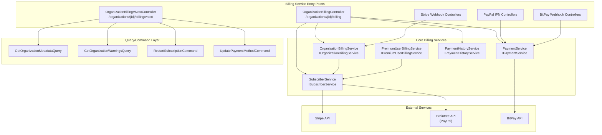
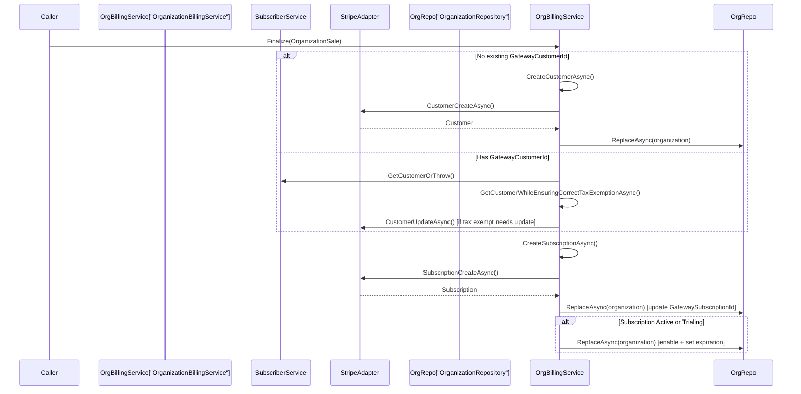
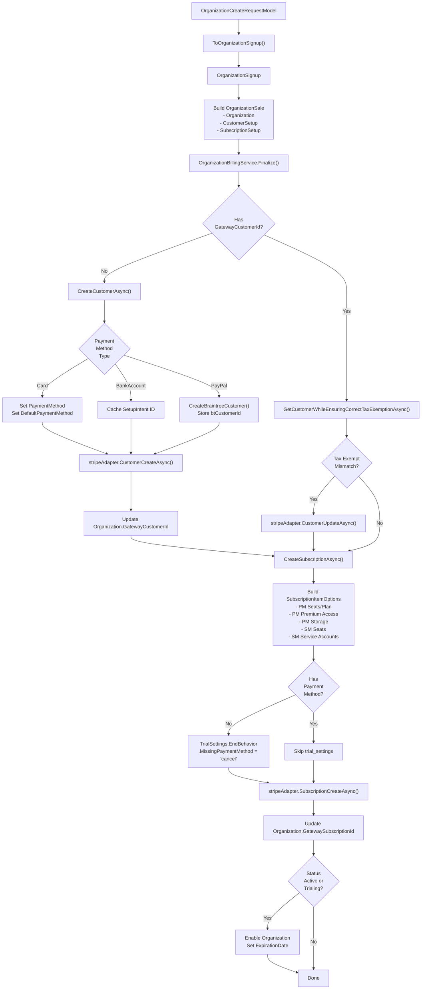
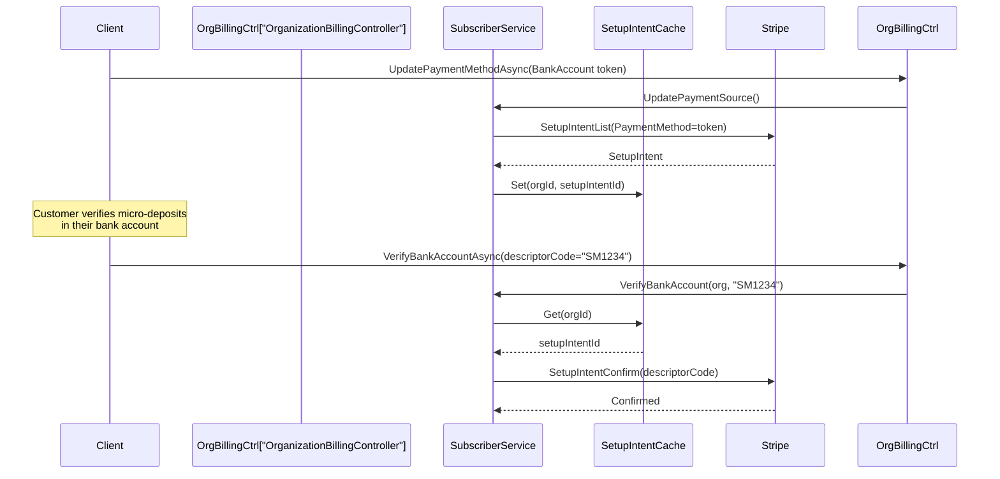
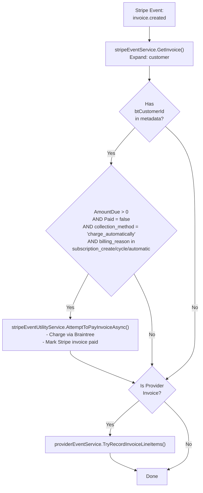

# Billing Service

<details>
<summary>Relevant source files</summary>

The following files were used as context for generating this wiki page:

- [.gitignore](https://github.com/bitwarden/server/blob/39f38f50/.gitignore)
- [src/Api/AdminConsole/Models/Request/Organizations/OrganizationCreateRequestModel.cs](https://github.com/bitwarden/server/blob/39f38f50/src/Api/AdminConsole/Models/Request/Organizations/OrganizationCreateRequestModel.cs)
- [src/Api/AdminConsole/Models/Request/Organizations/OrganizationNoPaymentCreateRequest.cs](https://github.com/bitwarden/server/blob/39f38f50/src/Api/AdminConsole/Models/Request/Organizations/OrganizationNoPaymentCreateRequest.cs)
- [src/Api/Billing/Controllers/OrganizationBillingController.cs](https://github.com/bitwarden/server/blob/39f38f50/src/Api/Billing/Controllers/OrganizationBillingController.cs)
- [src/Api/Billing/Controllers/VNext/OrganizationBillingVNextController.cs](https://github.com/bitwarden/server/blob/39f38f50/src/Api/Billing/Controllers/VNext/OrganizationBillingVNextController.cs)
- [src/Billing/Services/Implementations/InvoiceCreatedHandler.cs](https://github.com/bitwarden/server/blob/39f38f50/src/Billing/Services/Implementations/InvoiceCreatedHandler.cs)
- [src/Core/Billing/Extensions/ServiceCollectionExtensions.cs](https://github.com/bitwarden/server/blob/39f38f50/src/Core/Billing/Extensions/ServiceCollectionExtensions.cs)
- [src/Core/Billing/Models/Sales/CustomerSetup.cs](https://github.com/bitwarden/server/blob/39f38f50/src/Core/Billing/Models/Sales/CustomerSetup.cs)
- [src/Core/Billing/Models/Sales/PremiumUserSale.cs](https://github.com/bitwarden/server/blob/39f38f50/src/Core/Billing/Models/Sales/PremiumUserSale.cs)
- [src/Core/Billing/Models/Sales/SubscriptionSetup.cs](https://github.com/bitwarden/server/blob/39f38f50/src/Core/Billing/Models/Sales/SubscriptionSetup.cs)
- [src/Core/Billing/Organizations/Models/OrganizationMetadata.cs](https://github.com/bitwarden/server/blob/39f38f50/src/Core/Billing/Organizations/Models/OrganizationMetadata.cs)
- [src/Core/Billing/Organizations/Queries/GetOrganizationMetadataQuery.cs](https://github.com/bitwarden/server/blob/39f38f50/src/Core/Billing/Organizations/Queries/GetOrganizationMetadataQuery.cs)
- [src/Core/Billing/Organizations/Services/OrganizationBillingService.cs](https://github.com/bitwarden/server/blob/39f38f50/src/Core/Billing/Organizations/Services/OrganizationBillingService.cs)
- [src/Core/Billing/Services/IPremiumUserBillingService.cs](https://github.com/bitwarden/server/blob/39f38f50/src/Core/Billing/Services/IPremiumUserBillingService.cs)
- [src/Core/Constants.cs](https://github.com/bitwarden/server/blob/39f38f50/src/Core/Constants.cs)
- [src/Core/Models/Business/OrganizationSignup.cs](https://github.com/bitwarden/server/blob/39f38f50/src/Core/Models/Business/OrganizationSignup.cs)
- [test/Api.Test/Billing/Controllers/OrganizationBillingControllerTests.cs](https://github.com/bitwarden/server/blob/39f38f50/test/Api.Test/Billing/Controllers/OrganizationBillingControllerTests.cs)
- [test/Core.Test/Billing/Organizations/Queries/GetOrganizationMetadataQueryTests.cs](https://github.com/bitwarden/server/blob/39f38f50/test/Core.Test/Billing/Organizations/Queries/GetOrganizationMetadataQueryTests.cs)
- [test/Core.Test/Billing/Services/OrganizationBillingServiceTests.cs](https://github.com/bitwarden/server/blob/39f38f50/test/Core.Test/Billing/Services/OrganizationBillingServiceTests.cs)

</details>


## Purpose and Scope

The Billing Service is a standalone web service responsible for managing subscriptions, payment methods, invoices, and billing operations for both organizations and premium users. It exposes REST API endpoints for subscription management, payment processing, and billing history retrieval, and processes webhooks from payment gateway providers (Stripe, Braintree, PayPal, BitPay).

This document covers the Billing service's architecture, API endpoints, and core business logic. For information about:
- Payment gateway integration details and webhook event handling, see [Webhook and IPN Processing](#8.2)
- Organization subscription plans and pricing structures, see [Subscription Plans and Pricing](#8.4)
- The broader payment processing architecture, see [Payment and Billing Architecture](#8)

**Sources:** Diagram 1, Diagram 4, [src/Api/Billing/Controllers/OrganizationBillingController.cs:1-312](https://github.com/bitwarden/server/blob/39f38f50/src/Api/Billing/Controllers/OrganizationBillingController.cs#L1-L312), [src/Billing/Services/Implementations/InvoiceCreatedHandler.cs:1-64](https://github.com/bitwarden/server/blob/39f38f50/src/Billing/Services/Implementations/InvoiceCreatedHandler.cs#L1-L64)

---

## Service Architecture

### Service Components

The Billing service operates as one of nine distinct services in the Bitwarden server architecture. It follows a layered architecture where API controllers handle HTTP requests, core services implement business logic, and integration layers communicate with external payment gateways.



**Sources:** [src/Api/Billing/Controllers/OrganizationBillingController.cs:15-24](https://github.com/bitwarden/server/blob/39f38f50/src/Api/Billing/Controllers/OrganizationBillingController.cs#L15-L24), [src/Api/Billing/Controllers/VNext/OrganizationBillingVNextController.cs:22-34](https://github.com/bitwarden/server/blob/39f38f50/src/Api/Billing/Controllers/VNext/OrganizationBillingVNextController.cs#L22-L34), [src/Core/Billing/Extensions/ServiceCollectionExtensions.cs:22-38](https://github.com/bitwarden/server/blob/39f38f50/src/Core/Billing/Extensions/ServiceCollectionExtensions.cs#L22-L38)

---

## API Controllers

### OrganizationBillingController

The primary controller for organization billing operations, located at `/organizations/{organizationId:guid}/billing`. It requires the `"Application"` authorization policy.

| HTTP Method | Route | Method | Purpose |
|-------------|-------|--------|---------|
| GET | `/metadata` | `GetMetadataAsync` | Retrieve billing metadata including standalone SM flag and occupied seats |
| GET | `/history` | `GetHistoryAsync` | Get full billing history with invoices and transactions |
| GET | `/invoices` | `GetInvoicesAsync` | Paginated invoice history with status filtering |
| GET | `/transactions` | `GetTransactionsAsync` | Paginated transaction history |
| GET | `/` | `GetBillingAsync` | Retrieve billing information (cloud-only) |
| GET | `/payment-method` | `GetPaymentMethodAsync` | Get current payment method details |
| PUT | `/payment-method` | `UpdatePaymentMethodAsync` | Update payment method and tax information |
| POST | `/payment-method/verify-bank-account` | `VerifyBankAccountAsync` | Verify bank account with descriptor code |
| GET | `/tax-information` | `GetTaxInformationAsync` | Retrieve tax information |
| PUT | `/tax-information` | `UpdateTaxInformationAsync` | Update tax information |
| POST | `/setup-business-unit` | `SetupBusinessUnitAsync` | Convert organization to provider business unit (cloud-only) |
| POST | `/change-frequency` | `ChangePlanSubscriptionFrequencyAsync` | Change subscription from annual to monthly or vice versa (cloud-only) |

**Authorization Requirements:**
- Most endpoints check `ViewBillingHistory(organizationId)` or `EditPaymentMethods(organizationId)` permissions via `ICurrentContext`
- The `SetupBusinessUnitAsync` endpoint requires `OrganizationUser(organizationId)` permission
- Several endpoints are restricted to cloud deployments via `[SelfHosted(NotSelfHostedOnly = true)]`

**Sources:** [src/Api/Billing/Controllers/OrganizationBillingController.cs:15-312](https://github.com/bitwarden/server/blob/39f38f50/src/Api/Billing/Controllers/OrganizationBillingController.cs#L15-L312)

### OrganizationBillingVNextController

A newer version of the billing controller at `/organizations/{organizationId:guid}/billing/vnext` using an alternative authorization approach with requirement-based policies and organization entity injection.

| HTTP Method | Route | Method | Purpose |
|-------------|-------|--------|---------|
| GET | `/address` | `GetBillingAddressAsync` | Get billing address |
| PUT | `/address` | `UpdateBillingAddressAsync` | Update billing address |
| GET | `/credit` | `GetCreditAsync` | Get account credit balance |
| POST | `/credit/bitpay` | `AddCreditViaBitPayAsync` | Add credit via BitPay invoice |
| GET | `/payment-method` | `GetPaymentMethodAsync` | Get payment method |
| PUT | `/payment-method` | `UpdatePaymentMethodAsync` | Update payment method |
| POST | `/subscription/restart` | `RestartSubscriptionAsync` | Restart cancelled subscription |
| GET | `/metadata` | `GetMetadataAsync` | Get organization metadata (feature-flagged) |
| GET | `/warnings` | `GetWarningsAsync` | Get billing warnings |

**Authorization:**
- Uses `[Authorize<ManageOrganizationBillingRequirement>]` for most billing operations
- Uses `[Authorize<MemberOrProviderRequirement>]` for read-only metadata/warnings
- Employs `[InjectOrganization]` attribute to automatically inject and validate the `Organization` entity

**Sources:** [src/Api/Billing/Controllers/VNext/OrganizationBillingVNextController.cs:22-144](https://github.com/bitwarden/server/blob/39f38f50/src/Api/Billing/Controllers/VNext/OrganizationBillingVNextController.cs#L22-L144)

---

## Core Services

### OrganizationBillingService

The `OrganizationBillingService` class implements `IOrganizationBillingService` and orchestrates the creation and management of organization subscriptions.

**Key Methods:**

#### Finalize
Creates the complete Stripe subscription setup for an organization. It accepts an `OrganizationSale` containing the organization, customer setup, and subscription setup.



The `CreateCustomerAsync` method handles:
- Setting up payment methods (Card, BankAccount, PayPal via Braintree)
- Configuring tax information and exemptions
- Creating Braintree customers for PayPal payments
- Caching SetupIntent IDs for bank account verification

**Sources:** [src/Core/Billing/Organizations/Services/OrganizationBillingService.cs:40-56](https://github.com/bitwarden/server/blob/39f38f50/src/Core/Billing/Organizations/Services/OrganizationBillingService.cs#L40-L56), [src/Core/Billing/Organizations/Services/OrganizationBillingService.cs:179-379](https://github.com/bitwarden/server/blob/39f38f50/src/Core/Billing/Organizations/Services/OrganizationBillingService.cs#L179-L379), [src/Core/Billing/Organizations/Services/OrganizationBillingService.cs:381-485](https://github.com/bitwarden/server/blob/39f38f50/src/Core/Billing/Organizations/Services/OrganizationBillingService.cs#L381-L485)

#### GetMetadata
Retrieves billing metadata for an organization, including whether it's on a Secrets Manager standalone plan and the number of occupied seats.

The method:
1. Returns default metadata for self-hosted installations
2. Returns default with occupied seats if no subscription exists
3. Checks for Secrets Manager standalone coupon by examining customer discount and subscription product IDs

**Sources:** [src/Core/Billing/Organizations/Services/OrganizationBillingService.cs:58-100](https://github.com/bitwarden/server/blob/39f38f50/src/Core/Billing/Organizations/Services/OrganizationBillingService.cs#L58-L100), [src/Core/Billing/Organizations/Services/OrganizationBillingService.cs:526-555](https://github.com/bitwarden/server/blob/39f38f50/src/Core/Billing/Organizations/Services/OrganizationBillingService.cs#L526-L555)

#### UpdatePaymentMethod
Updates the payment method and tax information for an organization. If the organization has no existing Stripe customer, it creates one. Otherwise, it updates the existing customer's payment source and tax information.

After updating the payment method, it automatically adjusts the subscription's `trial_settings.end_behavior.missing_payment_method` from `"cancel"` to `"create_invoice"` if needed.

**Sources:** [src/Core/Billing/Organizations/Services/OrganizationBillingService.cs:102-127](https://github.com/bitwarden/server/blob/39f38f50/src/Core/Billing/Organizations/Services/OrganizationBillingService.cs#L102-L127), [src/Core/Billing/Organizations/Services/OrganizationBillingService.cs:557-574](https://github.com/bitwarden/server/blob/39f38f50/src/Core/Billing/Organizations/Services/OrganizationBillingService.cs#L557-L574)

#### UpdateSubscriptionPlanFrequency
Changes an organization's subscription from annual to monthly or vice versa. This method:
1. Retrieves the current subscription and its items
2. Maps each subscription item to the corresponding plan in the new frequency
3. Updates the subscription with proration behavior set to `"create_prorations"`

**Sources:** [src/Core/Billing/Organizations/Services/OrganizationBillingService.cs:129-175](https://github.com/bitwarden/server/blob/39f38f50/src/Core/Billing/Organizations/Services/OrganizationBillingService.cs#L129-L175)

### GetOrganizationMetadataQuery

A query class implementing `IGetOrganizationMetadataQuery` that retrieves billing metadata. This is the newer, feature-flagged version used by `OrganizationBillingVNextController`.

The query follows this logic:
1. Returns `null` if organization is `null`
2. Returns `OrganizationMetadata.Default` for self-hosted installations
3. Returns default with occupied seats if no `GatewaySubscriptionId` exists
4. Returns default with occupied seats if customer or subscription is `null`
5. Otherwise, calculates `IsOnSecretsManagerStandalone` by checking:
   - The plan supports Secrets Manager
   - Customer has the Secrets Manager Standalone coupon (`StripeConstants.CouponIDs.SecretsManagerStandalone`)
   - The coupon applies to at least one product in the subscription

**Sources:** [src/Core/Billing/Organizations/Queries/GetOrganizationMetadataQuery.cs:1-95](https://github.com/bitwarden/server/blob/39f38f50/src/Core/Billing/Organizations/Queries/GetOrganizationMetadataQuery.cs#L1-L95), [src/Core/Constants.cs:175-185](https://github.com/bitwarden/server/blob/39f38f50/src/Core/Constants.cs#L175-L185)

### PremiumUserBillingService

The `IPremiumUserBillingService` interface defines operations for premium user billing:

- `Finalize(PremiumUserSale sale)` - Establishes Stripe entities for a premium user subscription
- `UpdatePaymentMethod(User, TokenizedPaymentSource, TaxInformation)` - Updates payment method for premium users
- `Credit(User, decimal amount)` - Credits a user's account

**Sources:** [src/Core/Billing/Services/IPremiumUserBillingService.cs:8-39](https://github.com/bitwarden/server/blob/39f38f50/src/Core/Billing/Services/IPremiumUserBillingService.cs#L8-L39)

---

## Billing Models

### OrganizationMetadata

A simple record containing billing metadata for an organization:

```csharp
public record OrganizationMetadata(
    bool IsOnSecretsManagerStandalone,
    int OrganizationOccupiedSeats)
```

The `IsOnSecretsManagerStandalone` flag indicates whether the organization is on a Secrets Manager standalone plan (has the specific coupon applied). The default metadata has both fields set to `false` and `0` respectively.

**Sources:** [src/Core/Billing/Organizations/Models/OrganizationMetadata.cs:1-10](https://github.com/bitwarden/server/blob/39f38f50/src/Core/Billing/Organizations/Models/OrganizationMetadata.cs#L1-L10)

### OrganizationSale

Represents the complete data needed to create an organization subscription. It consists of three components:
- `Organization` - The organization entity
- `CustomerSetup` - Customer creation configuration (payment source, tax information, coupon)
- `SubscriptionSetup` - Subscription configuration (plan type, seats, storage, service accounts)

**Sources:** Inferred from [src/Core/Billing/Organizations/Services/OrganizationBillingService.cs:40-56](https://github.com/bitwarden/server/blob/39f38f50/src/Core/Billing/Organizations/Services/OrganizationBillingService.cs#L40-L56)

### CustomerSetup

Contains the information needed to create or configure a Stripe customer:

```csharp
public class CustomerSetup
{
    public TokenizedPaymentSource? TokenizedPaymentSource { get; set; }
    public TaxInformation? TaxInformation { get; set; }
    public string? Coupon { get; set; }
    
    public bool IsBillable => TokenizedPaymentSource != null && TaxInformation != null;
}
```

The `IsBillable` property indicates whether the customer setup contains sufficient information to create a billable customer.

**Sources:** [src/Core/Billing/Models/Sales/CustomerSetup.cs:1-14](https://github.com/bitwarden/server/blob/39f38f50/src/Core/Billing/Models/Sales/CustomerSetup.cs#L1-L14)

### SubscriptionSetup

Defines the configuration for a new subscription:

```csharp
public class SubscriptionSetup
{
    public required PlanType PlanType { get; set; }
    public required PasswordManager PasswordManagerOptions { get; set; }
    public SecretsManager? SecretsManagerOptions { get; set; }
    public bool SkipTrial = false;
    public string? InitiationPath { get; set; }
}
```

It includes nested classes for Password Manager options (seats, storage, premium access) and Secrets Manager options (seats, service accounts).

**Sources:** [src/Core/Billing/Models/Sales/SubscriptionSetup.cs:1-27](https://github.com/bitwarden/server/blob/39f38f50/src/Core/Billing/Models/Sales/SubscriptionSetup.cs#L1-L27)

### PremiumUserSale

Similar to `OrganizationSale`, but for premium users:

```csharp
public class PremiumUserSale
{
    public required User User { get; set; }
    public required CustomerSetup CustomerSetup { get; set; }
    public short? Storage { get; set; }
}
```

Provides a factory method `From(User, PaymentMethodType, string token, TaxInfo, short? storage)` to construct instances.

**Sources:** [src/Core/Billing/Models/Sales/PremiumUserSale.cs:1-50](https://github.com/bitwarden/server/blob/39f38f50/src/Core/Billing/Models/Sales/PremiumUserSale.cs#L1-L50)

### OrganizationSignup

An intermediary model used during organization creation that extends `OrganizationUpgrade`:

**Key Properties:**
- `Name`, `BillingEmail` - Basic organization information
- `Owner`, `OwnerKey` - Owner user and encryption key
- `CollectionName` - Default collection name
- `PaymentMethodType`, `PaymentToken` - Payment information
- `MaxAutoscaleSeats` - Maximum autoscaling seat count
- `InitiationPath` - Trial initiation source tracking
- `IsFromSecretsManagerTrial` - Whether created from SM trial
- `IsFromProvider` - Whether created by a provider
- `SkipTrial` - Whether to skip the trial period

**Sources:** [src/Core/Models/Business/OrganizationSignup.cs:1-23](https://github.com/bitwarden/server/blob/39f38f50/src/Core/Models/Business/OrganizationSignup.cs#L1-L23)

---

## Subscription Creation Flow

The following diagram illustrates the complete flow for creating an organization subscription:



**Sources:** [src/Core/Billing/Organizations/Services/OrganizationBillingService.cs:40-485](https://github.com/bitwarden/server/blob/39f38f50/src/Core/Billing/Organizations/Services/OrganizationBillingService.cs#L40-L485), [src/Api/AdminConsole/Models/Request/Organizations/OrganizationCreateRequestModel.cs:84-122](https://github.com/bitwarden/server/blob/39f38f50/src/Api/AdminConsole/Models/Request/Organizations/OrganizationCreateRequestModel.cs#L84-L122)

---

## Payment Method Management

### Payment Method Types

The system supports four payment method types:

| Type | Gateway | Implementation Details |
|------|---------|------------------------|
| `Card` | Stripe | Stored as Stripe PaymentMethod, set as default payment method |
| `BankAccount` | Stripe | Requires SetupIntent verification, stored in cache until confirmed |
| `PayPal` | Braintree | Creates Braintree customer, stores `btCustomerId` in Stripe customer metadata |
| `BankTransfer` | N/A | Manual payment processing |
| `Bitcoin` / `BitPay` | BitPay | Creates BitPay invoices for credit purchases |

**Sources:** [src/Core/Billing/Organizations/Services/OrganizationBillingService.cs:289-326](https://github.com/bitwarden/server/blob/39f38f50/src/Core/Billing/Organizations/Services/OrganizationBillingService.cs#L289-L326)

### Bank Account Verification

When a bank account is used as the payment method:

1. A Stripe SetupIntent is created with the bank account token
2. The SetupIntent ID is cached using `ISetupIntentCache` with the organization ID as the key
3. The customer provides a 6-character descriptor code starting with "SM"
4. The `VerifyBankAccountAsync` endpoint validates and confirms the SetupIntent



**Sources:** [src/Api/Billing/Controllers/OrganizationBillingController.cs:182-207](https://github.com/bitwarden/server/blob/39f38f50/src/Api/Billing/Controllers/OrganizationBillingController.cs#L182-L207), [src/Core/Billing/Organizations/Services/OrganizationBillingService.cs:294-308](https://github.com/bitwarden/server/blob/39f38f50/src/Core/Billing/Organizations/Services/OrganizationBillingService.cs#L294-L308)

### Tax Exemption Handling

The system automatically manages tax exemption status based on the organization's plan tier and location:

- **Non-US Organizations** on Teams, TeamsStarter, or Enterprise plans → Set to `TaxExempt = "reverse"` (reverse charge)
- **US Organizations** or Free/Families plans → No tax exemption (`TaxExempt = "none"`)

The `GetCustomerWhileEnsuringCorrectTaxExemptionAsync` method updates the customer's tax exemption status during subscription creation if it doesn't match the expected value.

**Sources:** [src/Core/Billing/Organizations/Services/OrganizationBillingService.cs:487-524](https://github.com/bitwarden/server/blob/39f38f50/src/Core/Billing/Organizations/Services/OrganizationBillingService.cs#L487-L524)

---

## Service Registration

All billing services are registered in the dependency injection container via the `AddBillingOperations` extension method:

```mermaid
graph LR
    ServiceCollection["IServiceCollection"]
    
    ServiceCollection --> TaxService["ITaxService → TaxService<br/>(Singleton)"]
    ServiceCollection --> OrgBillingService["IOrganizationBillingService → OrganizationBillingService<br/>(Transient)"]
    ServiceCollection --> PremiumBillingService["IPremiumUserBillingService → PremiumUserBillingService<br/>(Transient)"]
    ServiceCollection --> SetupIntentCache["ISetupIntentCache → SetupIntentDistributedCache<br/>(Transient)"]
    ServiceCollection --> SubscriberService["ISubscriberService → SubscriberService<br/>(Transient)"]
    ServiceCollection --> LicenseServices["License Services"]
    ServiceCollection --> PricingClient["IPricingClient"]
    ServiceCollection --> PaymentOperations["Payment Operations"]
    ServiceCollection --> Queries["Queries & Commands"]
```



**Key Registrations:**
- `IOrganizationBillingService` → `OrganizationBillingService` (Transient)
- `IPremiumUserBillingService` → `PremiumUserBillingService` (Transient)
- `ISubscriberService` → `SubscriberService` (Transient)
- `ISetupIntentCache` → `SetupIntentDistributedCache` (Transient)
- `ITaxService` → `TaxService` (Singleton)
- `IGetOrganizationMetadataQuery` → `GetOrganizationMetadataQuery` (Transient)
- `IRestartSubscriptionCommand` → `RestartSubscriptionCommand` (Transient)

**Sources:** [src/Core/Billing/Extensions/ServiceCollectionExtensions.cs:22-53](https://github.com/bitwarden/server/blob/39f38f50/src/Core/Billing/Extensions/ServiceCollectionExtensions.cs#L22-L53)

---

## Webhook Processing

### Invoice Created Handler

The `InvoiceCreatedHandler` processes the `invoice.created` Stripe webhook event. It has two primary responsibilities:

1. **PayPal Invoice Payment**: If the invoice belongs to a PayPal customer (identified by `btCustomerId` in metadata) and the invoice is ready to be paid, it attempts to charge the Braintree customer and marks the Stripe invoice as paid.

2. **Provider Invoice Recording**: For invoices belonging to providers, it records a point-in-time snapshot of invoice line items broken down by client organizations for provider invoice exports.



The handler wraps each responsibility in a try-catch to ensure one failure doesn't prevent the other from executing.

**Sources:** [src/Billing/Services/Implementations/InvoiceCreatedHandler.cs:13-63](https://github.com/bitwarden/server/blob/39f38f50/src/Billing/Services/Implementations/InvoiceCreatedHandler.cs#L13-L63)

---

## Constants and Configuration

### Billing-Related Constants

The `Constants` class defines several billing-related values:

| Constant | Value | Purpose |
|----------|-------|---------|
| `OrganizationSelfHostSubscriptionGracePeriodDays` | `60` | Grace period for self-hosted org subscriptions |
| `CreateProrations` | `"create_prorations"` | Stripe proration behavior for subscription changes |
| `AlwaysInvoice` | `"always_invoice"` | Stripe invoice generation behavior |
| `CountryAbbreviations.UnitedStates` | `"US"` | US country code for tax determination |

**Sources:** [src/Core/Constants.cs:29-72](https://github.com/bitwarden/server/blob/39f38f50/src/Core/Constants.cs#L29-L72)

### Feature Flags

Several billing-related feature flags are defined in `FeatureFlagKeys`:

| Flag Key | Purpose |
|----------|---------|
| `TrialPayment` | Trial payment feature |
| `PM17772_AdminInitiatedSponsorships` | Admin-initiated sponsorship management |
| `UsePricingService` | Use the pricing service for plan information |
| `PM19422_AllowAutomaticTaxUpdates` | Allow automatic tax updates |
| `PM21821_ProviderPortalTakeover` | Provider portal takeover feature |
| `PM22415_TaxIDWarnings` | Tax ID warning messages |
| `PM25379_UseNewOrganizationMetadataStructure` | Use new organization metadata structure (VNext controller) |
| `PM24996ImplementUpgradeFromFreeDialog` | Upgrade from free dialog |
| `PM24032_NewNavigationPremiumUpgradeButton` | Premium upgrade button in new navigation |
| `PM23713_PremiumBadgeOpensNewPremiumUpgradeDialog` | Premium badge upgrade dialog |
| `PremiumUpgradeNewDesign` | Premium upgrade page new design |