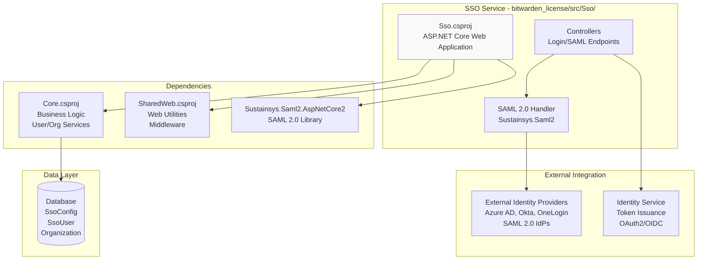
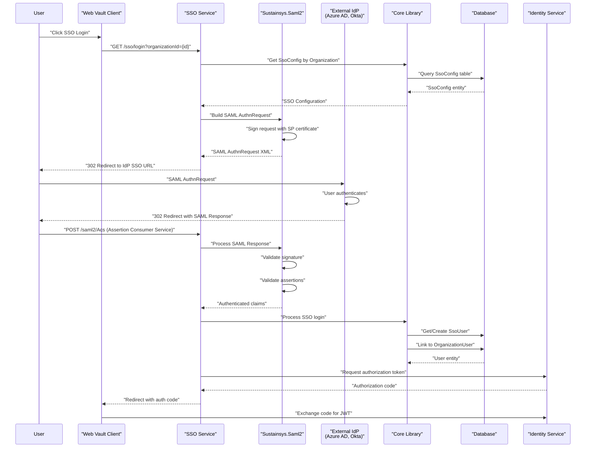
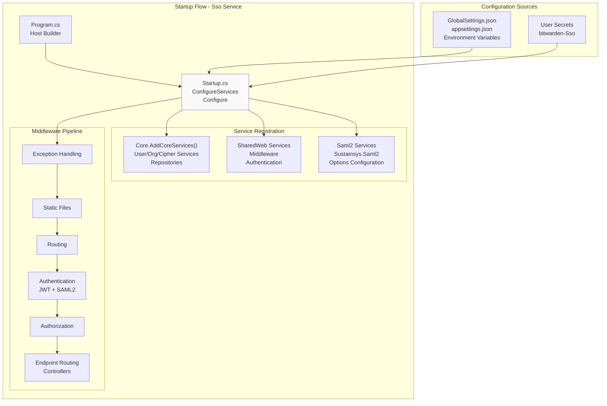
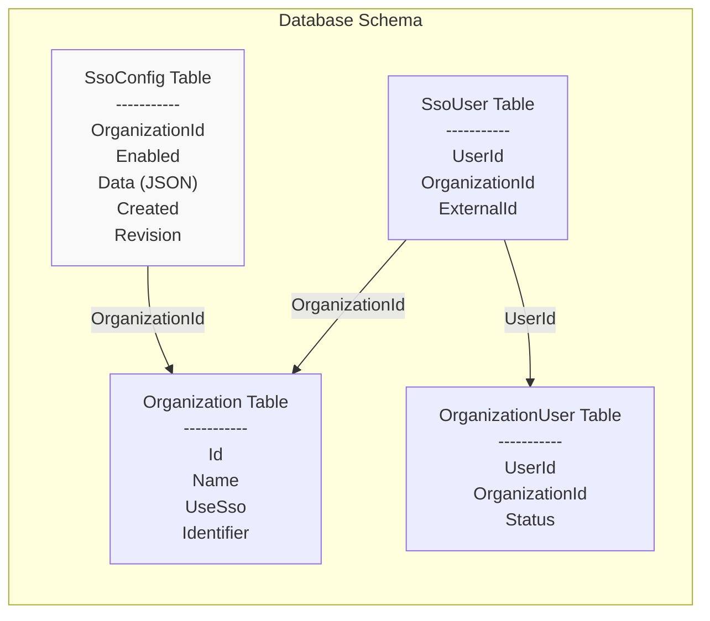
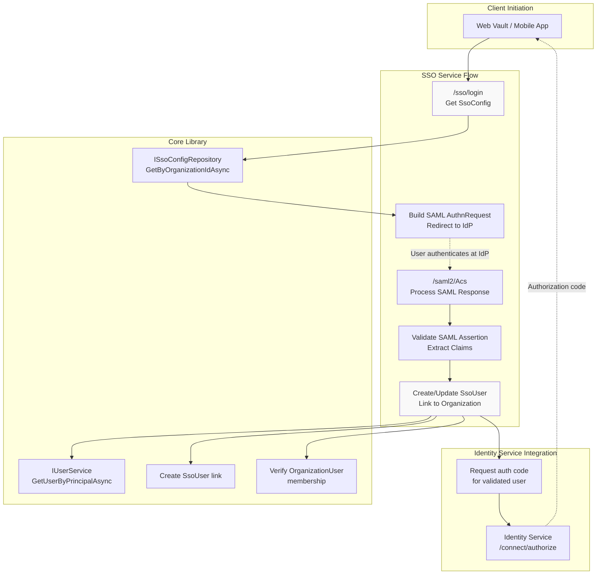
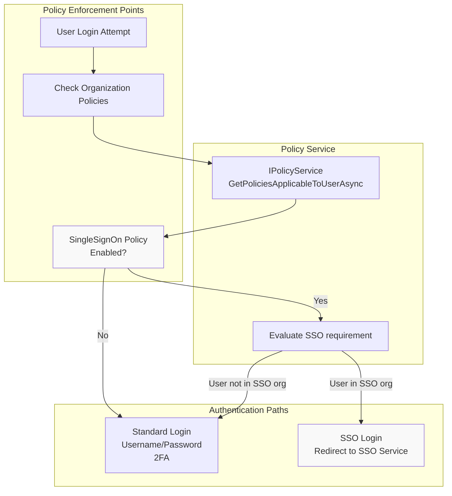
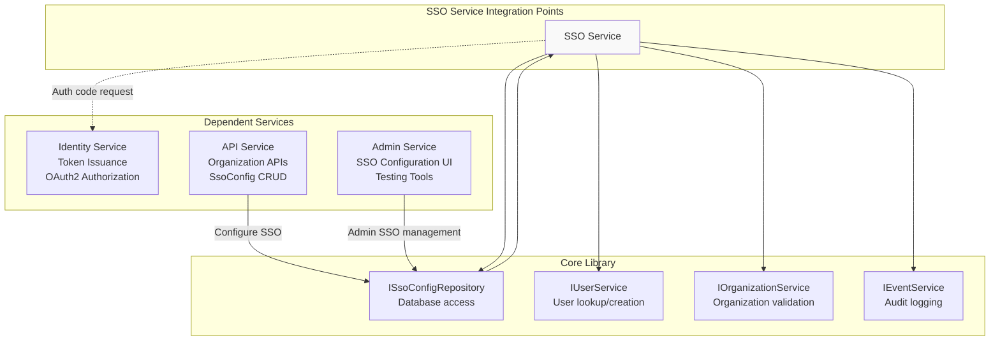

# SSO Service

<details>
<summary>Relevant source files</summary>

The following files were used as context for generating this wiki page:

- [bitwarden_license/src/Sso/Sso.csproj](https://github.com/bitwarden/server/blob/39f38f50/bitwarden_license/src/Sso/Sso.csproj)
- [src/Admin/Admin.csproj](https://github.com/bitwarden/server/blob/39f38f50/src/Admin/Admin.csproj)
- [src/Api/Api.csproj](https://github.com/bitwarden/server/blob/39f38f50/src/Api/Api.csproj)
- [src/Billing/Billing.csproj](https://github.com/bitwarden/server/blob/39f38f50/src/Billing/Billing.csproj)
- [src/Core/Core.csproj](https://github.com/bitwarden/server/blob/39f38f50/src/Core/Core.csproj)
- [src/Events/Events.csproj](https://github.com/bitwarden/server/blob/39f38f50/src/Events/Events.csproj)
- [src/EventsProcessor/EventsProcessor.csproj](https://github.com/bitwarden/server/blob/39f38f50/src/EventsProcessor/EventsProcessor.csproj)
- [src/Icons/Icons.csproj](https://github.com/bitwarden/server/blob/39f38f50/src/Icons/Icons.csproj)
- [src/Identity/Identity.csproj](https://github.com/bitwarden/server/blob/39f38f50/src/Identity/Identity.csproj)
- [src/Notifications/Notifications.csproj](https://github.com/bitwarden/server/blob/39f38f50/src/Notifications/Notifications.csproj)
- [util/Server/Server.csproj](https://github.com/bitwarden/server/blob/39f38f50/util/Server/Server.csproj)
- [util/Setup/Setup.csproj](https://github.com/bitwarden/server/blob/39f38f50/util/Setup/Setup.csproj)

</details>


## Purpose and Scope

The SSO Service provides enterprise single sign-on (SSO) capabilities for Bitwarden organizations using the SAML 2.0 protocol. This service enables organizations to authenticate their users through external identity providers such as Azure AD, Okta, OneLogin, and other SAML-compliant IdPs. The SSO Service acts as a SAML Service Provider (SP) that processes authentication requests and responses from enterprise identity providers.

For general authentication and OAuth2/OIDC flows, see [Identity Service](#3.2). For organization management and SSO configuration, see [Organization Service](#6.1). For policy enforcement of SSO requirements, see [Policy Requirements and Enforcement](#6.4).

---

## Service Architecture

The SSO Service is part of the commercial/licensed portion of the Bitwarden server codebase, located at [bitwarden_license/src/Sso/]() rather than in the open-source [src/]() directory. This service operates as an independent web application that integrates with the Core library for business logic and with the Identity service for token issuance.



**Service Dependencies**

| Dependency | Purpose |
|------------|---------|
| `Core.csproj` | Provides user services, organization services, repository layer, and SSO configuration logic |
| `SharedWeb.csproj` | Provides web utilities, middleware, and shared web infrastructure |
| `Sustainsys.Saml2.AspNetCore2` | Third-party SAML 2.0 implementation for ASP.NET Core |
| `Microsoft.AspNetCore.Http` v2.2.2 | Transitive dependency required by Sustainsys.Saml2 |

Sources: [bitwarden_license/src/Sso/Sso.csproj:1-21](https://github.com/bitwarden/server/blob/39f38f50/bitwarden_license/src/Sso/Sso.csproj#L1-L21)

---

## SAML 2.0 Implementation

The SSO Service uses the Sustainsys.Saml2.AspNetCore2 library to implement SAML 2.0 Service Provider functionality. This enables the service to act as a SAML SP that receives authentication assertions from external SAML Identity Providers.



**SAML Flow Components**

| Component | Responsibility |
|-----------|---------------|
| **SAML AuthnRequest** | Generated by Sustainsys.Saml2, signed with SP certificate, redirects user to IdP |
| **Assertion Consumer Service (ACS)** | Endpoint at `/saml2/Acs` that receives SAML responses from IdP |
| **SAML Response Processing** | Validates signatures, timestamps, audience restrictions, and assertion conditions |
| **Claims Mapping** | Maps SAML attributes to Bitwarden user attributes (email, name, external ID) |
| **SsoUser Entity** | Links external IdP user identifier to Bitwarden user and organization |

Sources: [bitwarden_license/src/Sso/Sso.csproj:13](https://github.com/bitwarden/server/blob/39f38f50/bitwarden_license/src/Sso/Sso.csproj#L13), Diagram 3 from high-level architecture

---

## Service Startup and Configuration

Like other Bitwarden services, the SSO Service uses ASP.NET Core's startup pipeline with dependency injection configured through the Core library's service collection extensions.



**Configuration Structure**

The SSO Service reads configuration from multiple sources following the standard ASP.NET Core configuration hierarchy:

| Configuration Source | Purpose | Example Settings |
|---------------------|---------|------------------|
| `appsettings.json` | Base configuration | Service URLs, connection strings |
| Environment Variables | Deployment-specific overrides | `globalSettings__sso__baseServiceUri__vault` |
| User Secrets | Local development secrets | `bitwarden-Sso` secrets ID |
| GlobalSettings | Parsed into `GlobalSettings` object | Database connection, Redis configuration, SSO-specific settings |

Sources: [bitwarden_license/src/Sso/Sso.csproj:3-4](https://github.com/bitwarden/server/blob/39f38f50/bitwarden_license/src/Sso/Sso.csproj#L3-L4), [src/Core/Core.csproj:1-84](https://github.com/bitwarden/server/blob/39f38f50/src/Core/Core.csproj#L1-L84)

---

## SSO Configuration Management

Organizations configure SSO through the Core library's SSO configuration services. The SSO Service reads these configurations at runtime to determine how to interact with each organization's identity provider.

**SsoConfig Entity Structure**



**SsoConfig.Data JSON Structure**

The `SsoConfig.Data` column contains a JSON object with provider-specific configuration:

| Configuration Field | Purpose |
|-------------------|---------|
| `ConfigType` | Integer value: 1 = SAML 2.0, 2 = OpenID Connect |
| `MemberDecryptionType` | How organization keys are decrypted: KeyConnector, MasterPassword |
| `SamlEntryPoint` | IdP Single Sign-On URL |
| `SamlIdpEntityId` | IdP Entity ID from metadata |
| `SamlX509PublicCert` | IdP certificate for signature validation |
| `SamlSpNameIdFormat` | NameID format requested in AuthnRequest |
| `SamlSignAuthNRequest` | Whether to sign outgoing AuthnRequests |
| `SamlAllowedClockDrift` | Time drift tolerance for assertion validation |

Sources: Core library entity models (referenced in Diagram 2)

---

## Authentication Flow Integration

The SSO Service integrates with the broader Bitwarden authentication system, particularly the Identity service for token issuance after successful SAML authentication.



**Post-Authentication Flow**

After SAML authentication succeeds:

1. **SsoUser Linking**: The service creates or updates an `SsoUser` record linking the external IdP user identifier to the Bitwarden user
2. **Organization Verification**: Confirms the user has an active `OrganizationUser` membership with the authenticating organization
3. **Token Request**: Redirects to Identity service with authenticated user context
4. **Authorization Code**: Identity service issues an OAuth2 authorization code
5. **Token Exchange**: Client exchanges authorization code for JWT access token and refresh token

This flow maintains separation of concerns: SSO Service handles SAML authentication, Identity service handles token issuance, and Core library handles user and organization business logic.

Sources: Diagram 3 from high-level architecture, [src/Core/Core.csproj:55](https://github.com/bitwarden/server/blob/39f38f50/src/Core/Core.csproj#L55) (Duende.IdentityServer reference)

---

## Policy Enforcement and SSO Requirements

Organizations can enforce SSO login requirements through the Policy system. When an organization enables the "Single Sign-On Authentication" policy, users must authenticate via SSO rather than traditional username/password.

**SSO Policy Integration**



**Policy Types Related to SSO**

| Policy | Effect on SSO |
|--------|---------------|
| `SingleSignOn` | Requires users to authenticate via SSO when enabled |
| `RequireSso` | Legacy policy name, same effect as SingleSignOn |
| `TwoFactorAuthentication` | Can be combined with SSO for additional security |
| `ResetPassword` | May interact with SSO for password reset flows |

Sources: [Policy Requirements and Enforcement](#6.4) (referenced section), Core library policy services

---

## Service Endpoints

The SSO Service exposes several key endpoints for the SAML authentication workflow:

**Primary Endpoints**

| Endpoint | Method | Purpose |
|----------|--------|---------|
| `/sso/login` | GET | Initiates SSO login, retrieves configuration, redirects to IdP |
| `/saml2/Acs` | POST | Assertion Consumer Service - receives SAML responses from IdP |
| `/saml2/signin` | Multiple | Sustainsys.Saml2 authentication handler endpoint |
| `/sso/prevalidate` | GET | Pre-validates organization SSO configuration before login |

**SAML Metadata Endpoints**

| Endpoint | Purpose |
|----------|---------|
| `/saml2` or `/saml2/metadata` | Serves SAML SP metadata XML for IdP configuration |

The metadata endpoint provides the Service Provider's entity ID, assertion consumer service URL, and public certificate for IdPs to configure.

Sources: [bitwarden_license/src/Sso/Sso.csproj:1-21](https://github.com/bitwarden/server/blob/39f38f50/bitwarden_license/src/Sso/Sso.csproj#L1-L21), Sustainsys.Saml2 documentation patterns

---

## Deployment Configuration

The SSO Service can be deployed in multiple configurations:

**Deployment Modes**

| Mode | Configuration | Use Case |
|------|--------------|----------|
| **Cloud Production** | Azure Kubernetes Service, load balanced | Multi-tenant cloud deployment |
| **Self-Hosted** | Docker container, `bitwarden/sso` image | Single organization self-hosted |
| **Development** | Local .NET runtime, User Secrets | Development and testing |

**Environment Variables**

Key environment variables for SSO Service configuration:

```
globalSettings__baseServiceUri__sso=https://sso.example.com
globalSettings__sqlServer__connectionString=...
globalSettings__redis__servers=redis:6379
globalSettings__identityServer__authority=https://identity.example.com
```

**Docker Image**

The SSO Service is built as a Docker image during the CI/CD pipeline and published to Azure Container Registry:
- Image name: `bitwardenprod.azurecr.io/sso`
- Multi-architecture support: `linux/amd64`, `linux/arm64`

Sources: [bitwarden_license/src/Sso/Sso.csproj:1-21](https://github.com/bitwarden/server/blob/39f38f50/bitwarden_license/src/Sso/Sso.csproj#L1-L21), Diagram 6 from high-level architecture

---

## Integration with Other Services

The SSO Service integrates with multiple other Bitwarden services to provide complete authentication functionality:



**Service Interactions**

| Service | Interaction Purpose |
|---------|-------------------|
| **Identity Service** | SSO Service redirects to Identity after successful SAML auth for token issuance |
| **API Service** | Provides REST endpoints for organizations to configure SSO settings |
| **Admin Service** | Provides administrative interface for SSO configuration and troubleshooting |
| **Core Library** | All business logic, data access, and external integrations |

**Audit Logging**

All SSO authentication attempts are logged through the Event Service:
- Successful SSO logins
- Failed SAML assertion validations
- Configuration changes
- User linking events

Sources: [src/Core/Core.csproj:1-84](https://github.com/bitwarden/server/blob/39f38f50/src/Core/Core.csproj#L1-L84), [bitwarden_license/src/Sso/Sso.csproj:17-18](https://github.com/bitwarden/server/blob/39f38f50/bitwarden_license/src/Sso/Sso.csproj#L17-L18)

---

## Security Considerations

The SSO Service implements several security measures for SAML authentication:

**Security Features**

| Security Layer | Implementation |
|----------------|----------------|
| **SAML Signature Validation** | All SAML responses must be signed by IdP certificate |
| **Certificate Management** | IdP certificates stored in `SsoConfig.Data` and validated on each authentication |
| **Replay Attack Prevention** | SAML assertion IDs tracked to prevent replay attacks |
| **Audience Restriction** | SAML assertions must specify correct SP entity ID as audience |
| **Time Window Validation** | Assertions validated within `NotBefore` and `NotOnOrAfter` constraints |
| **Clock Drift Tolerance** | Configurable `SamlAllowedClockDrift` for timestamp validation |
| **HTTPS Requirements** | All SSO endpoints require HTTPS in production |

**Authorization Flow Security**

After SAML authentication, the authorization code flow ensures:
1. Short-lived authorization codes (minutes)
2. Single-use codes (cannot be replayed)
3. Codes bound to the authenticating client
4. Transition to JWT tokens for API access