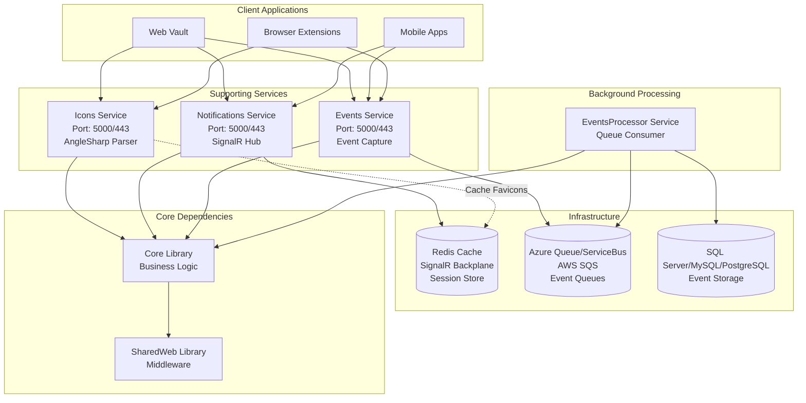
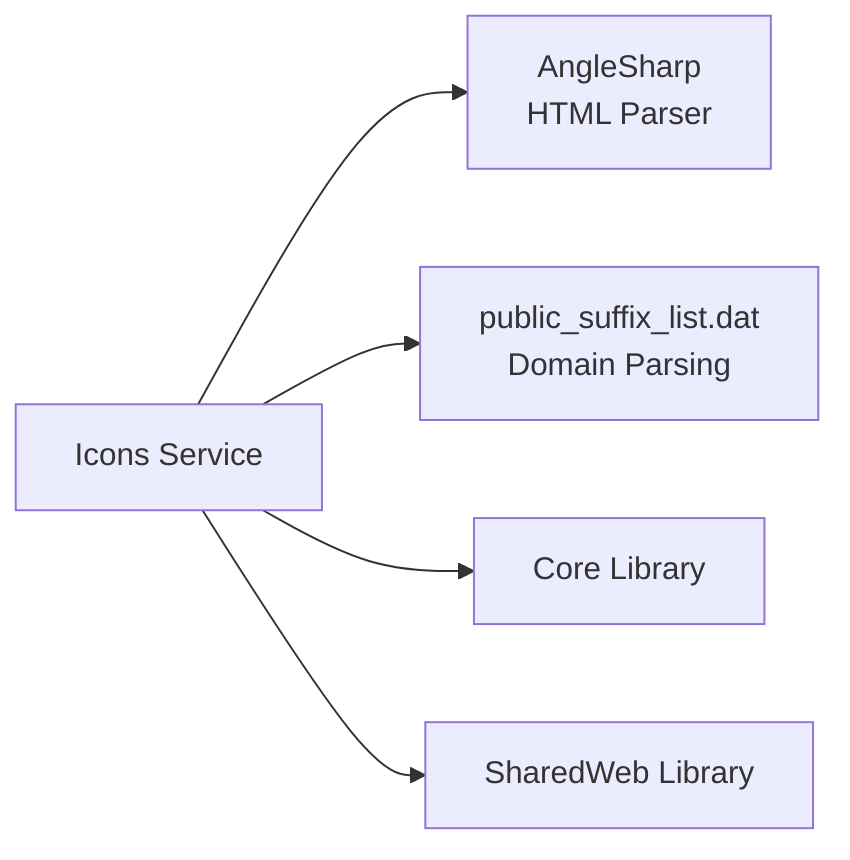
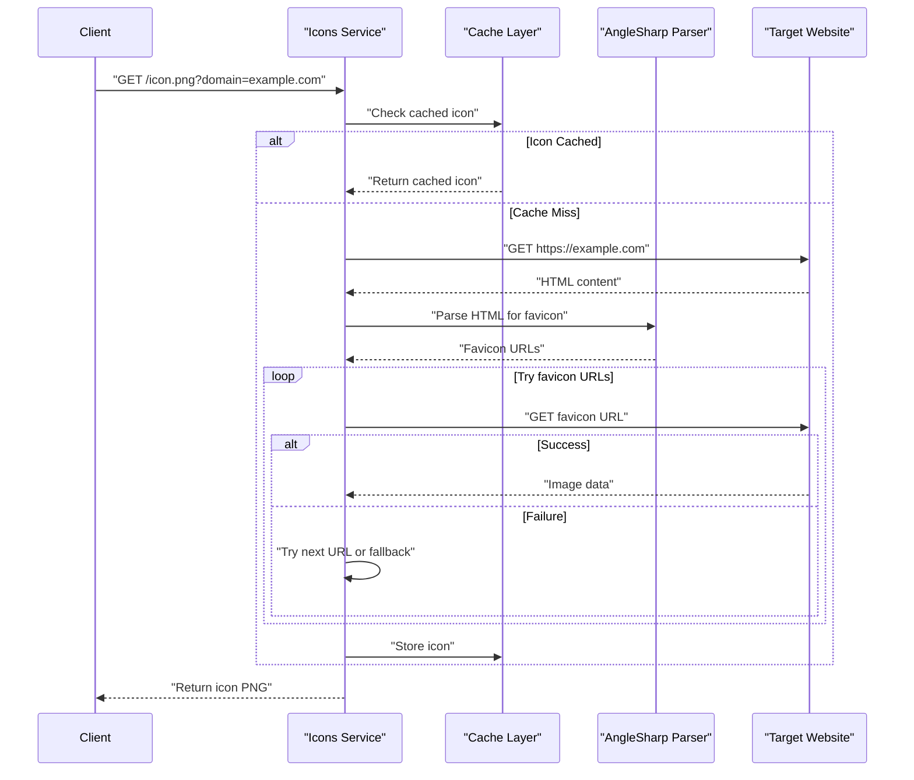
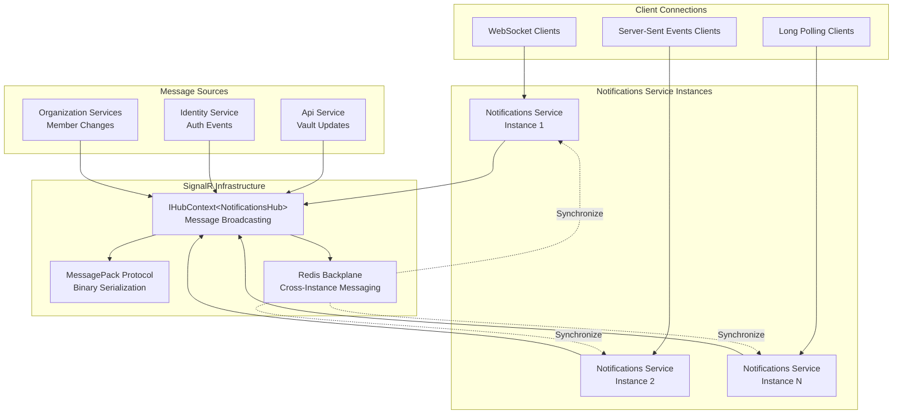
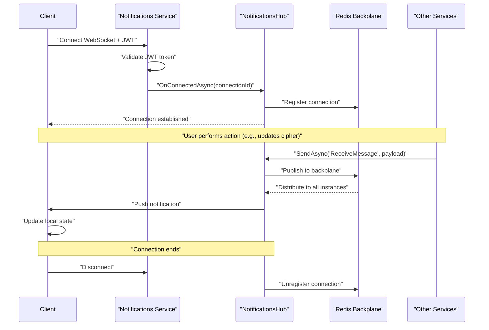
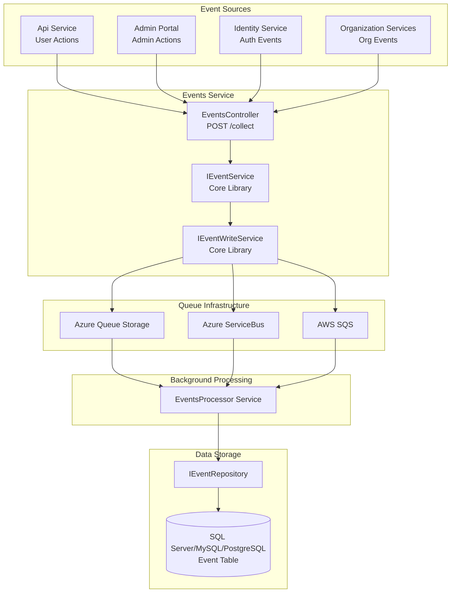
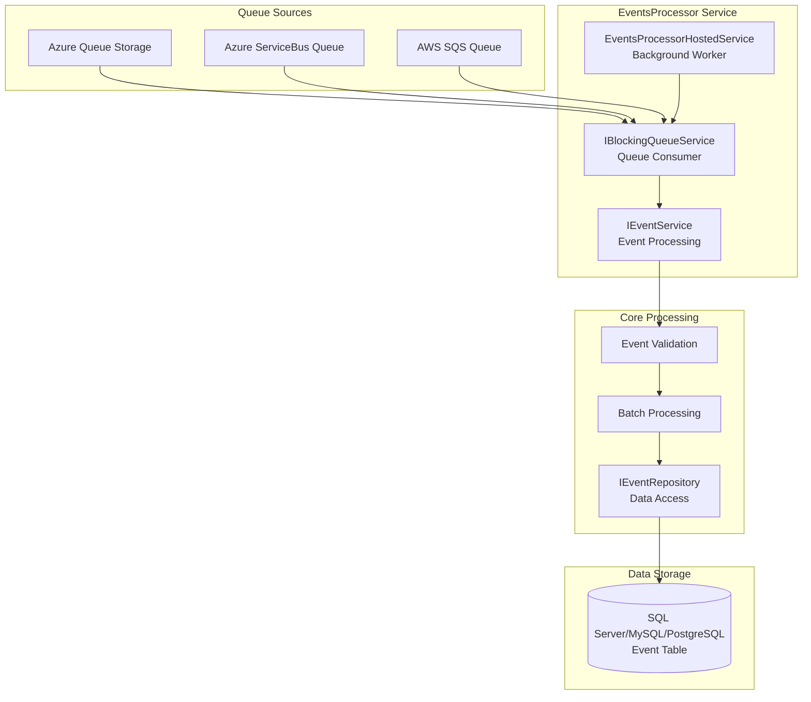
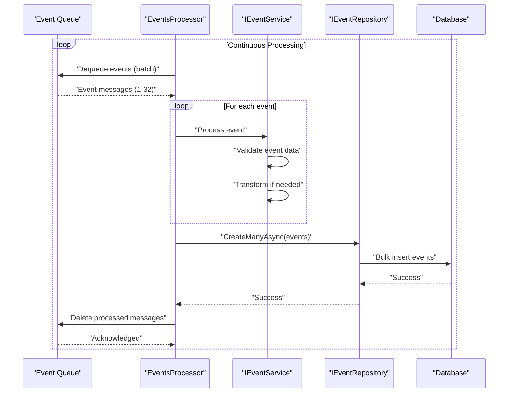
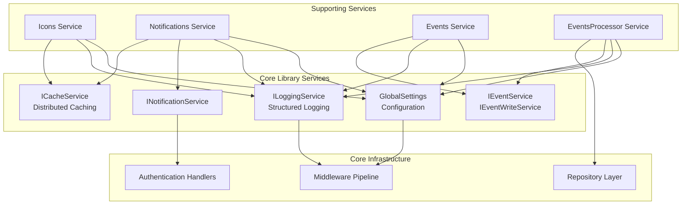

# Supporting Services

<details>
<summary>Relevant source files</summary>

The following files were used as context for generating this wiki page:

- [bitwarden_license/src/Sso/Sso.csproj](https://github.com/bitwarden/server/blob/39f38f50/bitwarden_license/src/Sso/Sso.csproj)
- [src/Admin/Admin.csproj](https://github.com/bitwarden/server/blob/39f38f50/src/Admin/Admin.csproj)
- [src/Api/Api.csproj](https://github.com/bitwarden/server/blob/39f38f50/src/Api/Api.csproj)
- [src/Billing/Billing.csproj](https://github.com/bitwarden/server/blob/39f38f50/src/Billing/Billing.csproj)
- [src/Core/Core.csproj](https://github.com/bitwarden/server/blob/39f38f50/src/Core/Core.csproj)
- [src/Events/Events.csproj](https://github.com/bitwarden/server/blob/39f38f50/src/Events/Events.csproj)
- [src/EventsProcessor/EventsProcessor.csproj](https://github.com/bitwarden/server/blob/39f38f50/src/EventsProcessor/EventsProcessor.csproj)
- [src/Icons/Icons.csproj](https://github.com/bitwarden/server/blob/39f38f50/src/Icons/Icons.csproj)
- [src/Identity/Identity.csproj](https://github.com/bitwarden/server/blob/39f38f50/src/Identity/Identity.csproj)
- [src/Notifications/Notifications.csproj](https://github.com/bitwarden/server/blob/39f38f50/src/Notifications/Notifications.csproj)
- [util/Server/Server.csproj](https://github.com/bitwarden/server/blob/39f38f50/util/Server/Server.csproj)
- [util/Setup/Setup.csproj](https://github.com/bitwarden/server/blob/39f38f50/util/Setup/Setup.csproj)

</details>


## Purpose and Scope

This document covers the three specialized web services that provide ancillary functionality to the main Bitwarden server infrastructure: the **Icons Service**, **Notifications Service**, and **Events Service**. These services handle favicon retrieval, real-time communications, and event capture respectively.

For information about the primary API endpoints and authentication, see [API Service](#3.1) and [Identity Service](#3.2). For background event processing, see the Events Processor section below. For event logging and audit trails, see [Events and Audit Logging](#10.3).

---

## Service Architecture Overview

The supporting services follow the same architectural pattern as the main services, depending on the Core library for business logic and SharedWeb for common web utilities. Each service is independently deployable and can be scaled horizontally.



**Sources:** [src/Icons/Icons.csproj:1-22](https://github.com/bitwarden/server/blob/39f38f50/src/Icons/Icons.csproj#L1-L22), [src/Notifications/Notifications.csproj:1-23](https://github.com/bitwarden/server/blob/39f38f50/src/Notifications/Notifications.csproj#L1-L23), [src/Events/Events.csproj:1-15](https://github.com/bitwarden/server/blob/39f38f50/src/Events/Events.csproj#L1-L15), [src/EventsProcessor/EventsProcessor.csproj:1-13](https://github.com/bitwarden/server/blob/39f38f50/src/EventsProcessor/EventsProcessor.csproj#L1-L13)

---

## Icons Service

### Overview

The Icons Service retrieves and serves website favicons for vault login items. It parses domain names, fetches icons from target websites, and caches them for performance. This service enables the Bitwarden client applications to display recognizable website logos alongside login entries.

| Property | Value |
|----------|-------|
| **Project** | `src/Icons/Icons.csproj` |
| **Port** | 5000 (HTTP), 443 (HTTPS) |
| **Primary Dependency** | AngleSharp 1.2.0 |
| **Key Resource** | `public_suffix_list.dat` (embedded) |
| **Authentication** | Not required |

### Key Dependencies



The Icons Service relies on:
- **AngleSharp** - HTML parsing library for extracting favicon links from website markup
- **public_suffix_list.dat** - Mozilla's public suffix list for accurate domain parsing and validation
- **Core Library** - Shared business logic and configuration
- **SharedWeb Library** - Common web middleware and utilities

**Sources:** [src/Icons/Icons.csproj:10-20](https://github.com/bitwarden/server/blob/39f38f50/src/Icons/Icons.csproj#L10-L20)

### Domain Parsing

The Icons Service uses the embedded `public_suffix_list.dat` resource to correctly parse domain names and identify the registrable domain portion. This is critical for:

1. **Domain normalization** - Converting `login.example.co.uk` to `example.co.uk`
2. **Subdomain handling** - Recognizing which part of a domain is the public suffix
3. **Cache key generation** - Ensuring consistent caching behavior across subdomains

The public suffix list handles complex cases like:
- Multi-level TLDs (e.g., `.co.uk`, `.com.au`)
- Special domains (e.g., `.github.io`, `.s3.amazonaws.com`)
- Private registries

**Sources:** [src/Icons/Icons.csproj:14](https://github.com/bitwarden/server/blob/39f38f50/src/Icons/Icons.csproj#L14)

### Favicon Retrieval Flow



The service follows this retrieval strategy:

1. **Domain normalization** - Parse and normalize the domain using the public suffix list
2. **Cache lookup** - Check if an icon is already cached
3. **HTML fetch** - If not cached, fetch the target website's HTML
4. **Favicon extraction** - Parse HTML for favicon links using AngleSharp:
   - `<link rel="icon">`
   - `<link rel="shortcut icon">`
   - `<link rel="apple-touch-icon">`
   - Default `/favicon.ico`
5. **Image fetch** - Retrieve the favicon image
6. **Format conversion** - Convert to PNG if necessary
7. **Cache storage** - Store for future requests

**Sources:** [src/Icons/Icons.csproj:10](https://github.com/bitwarden/server/blob/39f38f50/src/Icons/Icons.csproj#L10)

### Project Configuration

The Icons Service is configured as a lightweight ASP.NET Core web application:

```
Icons.csproj:
- SDK: Microsoft.NET.Sdk.Web
- UserSecretsId: bitwarden-Icons
- MvcRazorCompileOnPublish: false (not using Razor views)
- Dependencies:
  - AngleSharp 1.2.0 (HTML parsing)
  - Core project reference (shared business logic)
  - SharedWeb project reference (web utilities)
- Embedded Resources:
  - Resources/public_suffix_list.dat (domain parsing)
```

**Sources:** [src/Icons/Icons.csproj:1-22](https://github.com/bitwarden/server/blob/39f38f50/src/Icons/Icons.csproj#L1-L22)

---

## Notifications Service

### Overview

The Notifications Service provides real-time push notifications to connected clients using SignalR. It enables instant synchronization of vault changes, organization updates, and other events across all of a user's devices. The service uses Redis as a backplane for scaling across multiple server instances.

| Property | Value |
|----------|-------|
| **Project** | `src/Notifications/Notifications.csproj` |
| **Port** | 5000 (HTTP), 443 (HTTPS) |
| **Protocol** | SignalR (WebSocket, Server-Sent Events, Long Polling) |
| **Primary Dependencies** | SignalR.StackExchangeRedis, MessagePack |
| **Backplane** | Redis |
| **Authentication** | JWT Bearer token required |

### Architecture and Dependencies



**Sources:** [src/Notifications/Notifications.csproj:1-23](https://github.com/bitwarden/server/blob/39f38f50/src/Notifications/Notifications.csproj#L1-L23)

### SignalR Configuration

The Notifications Service is configured with the following SignalR features:

#### MessagePack Protocol

The service uses MessagePack for efficient binary serialization of messages, reducing bandwidth and improving performance:

```
Package: Microsoft.AspNetCore.SignalR.Protocols.MessagePack 8.0.8
Package: MessagePack 2.5.192 (pinned transitive dependency)
```

MessagePack provides:
- **Binary serialization** - Smaller payload sizes compared to JSON
- **Type preservation** - Maintains .NET type information
- **Performance** - Faster serialization/deserialization than JSON

**Sources:** [src/Notifications/Notifications.csproj:10](https://github.com/bitwarden/server/blob/39f38f50/src/Notifications/Notifications.csproj#L10), [src/Notifications/Notifications.csproj:15](https://github.com/bitwarden/server/blob/39f38f50/src/Notifications/Notifications.csproj#L15)

#### Redis Backplane

The service uses Redis as a backplane to enable SignalR to work across multiple server instances:

```
Package: Microsoft.AspNetCore.SignalR.StackExchangeRedis 8.0.8
```

The Redis backplane provides:
- **Horizontal scaling** - Multiple Notifications Service instances can serve clients
- **Message synchronization** - Messages sent to one instance reach clients on all instances
- **Connection management** - Maintains connection state across server instances
- **Failover support** - Clients can reconnect to different instances

**Sources:** [src/Notifications/Notifications.csproj:11](https://github.com/bitwarden/server/blob/39f38f50/src/Notifications/Notifications.csproj#L11)

### Notification Types

The Notifications Service broadcasts various event types to connected clients:

| Notification Type | Purpose | Trigger |
|-------------------|---------|---------|
| **SyncCipherUpdate** | Vault item modified | Cipher CRUD operations |
| **SyncCipherCreate** | New vault item | Cipher creation |
| **SyncLoginDelete** | Login deleted | Cipher deletion |
| **SyncFolderUpdate** | Folder changed | Folder CRUD operations |
| **SyncVault** | Full vault sync needed | Bulk operations, imports |
| **SyncOrganizations** | Organization membership changed | User invited/confirmed/removed |
| **SyncOrgKeys** | Organization key rotation | Key rotation operations |
| **SyncSettings** | User settings changed | Account settings updates |
| **LogOut** | Force logout | Account lockout, password change |

### Connection Flow



**Sources:** [src/Notifications/Notifications.csproj:10-16](https://github.com/bitwarden/server/blob/39f38f50/src/Notifications/Notifications.csproj#L10-L16)

### Project Configuration

```
Notifications.csproj:
- SDK: Microsoft.NET.Sdk.Web
- UserSecretsId: bitwarden-Notifications
- Dependencies:
  - Microsoft.AspNetCore.SignalR.Protocols.MessagePack 8.0.8
  - Microsoft.AspNetCore.SignalR.StackExchangeRedis 8.0.8
  - MessagePack 2.5.192 (pinned)
  - Core project reference
  - SharedWeb project reference
- Run Configurations:
  - Notifications (cloud)
  - Notifications-SelfHost (self-hosted)
```

**Sources:** [src/Notifications/Notifications.csproj:1-23](https://github.com/bitwarden/server/blob/39f38f50/src/Notifications/Notifications.csproj#L1-L23)

---

## Events Service

### Overview

The Events Service provides REST endpoints for capturing audit events throughout the Bitwarden system. Events are written to cloud queues (Azure Queue/ServiceBus or AWS SQS) for asynchronous processing by the EventsProcessor service. This architecture decouples event capture from event storage, enabling high-throughput event logging without blocking API requests.

| Property | Value |
|----------|-------|
| **Project** | `src/Events/Events.csproj` |
| **Port** | 5000 (HTTP), 443 (HTTPS) |
| **Protocol** | REST (HTTP/JSON) |
| **Authentication** | JWT Bearer token required |
| **Queue Systems** | Azure Queue, Azure ServiceBus, AWS SQS |
| **Processing** | Asynchronous via EventsProcessor |

### Event Capture Architecture



**Sources:** [src/Events/Events.csproj:1-15](https://github.com/bitwarden/server/blob/39f38f50/src/Events/Events.csproj#L1-L15), [src/EventsProcessor/EventsProcessor.csproj:1-13](https://github.com/bitwarden/server/blob/39f38f50/src/EventsProcessor/EventsProcessor.csproj#L1-L13)

### Event Collection Flow

The Events Service follows this pattern for event capture:

1. **Event submission** - Services POST event data to `/collect` endpoint
2. **Validation** - JWT token validates the submitter
3. **Queue writing** - Event is serialized and written to configured queue
4. **Acknowledgment** - HTTP 200 response returned immediately
5. **Async processing** - EventsProcessor consumes from queue
6. **Database storage** - Events persisted to Event table

This asynchronous pattern ensures:
- **High throughput** - Queue writes are fast
- **Reliability** - Queue guarantees delivery
- **Resilience** - API requests aren't blocked by database writes
- **Scalability** - Multiple EventsProcessor instances can consume events

### Event Types

The system captures a wide range of event types for audit trails:

| Event Category | Examples |
|----------------|----------|
| **User Events** | User_LoggedIn, User_ChangedPassword, User_Updated2fa |
| **Cipher Events** | Cipher_Created, Cipher_Updated, Cipher_Deleted, Cipher_Viewed |
| **Collection Events** | Collection_Created, Collection_Updated, Collection_Deleted |
| **Group Events** | Group_Created, Group_Updated, Group_Deleted |
| **Organization Events** | Organization_Updated, Organization_PurgedVault, Organization_ClientExportedVault |
| **OrganizationUser Events** | OrganizationUser_Invited, OrganizationUser_Confirmed, OrganizationUser_Updated, OrganizationUser_Removed |
| **Policy Events** | Policy_Updated |

Each event includes:
- **Type** - Event type enumeration
- **UserId** - User who performed the action (if applicable)
- **OrganizationId** - Organization context (if applicable)
- **ActingUserId** - User who initiated the action (for admin actions)
- **Date** - Timestamp of the event
- **DeviceType** - Client device type
- **IpAddress** - Source IP address

**Sources:** [src/Events/Events.csproj:10-13](https://github.com/bitwarden/server/blob/39f38f50/src/Events/Events.csproj#L10-L13)

### Project Configuration

```
Events.csproj:
- SDK: Microsoft.NET.Sdk.Web
- UserSecretsId: bitwarden-Events
- MvcRazorCompileOnPublish: false (API only, no views)
- Dependencies:
  - Core project reference (event services)
  - SharedWeb project reference (web middleware)
- Run Configurations:
  - Events (cloud)
  - Events-SelfHost (self-hosted)
```

**Sources:** [src/Events/Events.csproj:1-15](https://github.com/bitwarden/server/blob/39f38f50/src/Events/Events.csproj#L1-L15)

---

## Events Processor Service

### Overview

The EventsProcessor service is a background worker that consumes events from cloud queues and persists them to the database. It runs continuously, polling queues for new events and processing them in batches for efficiency. This service is essential for the async event logging architecture.

| Property | Value |
|----------|-------|
| **Project** | `src/EventsProcessor/EventsProcessor.csproj` |
| **Type** | Background Service (HostedService) |
| **Queue Sources** | Azure Queue, Azure ServiceBus, AWS SQS |
| **Processing Mode** | Batch processing |
| **Dependencies** | Core Library (event repositories) |

### Processing Architecture



**Sources:** [src/EventsProcessor/EventsProcessor.csproj:1-13](https://github.com/bitwarden/server/blob/39f38f50/src/EventsProcessor/EventsProcessor.csproj#L1-L13)

### Queue Configuration

The EventsProcessor supports multiple queue backends based on deployment configuration:

| Queue Provider | Use Case | Configuration Key |
|----------------|----------|-------------------|
| **Azure Queue Storage** | Cloud deployments (primary) | `globalSettings:events:connectionString` |
| **Azure ServiceBus** | Enterprise deployments | `globalSettings:serviceBus:connectionString` |
| **AWS SQS** | AWS deployments | `globalSettings:aws:sqsQueueUrl` |
| **Self-Hosted** | Docker Compose | Uses database-backed queue |

The service polls the configured queue and processes messages according to the queue's visibility timeout and retry policies.

### Processing Flow



The EventsProcessor implements these patterns:

1. **Polling** - Continuously polls queue for new messages
2. **Batch dequeue** - Retrieves multiple messages at once (up to 32)
3. **Validation** - Validates each event's structure and data
4. **Bulk insert** - Inserts multiple events in a single database operation
5. **Acknowledgment** - Deletes messages from queue after successful processing
6. **Error handling** - Failed events return to queue for retry based on queue policy

**Sources:** [src/EventsProcessor/EventsProcessor.csproj:8-11](https://github.com/bitwarden/server/blob/39f38f50/src/EventsProcessor/EventsProcessor.csproj#L8-L11)

### Error Handling and Resilience

The EventsProcessor implements several resilience patterns:

- **Visibility timeout** - Messages become visible again if processing fails
- **Retry policies** - Queue automatically retries failed messages
- **Dead letter queue** - Repeatedly failed messages move to DLQ for investigation
- **Graceful shutdown** - Completes in-flight processing before stopping
- **Health checks** - Reports processing health to monitoring systems

### Project Configuration

```
EventsProcessor.csproj:
- SDK: Microsoft.NET.Sdk.Web (for hosted service support)
- UserSecretsId: bitwarden-EventsProcessor
- Dependencies:
  - Core project reference (event services, repositories)
  - SharedWeb project reference (configuration, logging)
- Run Configuration:
  - EventsProcessor (background worker)
```

The service is typically deployed as a singleton instance per region, but can be scaled horizontally if event volume requires it. Multiple instances can safely consume from the same queue due to queue message locking.

**Sources:** [src/EventsProcessor/EventsProcessor.csproj:1-13](https://github.com/bitwarden/server/blob/39f38f50/src/EventsProcessor/EventsProcessor.csproj#L1-L13)

---

## Integration with Core Library

All three supporting services depend heavily on the Core library for shared functionality:

### Common Core Dependencies



### Shared Core Packages

From the Core.csproj, the supporting services indirectly benefit from:

| Package | Purpose | Used By |
|---------|---------|---------|
| **Azure.Storage.Queues** | Event queue storage | Events, EventsProcessor |
| **Azure.Messaging.ServiceBus** | Enterprise event bus | Events, EventsProcessor |
| **AWSSDK.SQS** | AWS queue service | Events, EventsProcessor |
| **Microsoft.Extensions.Caching.StackExchangeRedis** | Redis caching/backplane | Icons, Notifications |
| **Serilog.AspNetCore** | Structured logging | All services |
| **LaunchDarkly.ServerSdk** | Feature flags | All services |

**Sources:** [src/Core/Core.csproj:23-68](https://github.com/bitwarden/server/blob/39f38f50/src/Core/Core.csproj#L23-L68)

---

## Deployment Considerations

### Scaling Recommendations

| Service | Scaling Strategy | Considerations |
|---------|------------------|----------------|
| **Icons Service** | Horizontal (stateless) | Cache hit rate determines load; consider CDN |
| **Notifications Service** | Horizontal with Redis backplane | All instances must share Redis; WebSocket sticky sessions recommended |
| **Events Service** | Horizontal (stateless) | Queue writes are fast; scale based on event volume |
| **EventsProcessor** | Vertical or limited horizontal | Database writes are bottleneck; 1-3 instances typically sufficient |

### Resource Requirements

**Icons Service:**
- CPU: Low (mostly I/O bound)
- Memory: Low (small image caching)
- Network: Moderate (outbound requests to target sites)
- Storage: Optional (if caching to disk)

**Notifications Service:**
- CPU: Low (message routing)
- Memory: Moderate (maintains connection state)
- Network: High (persistent connections)
- Redis: Required (backplane)

**Events Service:**
- CPU: Low (queue writes)
- Memory: Low (stateless)
- Network: Low (queue writes only)

**EventsProcessor:**
- CPU: Low to moderate (batch processing)
- Memory: Low
- Network: Low (queue reads, database writes)
- Database: Required (event storage)

### Self-Hosted Configuration

For self-hosted deployments, these services can be run independently or combined with other services:

```yaml
# Docker Compose example
services:
  icons:
    image: bitwarden/icons
    environment:
      - globalSettings__baseServiceUri__icons=http://icons:5000
  
  notifications:
    image: bitwarden/notifications
    environment:
      - globalSettings__baseServiceUri__notifications=http://notifications:5000
      - globalSettings__redis__connectionString=redis:6379
    depends_on:
      - redis
  
  events:
    image: bitwarden/events
    environment:
      - globalSettings__baseServiceUri__events=http://events:5000
  
  events-processor:
    image: bitwarden/events-processor
    depends_on:
      - events
```