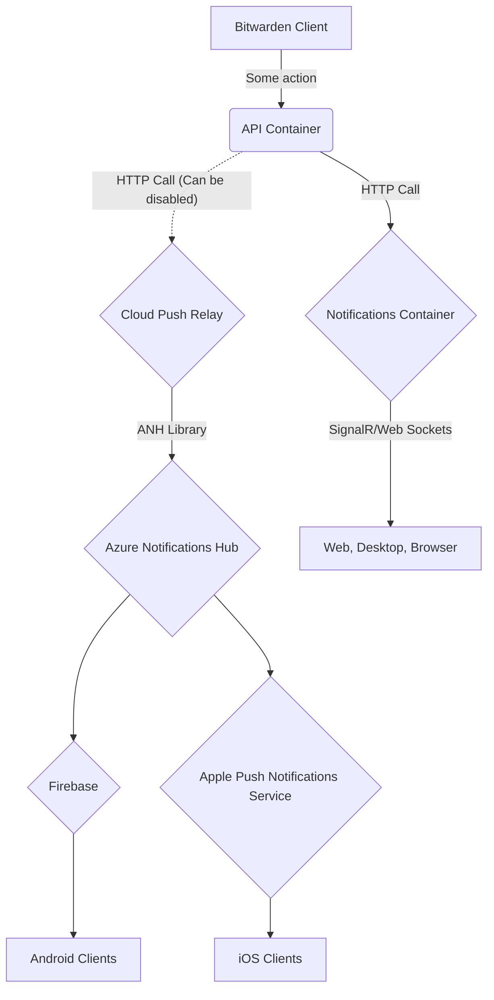
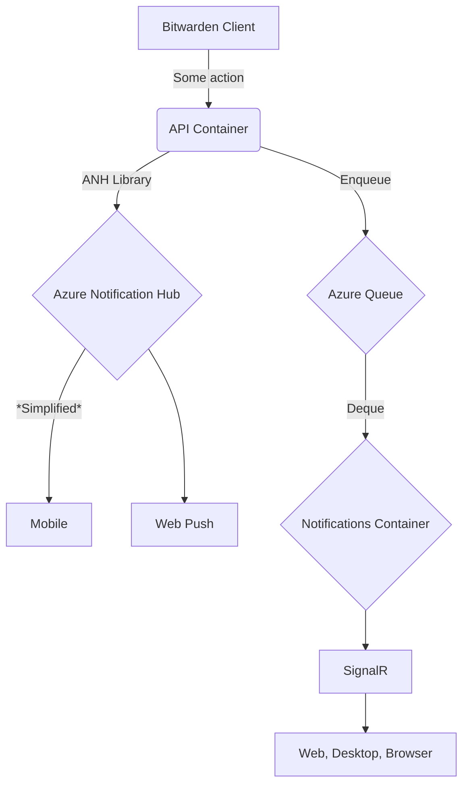

# Push

## About

Push is a feature for sending packets of information to end user devices. This can be useful for
telling the device that there is new information that it should request or that the request they
created was just accepted.

## Usage

The general usage will be to call `Bit.Core.Platform.Push.IPushNotificationService.PushAsync`. That
method takes a `PushNotification<T>`.

```c#
// This would send a notification to all the devices of the given `userId`.
await pushNotificationService.PushAsync(new PushNotification<MyPayload>
{
    Type = PushType.MyNotificationType,
    Target = NotificationTarget.User,
    TargetId = userId,
    Payload = new MyPayload
    {
        Message = "Request accepted",
    },
    ExcludeCurrentContext = false,
});
```

## Extending

If you want to extend this framework for sending your own notification type you do so by adding a
new enum member to the [`PushType`](./PushType.cs) enum. Assign a number to it that is 1 above the
next highest value. You must then annotate that enum member with a
[`[NotificationInfo]`](./NotificationInfoAttribute.cs) attribute to inform others who the owning
team and expected payload type are. Then you may inject
[`IPushNotificationService`](./IPushNotificationService.cs) into your own service and call its
`PushAsync` method.

You also need to add code to [`HubHelpers`](../../../Notifications/HubHelpers.cs) to read your
payload body and select the appropriate group or user to send the notification to.

You should NOT add tests for your specific notification type in any of the `IPushEngine`
implementations. They do currently have tests for many of the notification types but those will
eventually be deleted and no new ones need to be added.

Since notifications are relayed through our cloud instance for self hosted users (if they opt in)
it's important to try and keep the information in the notification payload minimal. It's generally
best to send a notification with IDs for any entities involved, which mean nothing to our cloud but
can then be used to get more detailed information once the notification is received on the device.

## Implementations

The implementation of push notifications scatters push notification requests to all `IPushEngine`s
that have been registered in DI for the current application. In release builds, this service does
NOT await the underlying engines to make sure that the notification has arrived at its destination
before its returned task completes.

### Azure Notification Hub

Used when the application is hosted by Bitwarden in the cloud. This sends the notification to the
configured [Azure Notification Hub (ANH)](https://learn.microsoft.com/en-us/azure/notification-hubs/notification-hubs-push-notification-overview),
which we currently rely on for sending notifications to:

- Our mobile clients, through the Notification Hub federation with mobile app notification systems
- Our clients configured to use Web Push (currently the Chrome Extension).

This implementation is always assumed to have available configuration when running in the cloud.

### Azure Queue

Used when the application is hosted by Bitwarden in the cloud, to send the notification over web
sockets (SignalR). This sends the notification to a Azure Queue. That queue is then consumed in our
Notifications service, where the notification is sent to a SignalR hub so that our clients connected
through a persistent web socket to our notifications service get the notification.

This implementation is registered in DI when `GlobalSettings:Notifications:ConnectionString` is set
to a value.

### Relay

Used when the application is being self-hosted. This relays a notification from the self-hosted
instance to a cloud instance. The notification is received by our cloud and then relayed to
Azure Notification Hub. This is necessary because self-hosted instance aren't able to directly send
notifications to mobile devices.

This instance is registered in DI when `GlobalSettings:PushRelayBaseUri` and
`GlobalSettings:Installation:Key` are available.

### Notifications API

Used when the application is being self-hosted. This sends a API request to the self-hosted instance
of the Notifications service. The Notifications service receives the request and then sends the
notification through the SignalR hub. This is very similar to cloud using an Azure Queue but it
doesn't require the self-hosted customer to run their own queuing infrastructure.

This instance is registered when `GlobalSettings:InternalIdentityKey` and
`GlobalSettings:BaseServiceUri:InternalNotifications` are set. Both of these settings are usually
set automatically in supported Bitwarden setups.

## Adding new notification targets

[`NotificationTarget`](./NotificationTarget.cs) is an enum that defines the possible targets for a
notification, `IPushEngine` implementations may or may not need to be aware and have special
considerations for each notification target type. For that reason adding a new target is NOT as easy
as adding a new enum member. The ANH implementation uses it to build its tag query. A new target
also needs to be something that is targettable through the tag query. For example, say a team wants
a notification target for users in an org with a verified email. Today this target would not be
expressable through a target because when we register a device with ANH we do not include whether
that user has a verified email. It would be possible to start including that information but the
effort of tracking that information and updating push registrations when a user verifies their email
needs to be weighed with the amount this notification is sent. What might instead be worth it would
be for the team that wants such a target to instead do a query to find users who match that query
and send a notification for each user individually using `NotificationTarget.User`. If there are
enough requests like that though we may want to consider adding a `BulkPushAsync` method to
`IPushNotificationService`.

### Self host diagram



### Cloud Diagram


